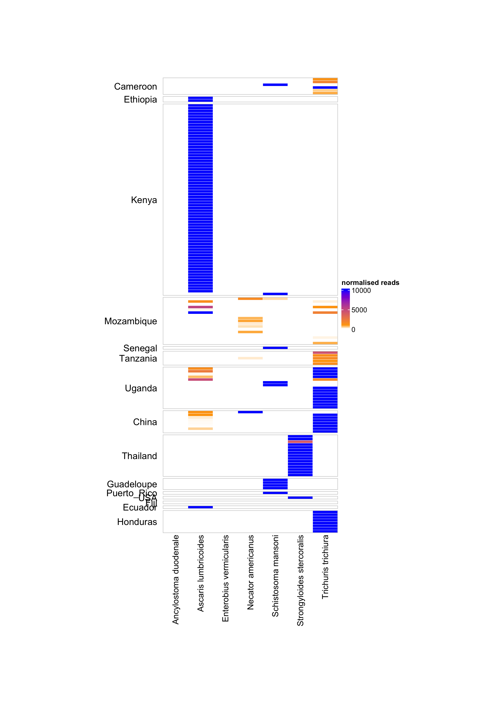
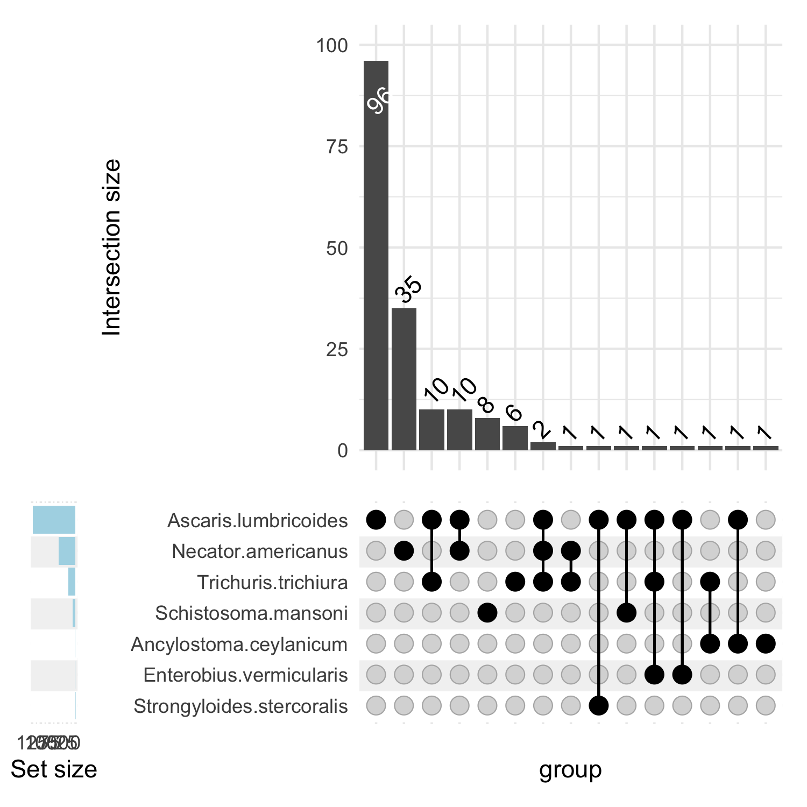
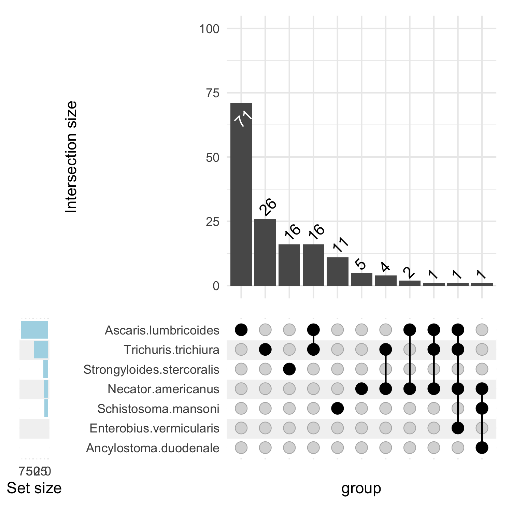

# Complex heatmaps with mitogenome reads
Author: Marina Papaiakovou, mpapaiakovou[at]gmail.com 

## Contents: 
- R code to create vertical heatmaps with complex heatmap 
- R code to create ComplexUpset plots to show co-infections
- Figure 1 (panels c & d) on paper; Supplementary Figure 1 as well. Doi to follow soon 
- Further beautifications done in Illustrator 
- Need to make a matrix that has rows of species.. columns of samples ands values as normalised reads 

``` {r  warning = FALSE,message = FALSE} 
library(tidyverse)
library(ComplexHeatmap)
library(gplots)
library(ComplexHeatmap)
library(circlize)
library(readxl)
library(ggrepel)
#install.packages("UpSetR")
#library(UpSetR) DO NOT LOAD THIS, IT WILL CLASH WITH THE COMPLEX UPSET
library(ComplexUpset)
library(patchwork)

#STEP 1: import the file with the mito stats ----
hum_mito_raw_counts <- read.table("/Users/marinapapaiakovou/Documents/00.Cambridge_PhD/02.Science/02.Genome_skimming/07.Global_genome_skim_2023/02_DATA/02_TRIMMED_DATA/02_MITOGENOME_MAPPING/POST_CIGAR_FILTER_DATA/ALL_STATS_FILTERED_n1000.txt", sep="\t", header=F )
#ALL_STATS_FILTERED_n1000.txt: updated with CIGAR filtering after picard MarkDuplicates and after adding more Trichuris samples. 

# Read the column names from the text file (assuming one column name per line)
column_names <- readLines("/Users/marinapapaiakovou/Documents/00.Cambridge_PhD/02.Science/02.Genome_skimming/07.Global_genome_skim_2023/02_DATA/02_TRIMMED_DATA/01_RAW_READ_COUNTS/extracted_names.txt")

# Assign the column names to your existing dataset
colnames(hum_mito_raw_counts) <- column_names
#1003

#will drop Echinococcus and anisakis
hum_mito_raw_counts <- hum_mito_raw_counts %>%
  slice(-6, -11) #dropping  taenia/echinococcus/anisakis as not relevant
#1003

#replace the names so I can sort them
hum_mito_raw_counts$species[hum_mito_raw_counts$species == 'AP017684_Enterobius_vermicularis_mitochondrial_DNA_complete'] <- 'Enterobius vermicularis'
hum_mito_raw_counts$species[hum_mito_raw_counts$species == 'NC_002545_Schistosoma_mansoni_mitochondrion_complete_genome'] <- 'Schistosoma mansoni'
hum_mito_raw_counts$species[hum_mito_raw_counts$species == 'NC_003415_Ancylostoma_duodenale_mitochondrion_complete_genome'] <- 'Ancylostoma duodenale'
hum_mito_raw_counts$species[hum_mito_raw_counts$species == 'NC_003416_Necator_americanus_mitochondrion_complete_genome'] <- 'Necator americanus'
hum_mito_raw_counts$species[hum_mito_raw_counts$species == 'NC_004022_Taenia_solium_mitochondrion_complete_genome'] <- 'Taenia solium'
hum_mito_raw_counts$species[hum_mito_raw_counts$species == 'NC_016198_Ascaris_lumbricoides_mitochondrion_complete_genome'] <- 'Ascaris lumbricoides'
hum_mito_raw_counts$species[hum_mito_raw_counts$species == 'NC_017750_Trichuris_trichiura_mitochondrion_complete_genome'] <- 'Trichuris trichiura'
hum_mito_raw_counts$species[hum_mito_raw_counts$species == 'NC_028624_Strongyloides_stercoralis_isolate_PV001_mitochondrion'] <- 'Strongyloides stercoralis'
hum_mito_raw_counts$species[hum_mito_raw_counts$species == 'NC_035142_Ancylostoma_ceylanicum_mitochondrion_complete_genome'] <- 'Ancylostoma ceylanicum'

#order the species name alphabetically
hum_mito_raw_counts2 <- hum_mito_raw_counts[order(hum_mito_raw_counts$species),]

# STEP 2: TRANSFORM THE DATASET ----
hum_mito_raw_counts_l <- pivot_longer(hum_mito_raw_counts2, names_to = "sample_id", values_to = "raw_read_counts", cols=4:1003)

# load data containing the total number of trimmed sequencing reads per sample
hum_samples_id_reads_n <- read.table("/Users/marinapapaiakovou/Documents/00.Cambridge_PhD/02.Science/02.Genome_skimming/07.Global_genome_skim_2023/02_DATA/02_TRIMMED_DATA/01_RAW_READ_COUNTS/READ_COUNTS_ALL.txt", header=T, sep="\t")

# merged the dataframes
hum_mito_data <- full_join(hum_mito_raw_counts_l, hum_samples_id_reads_n, by="sample_id")

country_map <- c(
  "BEN" = "Benin","CMR" = "Cameroon","TZA" = "Tanzania","ETH" = "Ethiopia","UGA" = "Uganda","IND" = "India","MWI" = "Malawi","MMR" = "Myanmar", "HND" ="Honduras",   "NGA" = "Nigeria","ARG" = "Argentina","BGD" = "Bangladesh","CHN" = "China","ECU" = "Ecuador","GLP" = "Guadeloupe","FJI" = "Fiji","LKA" = "Sri_Lanka",
  "MOZ" = "Mozambique","ITA" = "Italy","PR1" = "Puerto_Rico","COD" = "DRC","SEN" = "Senegal","THA" = "Thailand","USA" = "USA","ZAF" = "South_Africa","MYS" = "Malaysia", 
  "KEN" = "Kenya")
hum_mito_data_country <- hum_mito_data %>%
  mutate(country = country_map[substr(sample_id, 1, 3)])

#write.csv(hum_mito_data_country, "/Users/marinapapaiakovou/Documents/00.Cambridge_PhD/02.Science/02.Genome_skimming/07.Global_genome_skim_2023/04_ANALYSIS/00_STATS_MAPPED/ALL_READS_MAPPED_matched_sample.id.csv")
#AT THIS POINT, ADD TWO COLUMNS
# one: ABOUT ENA, OR NEW SKIM
# two: whether it's a worm of poo data/metagenome

hum_mito_data_country_2 <- hum_mito_data_country %>% mutate(study_origin = ifelse(grepl("BEN|BGD|ARG|ETH0|FJI|IND|KEN00|LKA0|MMR0|MWI|NGA|ZAF|COD", sample_id), 'new_skim', 'ENA'))
hum_mito_data_country_3 <- hum_mito_data_country_2 %>% mutate(data_type = ifelse(grepl("BEN|BGD|ARG|ETH003|ETH_|IND|KEN00|LKA|ITA|MMR|MWI|NGA|ZAF|COD|MYS|UGA0|UGA_BLANK", sample_id), 'faecal_metagenome', 'worm_eggs'))
#this includes the ETH001, ETH002 etc which are new, and the ETH_ET103, ETH_ET018 which are from IJP


# STEP 3: normalise the data
hum_mito_data_country_norm <- hum_mito_data_country_3 %>% mutate(normalised = (raw_read_counts) / (raw_reads_n / 1000000) / (mitogenome_size_bp / 1e6))

#testing a threshold of 10, to see if that will reduce the non specific hits in the geomaps down the line

hum_mito_data_country_norm <- hum_mito_data_country_norm %>%
  filter(normalised > 10) #to remove non specific hits

#add continent and order results by continent 
hum_mito_data_country_norm <- hum_mito_data_country_norm %>% 
  mutate(continent = ifelse(grepl("BGD|IND|LKA|MMR|MYS|CHN|THA", sample_id), 'Asia', 
                            ifelse(grepl("BEN|ETH|KEN|MWI|NGA|ZAF|COD|UGA|CMR|TZA|MOZ|SEN", sample_id), 'Africa', 
                                   ifelse(grepl("ITA", sample_id), 'Europe', 
                                          ifelse(grepl("HND|ARG|ECU", sample_id), 'South_America', 
                                                 ifelse(grepl("FJI", sample_id), 'Oceania', 'North_America'))))))

#order the results by the column
hum_mito_data_country_norm_ordered <- hum_mito_data_country_norm %>% 
  arrange(continent, country, species)

```

### Complex heatmap for faecal data
```{r warning = FALSE}
#STEP 4: COMPLEX HEATMAP FOR FAECAL DATA  ----

#CONTAINS ONLY DATA THAT CAME FROM FAECAL METAGENOMES AND THEN ONLY THOSE FOR WHICH COLUMN SUMS WERE NOT O 
test  <- hum_mito_data_country_norm_ordered %>%
  filter(data_type=="faecal_metagenome") %>%
  dplyr::select(1,4,10) #species, sample id, normalised reads 

#make it a wide format
test_w <- test %>%
  #group_by(country) %>%
  pivot_wider(names_from = sample_id, values_from = normalised, values_fill = 0) #converts NAs to 0
#that was not working before because I was using the hum_mito_data_country_norm df and that had a lot more columns and since i was not specifying them, R did not know what to do with them and was treating them as unique rows 

test_w_num <- test_w[-1] #removed the species column
#DROP ALL COLUMNS FOR WHICH ALL SPECIES GIVE ZERO VALUES 
test_w_clean <- test_w_num %>% select_if(colSums(test_w_num) != 0) #this reduced the obs from 843 to 267 
#having a threshold of 10,  did not reduce it; it is still 175

#add the row names back
row.names(test_w_clean) <- c( "Ascaris lumbricoides", "Schistosoma mansoni", "Necator americanus","Trichuris trichiura", "Ancylostoma ceylanicum", "Strongyloides stercoralis","Enterobius vermicularis"  )

#alternative - how many times a pattern is found in the col names 
sum(length(grep(x = colnames(test_w_clean), pattern = "ARG")), 
    length(grep(x = colnames(test_w_clean), pattern = "BEN")),
    length(grep(x = colnames(test_w_clean), pattern = "BGD")), 
    length(grep(x = colnames(test_w_clean), pattern = "COD")),
    length(grep(x = colnames(test_w_clean), pattern = "ETH")),
    length(grep(x = colnames(test_w_clean), pattern = "IND")),
    length(grep(x = colnames(test_w_clean), pattern = "KEN")),
    length(grep(x = colnames(test_w_clean), pattern = "LKA")),
    length(grep(x = colnames(test_w_clean), pattern = "MMR")),
    length(grep(x = colnames(test_w_clean), pattern = "MWI")),
    length(grep(x = colnames(test_w_clean), pattern = "MYS")),
    length(grep(x = colnames(test_w_clean), pattern = "NGA")),
    length(grep(x = colnames(test_w_clean), pattern = "UGA")),
    length(grep(x = colnames(test_w_clean), pattern = "ITA")),
    length(grep(x = colnames(test_w_clean), pattern = "ZAF")),
    length(grep(x = colnames(test_w_clean), pattern = "DRC")))

test_w_clean_2  <- tibble::rownames_to_column(test_w_clean, "species")

test_w_clean_l <- test_w_clean_2 %>%
  pivot_longer(cols=2:176, names_to="sample_id", values_to = "normalised") #this works 

#now add country column 
test_w_clean_l_country <- test_w_clean_l %>%
  mutate(country = country_map[substr(sample_id, 1, 3)])


#Now I think i have to made that wide again .... 
test_w_clean_l_country <- test_w_clean_l_country[1:3] # have to retain only sample id, species, normalised 

test_w_clean_l_2_w <- test_w_clean_l_country %>%
  #group_by(country) %>%
  pivot_wider(names_from = sample_id, values_from = normalised, values_fill = 0) #this gives me 257 variables or 268 depending on the species I am including

#order it again?
#Not if you want it by continent
test_w_clean_l_2_w_ordered <- test_w_clean_l_2_w[order(test_w_clean_l_2_w$species),]

#now need to make the first column row names 
#test_w_clean_l_2_w_formatted <- test_w_clean_l_2_w_ordered %>% remove_rownames %>% column_to_rownames(var="species")
test_w_clean_l_2_w_formatted <- test_w_clean_l_2_w_ordered %>% remove_rownames %>% column_to_rownames(var="species")

col_fun = colorRamp2(c(10, 50, 300), c("white", "orange", "blue"))

#ph1_matrix
ph1_matrix <- test_w_clean_l_2_w_formatted


##########################################
#### FOR VERTICAL POO HEATMAP ---- 
#########################################
# Transpose the data matrix

ph1_matrix_transposed <- t(ph1_matrix)

X175_samples_non_zero_reads_countrynames_trasnposed <- read_excel("/Users/marinapapaiakovou/Documents/00.Cambridge_PhD/02.Science/02.Genome_skimming/07.Global_genome_skim_2023/02_DATA/02_TRIMMED_DATA/02_MITOGENOME_MAPPING/POST_CIGAR_FILTER_DATA/175_samples_non_zero_reads_countrynames_FILTERED_NORMALISED_READS_ORDERED_BY_CONTINENT_TRANSPOSED.xlsx", col_names = FALSE)
X175_samples_non_zero_reads_continentnames_transposed <- read_excel("/Users/marinapapaiakovou/Documents/00.Cambridge_PhD/02.Science/02.Genome_skimming/07.Global_genome_skim_2023/02_DATA/02_TRIMMED_DATA/02_MITOGENOME_MAPPING/POST_CIGAR_FILTER_DATA/175_samples_non_zero_reads_CONTINENTnames_FILTERED_NORMALISED_READS_TRANSPOSED.xlsx",  col_names = FALSE)

#colnames(X256_samples_non_zero_reads_countrynames) <- "country"
#colnames(X267_samples_non_zero_reads_countrynames) <- "country"
colnames(X175_samples_non_zero_reads_countrynames_trasnposed) <- c("country", "country", "country", "country", "country", "country", "country")
colnames(X175_samples_non_zero_reads_continentnames_transposed) <- c("continent", "continent", 
                                                                     "continent", "continent", "continent", "continent", "continent")

#after filtering for normalised > 10 
ann <- data.frame(X175_samples_non_zero_reads_countrynames_trasnposed)
#continent_ann <- data.frame(X175_samples_non_zero_reads_continentnames$continent)
ann_continent <- data.frame(X175_samples_non_zero_reads_continentnames_transposed)

colnames(ann) <- c("country", "country", "country", "country", "country", "country", "country")
colnames(ann_continent) <- c("continent", "continent", 
                             "continent", "continent", "continent", "continent", "continent")

#this
col_fun = colorRamp2(c(10, 50, 300), c("white", "orange", "blue"))


colAnn <- HeatmapAnnotation(df = ann,
                            which = 'col',
                            col = list(ann = NA, continent_ann=NA), border=T,
                            annotation_width = unit(c(1, 4), 'cm'),
                            gap = unit(1, 'mm'))

colAnn_continent <- HeatmapAnnotation(df = ann_continent,
                                      which = 'col',
                                      col = list(ann = NA, continent_ann=NA), border=T,
                                      annotation_width = unit(c(1, 4), 'cm'),
                                      gap = unit(1, 'mm'))


# Assuming X175_samples_non_zero_reads_countrynames is your dataset and country is the column containing country names
# Convert the country column to a factor with the desired order
X175_samples_non_zero_reads_countrynames_trasnposed$country <- factor(X175_samples_non_zero_reads_countrynames_trasnposed$country, levels = unique(X175_samples_non_zero_reads_countrynames_trasnposed$country))
X175_samples_non_zero_reads_continentnames_transposed$continent <- factor(X175_samples_non_zero_reads_continentnames_transposed$continent, levels = unique(X175_samples_non_zero_reads_continentnames_transposed$continent))
# Adjusted dimensions for the PDF file
``` 
```{r FAECAL_HEATMAP, fig.path='./00_FIGURES/'}

png(filename = "00_FIGURES/FAECAL_HEATMAP.png", height = 14, width = 10, units = "in", res = 300)


# Use the column_split argument with the modified country column
hmap <- Heatmap(
  ph1_matrix_transposed,  # Use the transposed data matrix
  name = "normalised reads",
  show_row_names = F,
  col = col_fun,
  column_title_rot = 90,
  row_title_rot = 0,
  show_column_names = T,
  cluster_rows = FALSE,
  cluster_columns = FALSE,
  show_column_dend = FALSE,
  border_gp = gpar(col = "lightgrey"),
  show_row_dend = FALSE,
  row_dend_reorder = FALSE, 
  # heatmap_height = unit(0.25, "cm") * nrow(ph1_matrix_transposed),  # Adjust height of heatmap tiles
  heatmap_height = unit(0.18, "cm") * nrow(ph1_matrix_transposed),  # Reduce height of heatmap tiles
  width = unit(88, "mm"),  # Increase width of heatmap tiles
  row_gap = unit(1, "mm"),  
  column_gap = unit(0.1, "mm"),
  # width = unit(40, "mm"),  # Adjust width of heatmap tiles
  heatmap_legend_param = list(
    legend_direction = "vertical",  # Keep legend orientation vertical
    legend_width = unit(2, "cm")),  # Adjust legend width
  row_split = X175_samples_non_zero_reads_countrynames_trasnposed$country, 
  rect_gp = gpar(col = "white", lwd = 0.5) # THIS WILL CONTROL HOW FULL THE RECTANGLES ARE

)

# Output the heatmap
draw(hmap, heatmap_legend_side = "right", show_annotation_legend = FALSE)  # Adjust legend position
dev.off()
```


### Complex heatmap for worm/egg data
``` {r  warning = FALSE}
#STEP 4: COMPLEX HEATMAP FOR WORMS/EGG DATA  ----
#RUN AGAIN FROM TOP TO 90 LINE 
ch2_df  <- hum_mito_data_country_norm_ordered %>%
  filter(data_type =="worm_eggs") %>%
  dplyr::select(1,4,10) #species, sample id, normalised reads 


#this also gets rid of all the schisto samples that had NA (since i removed)
ch2_df_w <- pivot_wider(na.omit(ch2_df), names_from = sample_id, values_from = normalised, values_fill = 0)  #otherwise I was getting an error re Can't convert `fill` <double> to <list>.


ch2_df_w_num <- ch2_df_w[-1] #drops the species value

#DROP ALL COLUMNS FOR WHICH ALL SPECIES GIVE ZERO VALUES 
ch2_df_w_clean <- ch2_df_w_num %>% select_if(colSums(ch2_df_w_num) != 0) #it did reduce it by 1 sample, FJI
#add back the rownames 
#this works 

#after I order for continent and species
row.names(ch2_df_w_clean) <- c( "Necator americanus", "Schistosoma mansoni", "Trichuris trichiura","Ascaris lumbricoides", "Ancylostoma duodenale","Enterobius vermicularis", "Strongyloides stercoralis"  )
#154 is the output after I filter for normalised reads

library(readxl)
country_list_worm_samples_country <- read_excel("~/Documents/00.Cambridge_PhD/02.Science/02.Genome_skimming/07.Global_genome_skim_2023/02_DATA/02_TRIMMED_DATA/02_MITOGENOME_MAPPING/POST_CIGAR_FILTER_DATA/154_samples_non_zero_reads_country_names_ORDERED_BY_CONTINENT.xlsx", col_names = FALSE)
country_list_worm_samples_continent <- read_excel("~/Documents/00.Cambridge_PhD/02.Science/02.Genome_skimming/07.Global_genome_skim_2023/02_DATA/02_TRIMMED_DATA/02_MITOGENOME_MAPPING/POST_CIGAR_FILTER_DATA/154_samples_non_zero_reads_continent_names_ONLYWORMS_EGGS_ORDERED_BY_CONTINENT.xlsx", col_names = FALSE)

colnames(country_list_worm_samples_country) <- "country"
colnames(country_list_worm_samples_continent) <- "continent"

#BRING ann dataframe to the same size as the ph1_matrix 
#might need to do the clean dt long, then add country, then wide again and remove country column 
ch2_df_w_clean_2 <- tibble::rownames_to_column(ch2_df_w_clean, "species")

#if you remove echinococcus and anisakis only (and keep taenia)
ch2_df_w_clean_l <- ch2_df_w_clean_2 %>%
  pivot_longer(cols=2:155, names_to="sample_id", values_to = "normalised") #this works 

#now add country column 
ch2_df_w_clean_l_country <- ch2_df_w_clean_l %>%
  mutate(country = country_map[substr(sample_id, 1, 3)])

#write_csv(ch2_df_w_clean_l_country, "ch2_df_w_clean_l_country.csv")


#Now I think i have to made that wide again .... 
ch2_df_w_clean_l_2 <- ch2_df_w_clean_l_country[1:3] # have to retain only sample id, species, normalised 
ch2_df_w_clean_l_2_w <- pivot_wider(na.omit(ch2_df_w_clean_l_2), names_from = sample_id, values_from = normalised, values_fill = 0)

#reorder alphabetically
ch2_df_w_clean_l_2_w2 <- ch2_df_w_clean_l_2_w[order(ch2_df_w_clean_l_2_w$species),]
#now need to make the first column row names 
ch2_df_w_clean_l_2_w_formatted <- ch2_df_w_clean_l_2_w2 %>% remove_rownames %>% column_to_rownames(var="species")


library(circlize)
col_fun2 = colorRamp2(c(100, 1000, 10000), c("white", "orange", "blue"))


ch2_matrix <- ch2_df_w_clean_l_2_w_formatted

##########################################
#### FOR VERTICAL WORM/EGG HEATMAP ---- 
#########################################
# Transpose the data matrix
ch2_matrix_transposed <- t(ch2_matrix)
# Convert the country column to a factor with the desired order

country_list_worm_samples_country_transposed <- read_excel("~/Documents/00.Cambridge_PhD/02.Science/02.Genome_skimming/07.Global_genome_skim_2023/02_DATA/02_TRIMMED_DATA/02_MITOGENOME_MAPPING/POST_CIGAR_FILTER_DATA/154_samples_non_zero_reads_country_names_ORDERED_BY_CONTINENT_TRANSPOSED.xlsx", col_names = FALSE)
country_list_worm_samples_continent_transposed <- read_excel("~/Documents/00.Cambridge_PhD/02.Science/02.Genome_skimming/07.Global_genome_skim_2023/02_DATA/02_TRIMMED_DATA/02_MITOGENOME_MAPPING/POST_CIGAR_FILTER_DATA/154_samples_non_zero_reads_continent_names_ONLYWORMS_EGGS_ORDERED_BY_CONTINENT_TRANSPOSED.xlsx", col_names = FALSE)

colnames(country_list_worm_samples_country_transposed) <- c("country", "country", "country", "country", "country", "country", "country")
colnames(country_list_worm_samples_continent_transposed) <- c("continent", "continent", 
                                                              "continent", "continent", "continent", "continent", "continent")

#after filtering for normalised > 10 
ann2_country_transposed <- data.frame(country_list_worm_samples_country_transposed)
ann2_continent_transposed <- data.frame(country_list_worm_samples_continent_transposed)

colnames(ann2_country_transposed) <- c("country", "country", "country", "country", "country", "country", "country")
colnames(ann2_continent_transposed) <- c("continent", "continent", 
                                         "continent", "continent", "continent", "continent", "continent")


country_list_worm_samples_country_transposed$country<- factor(country_list_worm_samples_country$country, levels = unique(country_list_worm_samples_country$country))
country_list_worm_samples_continent_transposed$continent <- factor(country_list_worm_samples_continent$continent, levels = unique(country_list_worm_samples_continent$continent))

```

```{r WORM_EGG_HEATMAP, fig.path='./00_FIGURES/'}
png(filename = "00_FIGURES/WORM_EGG_HEATMAP.png", height = 14, width = 10, units = "in", res = 300)


# Use the column_split argument with the modified country column
hmap2 <- Heatmap(
  ch2_matrix_transposed,  # Use the transposed data matrix
  name = "normalised reads",
  show_row_names = F,
  col = col_fun2,
  column_title_rot = 90,
  row_title_rot = 0,
  show_column_names = T,
  cluster_rows = FALSE,
  cluster_columns = FALSE,
  show_column_dend = FALSE,
  border_gp = gpar(col = "lightgrey"),
  show_row_dend = FALSE,
  row_dend_reorder = FALSE, 
  # heatmap_height = unit(0.25, "cm") * nrow(ph1_matrix_transposed),  # Adjust height of heatmap tiles
  heatmap_height = unit(0.18, "cm") * nrow(ch2_matrix_transposed),  # Reduce height of heatmap tiles
  width = unit(88, "mm"),  # Increase width of heatmap tiles
  row_gap = unit(1, "mm"), 
  column_gap = unit(0.1, "mm"),
  # width = unit(40, "mm"),  # Adjust width of heatmap tiles
  heatmap_legend_param = list(
    legend_direction = "vertical",  # Keep legend orientation vertical
    legend_width = unit(2, "cm")),  # Adjust legend width
  row_split = country_list_worm_samples_country_transposed$country, 
  rect_gp = gpar(col = "white", lwd = 0.5), # THIS WILL CONTROL HOW FULL THE RECTANGLES ARE
)

draw(hmap2, heatmap_legend_side = "right", show_annotation_legend = FALSE)  # Adjust legend position
dev.off()

```



# ComplexUpset Plots to show co-infections
``` {r  warning = FALSE}

#####POO DATA 
#I need to have the species as main columns and the observations as rows in order for that to work
#test_w_clean_l_2_w_ordered dataset looking like this:
#species    BEN001_trimmed BEN002_trimmed BEN003_trimmed BEN005_trimmed BEN006_trimmed BEN007_trimmed BEN008_trimmed
#  <chr>               <dbl>          <dbl>          <dbl>          <dbl>          <dbl>          <dbl>          <dbl>
#1 Ancylosto…            0              0              0               0              0              0              0 
#2 Ascaris l…           24.3           33.7           21.4           335.           205.           196.           108.

test_w_clean_l_2_w_forupset <- pivot_longer(test_w_clean_l_2_w_ordered, names_to = "sample_id", cols = 2:ncol(test_w_clean_l_2_w))
test_w_clean_l_2_w_forupset <- test_w_clean_l_2_w_forupset %>% pivot_wider(names_from = species, values_from = value)
#now convert anything > 0 to 1, because UPSETR wants a matrix of 0s and 1s
test_w_clean_l_2_w_forupset2 <- test_w_clean_l_2_w_forupset %>% mutate_if(is.numeric, ~1 * (. != 0))
test_w_clean_l_2_w_forupset3 <- data.frame(test_w_clean_l_2_w_forupset2)

#https://krassowski.github.io/complex-upset/articles/Examples_R.html#adjusting-the-default-themes
samples <- test_w_clean_l_2_w_forupset3
species <- colnames(samples)[2:8] #change this depending hwo many species you have

```
# Faecal data - ComplexUpset Plot
```{r SUPPLEMENTARY_FIGURE_1_UPSET_PLOT_ONLY_FAECAL, fig.path='./00_FIGURES/'}
png(filename = "00_FIGURES/SUPPLEMENTARY_FIGURE_1_UPSET_PLOT_ONLY_FAECAL.png", height = 5, width = 5, units = "in", res = 300)

#set up same y limits between the two plots
UPSET_PLOT_ALL_SPECIES_FAECAL <- upset(
  samples, species, 
  base_annotations = list(
    'Intersection size' = (
      intersection_size(text = list(vjust = -0.1, hjust = -0.1, angle = 45)) +
        scale_y_continuous(limits = c(0, 100)) # Set y-axis limits here
    )
  ),
  min_size = 0,
  width_ratio = 0.1,
  set_sizes = upset_set_size(
    geom = geom_bar(fill = 'lightblue') # Customize set size bar color for second set
  )
)


#FOR THE ABOVE TO WORK, DON'T LOAD THE library(UpSetR)!!! You need to only load the library(ComplexUpset)
#Otherwise they clash !!
#https://support.bioconductor.org/p/103113/
#how to combine the plots!!!!!!!

print(UPSET_PLOT_ALL_SPECIES_FAECAL)
dev.off()
```



``` {r  warning = FALSE}

####WORM DATA
# I don't need the below for the upset plot, but it's easier to calculate the number of posiitves if I convert he dataset to 0 1 matrix
ch2_df_w_clean_l_2_w_forupset <- pivot_longer(ch2_df_w_clean_l_2_w2, names_to = "sample_id", cols = 2:ncol(ch2_df_w_clean_l_2_w2))
ch2_df_w_clean_l_2_w_forupset <- ch2_df_w_clean_l_2_w_forupset %>% pivot_wider(names_from = species, values_from = value)
#now convert anything > 0 to 1, because UPSETR wants a matrix of 0s and 1s
ch2_df_w_clean_l_2_w_forupset2 <- ch2_df_w_clean_l_2_w_forupset %>% mutate_if(is.numeric, ~1 * (. != 0))
ch2_df_w_clean_l_2_w_forupset3 <- data.frame(ch2_df_w_clean_l_2_w_forupset2)

samples_worms <- ch2_df_w_clean_l_2_w_forupset3
species_worms <- colnames(samples_worms)[2:8] #change this dependig hwo many species you have

```
# Worm/egg data - ComplexUpset Plot

```{r SUPPLEMENTARY_FIGURE_1_UPSET_PLOT_WORMSEGGS, fig.path='./00_FIGURES/'}
png(filename = "00_FIGURES/SUPPLEMENTARY_FIGURE_1_UPSET_PLOT_WORMSEGGS.png", height = 5, width = 5, units = "in", res = 300)

#UPSET_PLOT_ALL_SPECIES_WORM_DATA <- upset(
#  samples_worms, species_worms, 
#  base_annotations=list('Intersection size'=intersection_size(text=list( vjust=-0.1,hjust=-0.1,angle=45))),min_size=0, width_ratio=0.1)
#HAVE CHECKED THE ABOVE, ALSO WORKS!

#try to set the same y limits between the two plots
UPSET_PLOT_ALL_SPECIES_WORM_DATA <- upset(
    samples_worms, species_worms, 
    base_annotations = list( 
      'Intersection size' = (
        intersection_size(text = list(vjust = -0.1, hjust = -0.1, angle = 45)) 
        + scale_y_continuous(limits = c(0, 100)) # Set y-axis limits here
      )
    ),
    min_size = 0,
    width_ratio = 0.1,
    set_sizes = (
      upset_set_size(geom = geom_bar(fill = 'lightblue') 
         # Customize set size color
      )
    )
  )

print(UPSET_PLOT_ALL_SPECIES_WORM_DATA)
#ggsave("SUPPLEMENTARY_FIGURE_1_UPSET_PLOT_WORMSEGGS.png", width = 5, height = 5, units = "in")
dev.off()
```

# Species geomaps with only positive samples 
- Normalised reads > 10 

# FAECAL data
```{r warning = FALSE}
real_country <- read_excel("~/Documents/00.Cambridge_PhD/02.Science/02.Genome_skimming/05.Geomapping/real_country.xlsx")
#View(real_country)
#library(readxl)
#https://stackoverflow.com/questions/15624656/label-points-in-geom-point

longitudes_latitudes <- real_country %>%
  select(-number_samples)

colnames(longitudes_latitudes) <- c('country', 'latitude', 'longitude', 'data_type')
world <- map_data("world")
#world


#will look like this: 
#tibble: 1,225 × 4
# species              sample_id      normalised country
# <chr>                <chr>               <dbl> <chr>  
# Ascaris lumbricoides BEN001_trimmed       24.3 Benin  
# Ascaris lumbricoides BEN002_trimmed       33.7 Benin  
# Ascaris lumbricoides BEN003_trimmed       21.4 Benin  

#you have already run this dataset from the Complex Heatmaps
test_w_clean_2  <- tibble::rownames_to_column(test_w_clean, "species")

test_w_clean_l <- test_w_clean_2 %>%
  pivot_longer(cols=2:176, names_to="sample_id", values_to = "normalised") #this works 


#now add country column 
test_w_clean_l_country <- test_w_clean_l %>%
  mutate(country = country_map[substr(sample_id, 1, 3)])

faecal_positives_genome_skim <- test_w_clean_l_country
#just_checking <- test_w_clean_l_country %>%
# filter(species=="Ancylostoma duodenale")
faecal_positives_genome_skim_filtered <- faecal_positives_genome_skim %>%
  filter(normalised > 10)

#count number of positives per species per country
# Assuming 'your_data' is your data frame with columns Group1 and Group2
faecal_pos_per_country_per_species <- table(faecal_positives_genome_skim_filtered$species, faecal_positives_genome_skim_filtered$country)
faecal_pos_per_country_per_species <- as.data.frame(faecal_pos_per_country_per_species)
faecal_pos_per_country_per_species_nozeros <- faecal_pos_per_country_per_species%>%
  filter(Freq>0)

#write_csv(faecal_pos_per_country_per_species_nozeros, "faecal_pos_per_country_per_species_nozeros.csv")

#collate the faecal_pos_per_country_per_species_nozeros with long and latitude 
#collate the worm data with latitude and longitude 
colnames(faecal_pos_per_country_per_species_nozeros) <- c('species', 'country', 'Freq')
longitudes_latitudes_faecal <- longitudes_latitudes %>%
  filter(data_type =="faecal")
faecal_pos_per_country_per_species_nozeros_long_lat <- left_join(faecal_pos_per_country_per_species_nozeros, longitudes_latitudes_faecal, by = "country")

```

# FAECAL PLOT
```{r Genome_skimming_countries_EVERYTHING_FAECAL_POSITIVE_DATA_FILTERED_FOR_NORMALISED_READS_OVER_10_ZOOMED_IN, fig.path='./00_FIGURES/'}

png(filename = "00_FIGURES/Genome_skimming_countries_EVERYTHING_FAECAL_POSITIVE_DATA_FILTERED_FOR_NORMALISED_READS_OVER_10_ZOOMED_IN.png", height = 5, width = 10, units = "in", res = 300)

faecal_positives_plot <- ggplot() +
  geom_map(
    data = world, map = world,
    aes(long, lat, map_id = region), inherit.aes = FALSE,
    color = "white", fill = "lightgray", size = 0.1)+
  # scale_size("n of samples available")+ #this works
  scale_size_continuous(
    name = "n of samples available",
    breaks = c(1, 10, 50)  # Adjust the breaks as needed
    # Adjust the labels as needed
  ) +
  #facet_wrap(~species, scales = "free")+
  geom_point(
    data = faecal_pos_per_country_per_species_nozeros_long_lat,
    aes(longitude, latitude, size = Freq),
    alpha = 0.7
  ) +
  #theme_void() +
  #theme(legend.position = "none")+
  geom_text_repel(data = faecal_pos_per_country_per_species_nozeros_long_lat, mapping = aes (x=longitude, y = latitude, label = country, size = Freq), size = 3, box.padding   = 0.35,
                  point.padding = 0.5, min.segment.length = 0, segment.angle = 90, segment.square = TRUE, hjust = "outward", force = 5, force_pull = 1, segment.size  = 0.2, max.overlaps = Inf,  
                  segment.color = "black", direction  = "both")+
  theme(panel.grid.major = element_line(color = gray(.5),
                                        linetype = "blank", 
                                        size = 0.5), 
        panel.background = element_rect(fill = "aliceblue"))+
  facet_wrap(~species)+
  geom_point()+
  #coord_fixed(xlim = c(-110, 170), ylim = c(-50,50)) #zoom in a bit
  coord_fixed(xlim = c(-130, 180), ylim = c(-50,70))
#ggsave("Genome_skimming_countries_EVERYTHING_FAECAL_POSITIVE_DATA_FILTERED_FOR_NORMALISED_READS_OVER_10_ZOOMED_IN.pdf", useDingbats = FALSE, width = 400, height = 200, units = "mm")

print(faecal_positives_plot)

dev.off()
```


# WORM_EGG data 

``` {r warning = FALSE}

#might need to do the clean dt long, then add country, then wide again and remove country column 
ch2_df_w_clean_2 <- tibble::rownames_to_column(ch2_df_w_clean, "species")

#ch2_df_w_clean_l <- ch2_df_w_clean_2 %>%
# pivot_longer(cols=2:147, names_to="sample_id", values_to = "normalised") #this works 

#if you remove echinococcus and anisakis only (and keep taenia)
ch2_df_w_clean_l <- ch2_df_w_clean_2 %>%
  pivot_longer(cols=2:155, names_to="sample_id", values_to = "normalised") #this works 


#now add country column 
ch2_df_w_clean_l_country <- ch2_df_w_clean_l %>%
  mutate(country = country_map[substr(sample_id, 1, 3)])

worm_egg_positives_genome_skim <- ch2_df_w_clean_l_country
worm_egg_positives_genome_skim_filtered <- worm_egg_positives_genome_skim %>%
  filter(normalised > 10)

worm_egg_pos_per_country_per_species <- table(worm_egg_positives_genome_skim_filtered$species, worm_egg_positives_genome_skim_filtered$country)
worm_egg_pos_per_country_per_species <- as.data.frame(worm_egg_pos_per_country_per_species)
worm_egg_pos_per_country_per_species_nozeros <- worm_egg_pos_per_country_per_species%>%
  filter(Freq>0)

#write_csv(worm_egg_pos_per_country_per_species_nozeros, "worm_egg_pos_per_country_per_species_nozeros.csv")

#collate the worm data with latitude and longitude 
colnames(worm_egg_pos_per_country_per_species_nozeros) <- c('species', 'country', 'Freq')
longitudes_latitudes_worm_egg <- longitudes_latitudes %>%
  filter(data_type =="worm_egg")
worm_egg_pos_per_country_per_species_nozeros_long_lat <- left_join(worm_egg_pos_per_country_per_species_nozeros, longitudes_latitudes_worm_egg, by = "country")
```


# WORM_EGG PLOT
```{r Genome_skimming_countries_EVERYTHING_WORM_EGG_POSITIVE_DATA_FILTERED_FOR_NORMALISED_READS_OVER_10_ZOOMED_IN, fig.path='./00_FIGURES/'}

png(filename = "00_FIGURES/Genome_skimming_countries_EVERYTHING_WORM_EGG_POSITIVE_DATA_FILTERED_FOR_NORMALISED_READS_OVER_10_ZOOMED_IN.png", height = 5, width = 10, units = "in", res = 300)

faecal_positives_plot <- ggplot() +
  geom_map(
    data = world, map = world,
    aes(long, lat, map_id = region), inherit.aes = FALSE,
    color = "white", fill = "lightgray", size = 0.1)+
  # scale_size("n of samples available")+ #this works
  scale_size_continuous(
    name = "n of samples available",
    breaks = c(1, 10, 50)  # Adjust the breaks as needed
    # Adjust the labels as needed
  ) +
  #facet_wrap(~species, scales = "free")+
  geom_point(
    data = worm_egg_pos_per_country_per_species_nozeros_long_lat,
    aes(longitude, latitude, size = Freq),
    alpha = 0.7
  ) +
  #theme_void() +
  #theme(legend.position = "none")+
  geom_text_repel(data = worm_egg_pos_per_country_per_species_nozeros_long_lat, mapping = aes (x=longitude, y = latitude, label = country, size = Freq), size = 3, box.padding   = 0.35,
                  point.padding = 0.5, min.segment.length = 0, segment.angle = 90, segment.square = TRUE, hjust = "outward", force = 5, force_pull = 1, segment.size  = 0.2, max.overlaps = Inf,  
                  segment.color = "black", direction  = "both")+
  theme(panel.grid.major = element_line(color = gray(.5),
                                        linetype = "blank", 
                                        size = 0.5), 
        panel.background = element_rect(fill = "aliceblue"))+
  facet_wrap(~species)+
  geom_point()+
  #coord_fixed(xlim = c(-110, 170), ylim = c(-50,50)) #zoom in a bit
  coord_fixed(xlim = c(-130, 180), ylim = c(-50,70))
#ggsave("Genome_skimming_countries_EVERYTHING_FAECAL_POSITIVE_DATA_FILTERED_FOR_NORMALISED_READS_OVER_10_ZOOMED_IN.pdf", useDingbats = FALSE, width = 400, height = 200, units = "mm")

print(faecal_positives_plot)

dev.off()
```


