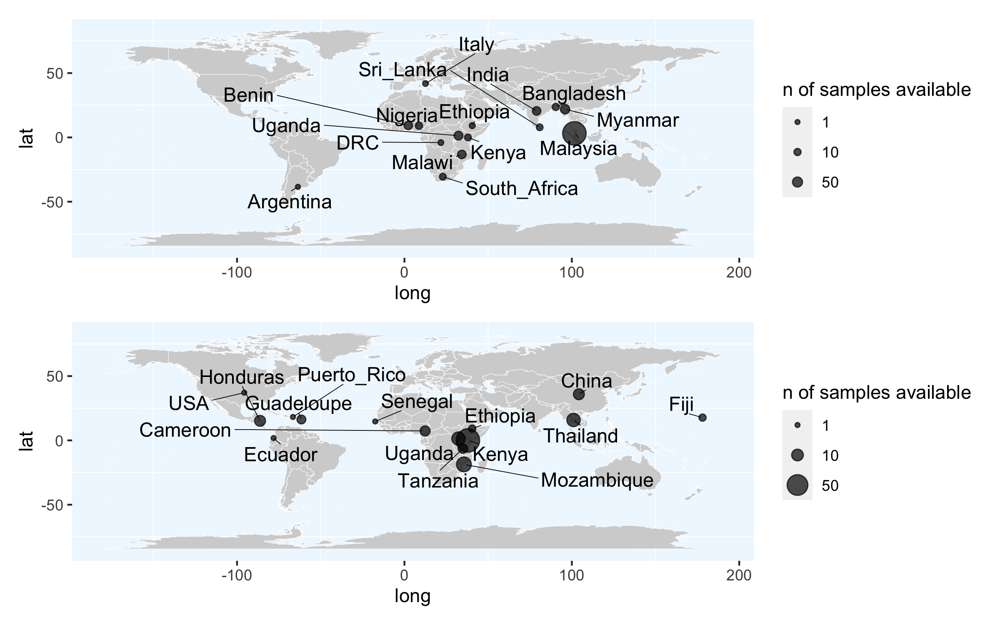

# Species-specific geomaps with sample size 
Author: Marina Papaiakovou, mpapaiakovou[at]gmail.com 

## Contents: 
- R code to create species-specific geomaps 
- Main figure 1 (panels a&b)
- Further beautifications done in Illustrator 

``` {r  warning = FALSE,message = FALSE}
#Making world geomaps for worm and egg data separately for the Fig1 of paper 
library(ggrepel)
library(readxl)
library(patchwork)
library(tidyverse)
#worldmaps with original sample sizes 

real_country <- read_excel("~/Documents/00.Cambridge_PhD/02.Science/02.Genome_skimming/05.Geomapping/real_country.xlsx")
#View(real_country)
#library(readxl)
#https://stackoverflow.com/questions/15624656/label-points-in-geom-point

longitudes_latitudes <- real_country

colnames(longitudes_latitudes) <- c('country', 'latitude', 'longitude', 'number_samples' ,'data_type')
world <- map_data("world")
#world

faecal_data <- longitudes_latitudes %>%
  filter(data_type =="faecal")

worm_egg_data <- longitudes_latitudes %>%
  filter(data_type =='worm_egg')

```

```{r Genome_skimming_countries_FAECAL_WORM_MAP_FROM_ORIGINAL_SAMPLE_SIZES, fig.path='./00_FIGURES/'}

png(filename = "00_FIGURES/Genome_skimming_countries_FAECAL_WORM_MAP_FROM_ORIGINAL_SAMPLE_SIZES.png", height = 5, width = 8, units = "in", res = 300)


faecal_plot <- ggplot() +
  geom_map(
    data = world, map = world,
    aes(long, lat, map_id = region), inherit.aes = FALSE,
    color = "white", fill = "lightgray", size = 0.1)+
  scale_size_continuous("n of samples available", 
                        breaks = c(1, 10, 50))+ #this works
  geom_point(
    data = faecal_data,
    aes(longitude, latitude, size = number_samples),
    alpha = 0.7
  ) +
  #theme_void() +
  #theme(legend.position = "none")+
  geom_text_repel(data = faecal_data, mapping = aes (x=longitude, y = latitude, label = country), size = 4, 
                  min.segment.length = 0, segment.angle = 90,  hjust = "outward", force = 5, force_pull = 1, segment.size  = 0.2, max.overlaps = 10,  
                   segment.color = "black", direction  = "both")+
  theme(panel.grid.major = element_line(color = gray(.5),
                                        linetype = "blank", 
                                        size = 0.5), 
        panel.background = element_rect(fill = "aliceblue")) 
 # facet_grid(~data_type)
#labs(title = "Sample selection for helminth characterisation") 

#for worm/egg data
worm_egg_plot <- ggplot() +
  geom_map(
    data = world, map = world,
    aes(long, lat, map_id = region), inherit.aes = FALSE,
    color = "white", fill = "lightgray", size = 0.1)+
  scale_size_continuous("n of samples available", 
                        breaks = c(1, 10, 50))+ #this works
  geom_point(
    data = worm_egg_data,
    aes(longitude, latitude, size = number_samples),
    alpha = 0.7
  ) +
  #theme_void() +
  #theme(legend.position = "none")+
  geom_text_repel(data = worm_egg_data, mapping = aes (x=longitude, y = latitude, label = country), size = 4, 
                  min.segment.length = 0, segment.angle = 90,  hjust = "outward", force = 5, force_pull = 1, segment.size  = 0.2, max.overlaps = 10,  
                  segment.color = "black", direction  = "both")+
  theme(panel.grid.major = element_line(color = gray(.5),
                                        linetype = "blank", 
                                        size = 0.5), 
        panel.background = element_rect(fill = "aliceblue")) 
# facet_grid(~data_type)


#CALL THEM TOGETHER 
ALL <- faecal_plot | worm_egg_plot 
print(ALL)
#ggsave("Genome_skimming_countries_FAECAL_WORM_MAP_FROM_ORIGINAL_SAMPLE_SIZES.pdf", useDingbats = FALSE, width = 8, height = 5, units = "in")


```



