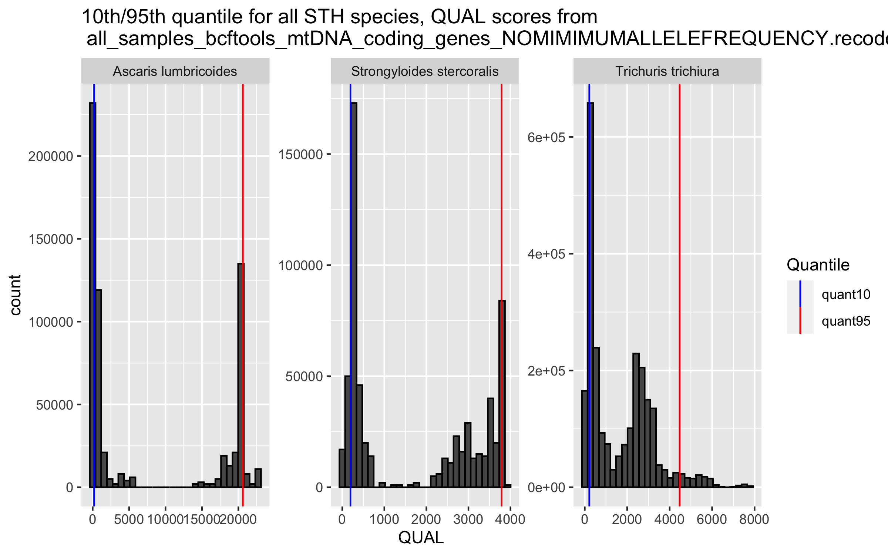

# Mitochondrial genome variant calling 
Author: Marina Papaiakovou, mpapaiakovou[at]gmail.com 

## Contents: 
- Bash code for variant calling 
- R code or QUAL filtering (10th quantile)
- R code for assessing missingness if filtering for high quality or not filtering at all 
- Filtering not included in the paper
- Further beautifications done in Illustrator 

 
```bash
bcftools mpileup  --annotate FORMAT/AD -Ov -f human_mito_ref.fasta -d 100000 -b bamlist_for_variant_call | bcftools call --ploidy 1 -mv --skip-variants indels -o all_samples_bcftools.vcf 
#-O output
# -v - variants only 
# -b, giving you a list of bams 
# -mv, multiallelic as opposed to -c (consensus)
# -d max depth 100000, I think for some samples 250 is very low  - let's see if the vcf will pull it off - https://github.com/samtools/samtools/issues/619
#took about 7 hours to finish 

vcftools --vcf all_samples_bcftools.vcf --min-alleles 2 --max-alleles 2 --recode --recode-INFO-all --out all_samples_bcftools_NOMINIMUMALLELEFREQ

#filtering here for keeping variants within mitochondrial genes
vcftools --vcf all_samples_bcftools_NOMINIMUMALLELEFREQ.recode.vcf --bed mtDNA_coding_genes_all_helminths_formatted.bed --recode --recode-INFO-all --out all_samples_bcftools_mtDNA_coding_genes_NOMIMIMUMALLELEFREQUENCY

```

```{r warning = FALSE}
setwd("/Users/marinapapaiakovou/Documents/00.Cambridge_PhD/02.Science/02.Genome_skimming/07.Global_genome_skim_2023/02_DATA/02_TRIMMED_DATA/04_VARIANT_CALLING/01_MITOGENOME_VARS/")

library(vcfR)
library(tidyverse)
library(VariantAnnotation)
library(stringr)

all_mito_SNPs_bcftools <- read.vcfR ("all_samples_bcftools_mtDNA_coding_genes_NOMIMIMUMALLELEFREQUENCY.recode.vcf")

all_mito_SNPs_bcftools_df <- vcfR2tidy(all_mito_SNPs_bcftools, single_frame = TRUE, toss_INFO_column = TRUE, alleles =TRUE)

all_mito_SNPs_bcftools_df_2 <- all_mito_SNPs_bcftools_df$dat

#will need to plot the QUALITY SCORES pper species
all_mito_SNPs_bcftools_df_3 <- all_mito_SNPs_bcftools_df_2 %>%
  dplyr::select(CHROM, POS, QUAL, REF, ALT,  DP4, Indiv)

all_mito_SNPs_bcftools_df_3$CHROM[all_mito_SNPs_bcftools_df_3$CHROM == 'AP017684_Enterobius_vermicularis_mitochondrial_DNA_complete'] <- 'Enterobius vermicularis'
all_mito_SNPs_bcftools_df_3$CHROM[all_mito_SNPs_bcftools_df_3$CHROM == 'NC_002545_Schistosoma_mansoni_mitochondrion_complete_genome'] <- 'Schistosoma mansoni'
all_mito_SNPs_bcftools_df_3$CHROM[all_mito_SNPs_bcftools_df_3$CHROM == 'NC_003415_Ancylostoma_duodenale_mitochondrion_complete_genome'] <- 'Ancylostoma duodenale'
all_mito_SNPs_bcftools_df_3$CHROM[all_mito_SNPs_bcftools_df_3$CHROM == 'NC_003416_Necator_americanus_mitochondrion_complete_genome'] <- 'Necator americanus'
all_mito_SNPs_bcftools_df_3$CHROM[all_mito_SNPs_bcftools_df_3$CHROM == 'NC_004022_Taenia_solium_mitochondrion_complete_genome'] <- 'Taenia solium'
all_mito_SNPs_bcftools_df_3$CHROM[all_mito_SNPs_bcftools_df_3$CHROM == 'NC_007934_Anisakis_simplex_mitochondrion_complete_genome'] <- 'Anisakis simplex'
all_mito_SNPs_bcftools_df_3$CHROM[all_mito_SNPs_bcftools_df_3$CHROM == 'NC_016198_Ascaris_lumbricoides_mitochondrion_complete_genome'] <- 'Ascaris lumbricoides'
all_mito_SNPs_bcftools_df_3$CHROM[all_mito_SNPs_bcftools_df_3$CHROM == 'NC_017750_Trichuris_trichiura_mitochondrion_complete_genome'] <- 'Trichuris trichiura'
all_mito_SNPs_bcftools_df_3$CHROM[all_mito_SNPs_bcftools_df_3$CHROM == 'NC_028624_Strongyloides_stercoralis_isolate_PV001_mitochondrion'] <- 'Strongyloides stercoralis'
all_mito_SNPs_bcftools_df_3$CHROM[all_mito_SNPs_bcftools_df_3$CHROM == 'NC_035142_Ancylostoma_ceylanicum_mitochondrion_complete_genome'] <- 'Ancylostoma ceylanicum'
all_mito_SNPs_bcftools_df_3$CHROM[all_mito_SNPs_bcftools_df_3$CHROM == 'NC_044548_Echinococcus_granulosus_mitochondrion_complete_genome'] <- 'Echinococcus granulosus'

#will calculate quantiles now, to plot the quality distributions
#but first will filter based on the species I am interested in. 
target <- c("Ascaris lumbricoides",  "Trichuris trichiura",  "Strongyloides stercoralis")
all_mito_SNPs_bcftools_df_3_filtered <- filter(all_mito_SNPs_bcftools_df_3, CHROM %in% target)

#I want to add a column for when the samples come from faecal metagenomes or egg/worms

all_mito_SNPs_bcftools_df_3_filtered2 <- all_mito_SNPs_bcftools_df_3_filtered %>% mutate(data_type = ifelse(grepl("BEN|BGD|ARG|ETH003|ETH_|IND|KEN00|LKA|ITA|MMR|MWI|NGA|ZAF|COD|MYS|UGA0|UGA_BLANK", Indiv), 'faecal_metagenome', 'worm_eggs'))
#comment it out 

#set the quantile breaks
q <- c(0.05, 0.1, 0.25, 0.5, 0.75, 0.95)

#calculate the quantiles, for these 5 species 
d2 <- all_mito_SNPs_bcftools_df_3_filtered2 %>%
  group_by(CHROM) %>%
  summarize(quant5 = quantile(QUAL, probs = q[1]), 
            quant10 =quantile(QUAL, probs = q[2]),
            quant25 = quantile(QUAL, probs = q[3]), 
            quant50 = quantile(QUAL, probs = q[4]),
            quant75 = quantile(QUAL, probs = q[5]),
            quant95 = quantile(QUAL, probs = q[6]))


```

- kept only *Ascaris*, *Trichuris* and *Necator*; Did not get more positives for *Schistosoma* (other than the published) and only two countries for *Strongyloides*

```{r QUALITY_PLOTS ,fig.path='./00_FIGURES/'}
png(filename = "00_FIGURES/QUALITY_PLOTS.png", height = 5, width = 8, units = "in", res = 300)

QUALITY_PLOTS <- ggplot(all_mito_SNPs_bcftools_df_3_filtered, aes (x = QUAL)) +
  geom_histogram(color = 'black') +
  #geom_density(alpha=.3) +
  geom_vline(data = d2, aes(xintercept = quant10, color="quant10")) +
  geom_vline(data = d2, aes(xintercept = quant95, color ="quant95"))+
  scale_color_manual("Quantile", values = c(quant10 = "blue", quant95 = "red"), labels= c("quant10","quant95"))+
  facet_wrap(CHROM~.,scales="free")+
  ggtitle("10th/95th quantile for all STH species, QUAL scores from  \n all_samples_bcftools_mtDNA_coding_genes_NOMIMIMUMALLELEFREQUENCY.recode.vcf")

print(QUALITY_PLOTS)
  #ggsave("./00_FIGURES/FiguerXX_Quantile_quality_plots_bcftools_species_only_SNPs_NOMINIMUMALLELEFREQUENCY_1#0_95_Quantile.pdf", width=170, height=100, units="mm")

dev.off()
```

