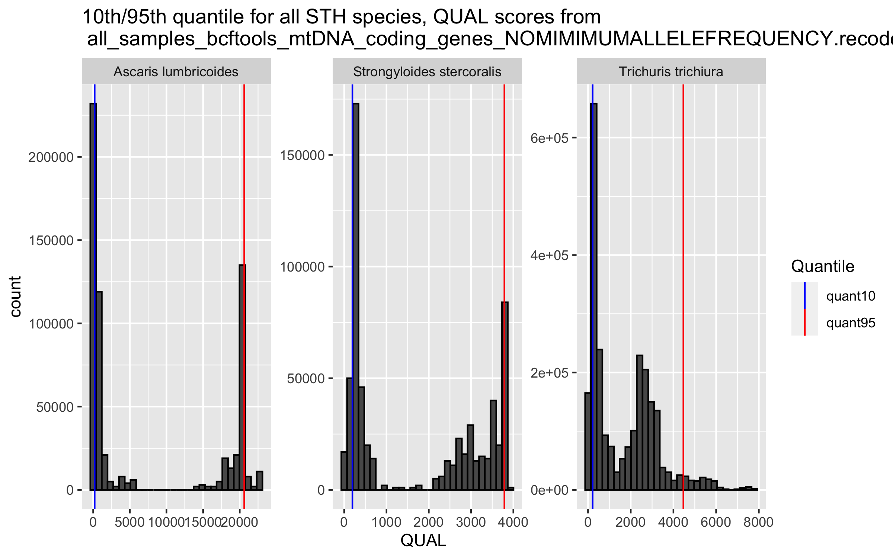

# Mitochondrial genome variant calling 
Author: Marina Papaiakovou, mpapaiakovou[at]gmail.com 

## Contents: 
- Bash code for variant calling 
- R code or QUAL filtering (10th quantile)
- R code for assessing missingness if filtering for high quality or not filtering at all 
- Filtering not included in the paper
- Further beautifications done in Illustrator 

 
```bash
bcftools mpileup  --annotate FORMAT/AD -Ov -f human_mito_ref.fasta -d 100000 -b bamlist_for_variant_call | bcftools call --ploidy 1 -mv --skip-variants indels -o all_samples_bcftools.vcf 
#-O output
# -v - variants only 
# -b, giving you a list of bams 
# -mv, multiallelic as opposed to -c (consensus)
# -d max depth 100000, I think for some samples 250 is very low  - let's see if the vcf will pull it off - https://github.com/samtools/samtools/issues/619
#took about 7 hours to finish 

vcftools --vcf all_samples_bcftools.vcf --min-alleles 2 --max-alleles 2 --recode --recode-INFO-all --out all_samples_bcftools_NOMINIMUMALLELEFREQ

#filtering here for keeping variants within mitochondrial genes
vcftools --vcf all_samples_bcftools_NOMINIMUMALLELEFREQ.recode.vcf --bed mtDNA_coding_genes_all_helminths_formatted.bed --recode --recode-INFO-all --out all_samples_bcftools_mtDNA_coding_genes_NOMIMIMUMALLELEFREQUENCY

```

```{r warning = FALSE}
setwd("/Users/marinapapaiakovou/Documents/00.Cambridge_PhD/02.Science/02.Genome_skimming/07.Global_genome_skim_2023/02_DATA/02_TRIMMED_DATA/04_VARIANT_CALLING/01_MITOGENOME_VARS/")

library(vcfR)
library(tidyverse)
library(VariantAnnotation)
library(stringr)

all_mito_SNPs_bcftools <- read.vcfR ("all_samples_bcftools_mtDNA_coding_genes_NOMIMIMUMALLELEFREQUENCY.recode.vcf")

all_mito_SNPs_bcftools_df <- vcfR2tidy(all_mito_SNPs_bcftools, single_frame = TRUE, toss_INFO_column = TRUE, alleles =TRUE)

all_mito_SNPs_bcftools_df_2 <- all_mito_SNPs_bcftools_df$dat

#will need to plot the QUALITY SCORES pper species
all_mito_SNPs_bcftools_df_3 <- all_mito_SNPs_bcftools_df_2 %>%
  dplyr::select(CHROM, POS, QUAL, REF, ALT,  DP4, Indiv)

all_mito_SNPs_bcftools_df_3$CHROM[all_mito_SNPs_bcftools_df_3$CHROM == 'AP017684_Enterobius_vermicularis_mitochondrial_DNA_complete'] <- 'Enterobius vermicularis'
all_mito_SNPs_bcftools_df_3$CHROM[all_mito_SNPs_bcftools_df_3$CHROM == 'NC_002545_Schistosoma_mansoni_mitochondrion_complete_genome'] <- 'Schistosoma mansoni'
all_mito_SNPs_bcftools_df_3$CHROM[all_mito_SNPs_bcftools_df_3$CHROM == 'NC_003415_Ancylostoma_duodenale_mitochondrion_complete_genome'] <- 'Ancylostoma duodenale'
all_mito_SNPs_bcftools_df_3$CHROM[all_mito_SNPs_bcftools_df_3$CHROM == 'NC_003416_Necator_americanus_mitochondrion_complete_genome'] <- 'Necator americanus'
all_mito_SNPs_bcftools_df_3$CHROM[all_mito_SNPs_bcftools_df_3$CHROM == 'NC_004022_Taenia_solium_mitochondrion_complete_genome'] <- 'Taenia solium'
all_mito_SNPs_bcftools_df_3$CHROM[all_mito_SNPs_bcftools_df_3$CHROM == 'NC_007934_Anisakis_simplex_mitochondrion_complete_genome'] <- 'Anisakis simplex'
all_mito_SNPs_bcftools_df_3$CHROM[all_mito_SNPs_bcftools_df_3$CHROM == 'NC_016198_Ascaris_lumbricoides_mitochondrion_complete_genome'] <- 'Ascaris lumbricoides'
all_mito_SNPs_bcftools_df_3$CHROM[all_mito_SNPs_bcftools_df_3$CHROM == 'NC_017750_Trichuris_trichiura_mitochondrion_complete_genome'] <- 'Trichuris trichiura'
all_mito_SNPs_bcftools_df_3$CHROM[all_mito_SNPs_bcftools_df_3$CHROM == 'NC_028624_Strongyloides_stercoralis_isolate_PV001_mitochondrion'] <- 'Strongyloides stercoralis'
all_mito_SNPs_bcftools_df_3$CHROM[all_mito_SNPs_bcftools_df_3$CHROM == 'NC_035142_Ancylostoma_ceylanicum_mitochondrion_complete_genome'] <- 'Ancylostoma ceylanicum'
all_mito_SNPs_bcftools_df_3$CHROM[all_mito_SNPs_bcftools_df_3$CHROM == 'NC_044548_Echinococcus_granulosus_mitochondrion_complete_genome'] <- 'Echinococcus granulosus'

#will calculate quantiles now, to plot the quality distributions
#but first will filter based on the species I am interested in. 
target <- c("Ascaris lumbricoides",  "Trichuris trichiura",  "Strongyloides stercoralis")
all_mito_SNPs_bcftools_df_3_filtered <- filter(all_mito_SNPs_bcftools_df_3, CHROM %in% target)

#I want to add a column for when the samples come from faecal metagenomes or egg/worms

all_mito_SNPs_bcftools_df_3_filtered2 <- all_mito_SNPs_bcftools_df_3_filtered %>% mutate(data_type = ifelse(grepl("BEN|BGD|ARG|ETH003|ETH_|IND|KEN00|LKA|ITA|MMR|MWI|NGA|ZAF|COD|MYS|UGA0|UGA_BLANK", Indiv), 'faecal_metagenome', 'worm_eggs'))
#comment it out 

#set the quantile breaks
q <- c(0.05, 0.1, 0.25, 0.5, 0.75, 0.95)

#calculate the quantiles, for these 5 species 
d2 <- all_mito_SNPs_bcftools_df_3_filtered2 %>%
  group_by(CHROM) %>%
  summarize(quant5 = quantile(QUAL, probs = q[1]), 
            quant10 =quantile(QUAL, probs = q[2]),
            quant25 = quantile(QUAL, probs = q[3]), 
            quant50 = quantile(QUAL, probs = q[4]),
            quant75 = quantile(QUAL, probs = q[5]),
            quant95 = quantile(QUAL, probs = q[6]))


```

- kept only *Ascaris*, *Trichuris* and *Necator*; Did not get more positives for *Schistosoma* (other than the published) and only two countries for *Strongyloides*

```{r QUALITY_PLOTS ,fig.path='./00_FIGURES/'}
png(filename = "00_FIGURES/QUALITY_PLOTS.png", height = 5, width = 8, units = "in", res = 300)

QUALITY_PLOTS <- ggplot(all_mito_SNPs_bcftools_df_3_filtered, aes (x = QUAL)) +
  geom_histogram(color = 'black') +
  #geom_density(alpha=.3) +
  geom_vline(data = d2, aes(xintercept = quant10, color="quant10")) +
  geom_vline(data = d2, aes(xintercept = quant95, color ="quant95"))+
  scale_color_manual("Quantile", values = c(quant10 = "blue", quant95 = "red"), labels= c("quant10","quant95"))+
  facet_wrap(CHROM~.,scales="free")+
  ggtitle("10th/95th quantile for all STH species, QUAL scores from  \n all_samples_bcftools_mtDNA_coding_genes_NOMIMIMUMALLELEFREQUENCY.recode.vcf")

print(QUALITY_PLOTS)
  #ggsave("./00_FIGURES/FiguerXX_Quantile_quality_plots_bcftools_species_only_SNPs_NOMINIMUMALLELEFREQUENCY_1#0_95_Quantile.pdf", width=170, height=100, units="mm")

dev.off()
```


``` {r warning = FALSE}

#filter the original file for QUAL=10th quantile for each species 
#to generate the positions list to filter the original VCF

#ASCARIS LUMBRICOIDES ----
#select species, POS, QUAL, sample_id
qual_pos_filter <- all_mito_SNPs_bcftools_df_3_filtered %>%
  dplyr::select(1,2,3,7)

#Ascaris filtering, low quality  ----
ALUM_low_quality <- qual_pos_filter %>%
  filter(CHROM == "Ascaris lumbricoides") %>% #species == was not working, needed %in% 
  filter(QUAL < 199.7466) 
ALUM_low_quality_uniq <- ALUM_low_quality %>%
  distinct(POS)  #commenting it out, so it does not generate the tables again 
  #group_walk(~ write.table(.x, paste0(.y, "_ALUM_low_quality_uniq.csv"), row.names=FALSE, col.names=FALSE, quote=FALSE)) #save independent csv per species for that condition
#62 SNPs... 

#Ascaris filtering, high quality -----
ALUM_high_quality <- qual_pos_filter %>%
  filter(CHROM == "Ascaris lumbricoides") %>% #species == was not working, needed %in% 
  filter(QUAL >= 199.7466) #same SNPs even if I was filtering for 199.7466 

ALUM_high_quality_uniq <- ALUM_high_quality %>%
  distinct(POS)
  #group_walk(~ write.table(.x, paste0(.y, "_ALUM_high_quality_uniq.csv"), row.names=FALSE, col.names=FALSE, quote=FALSE)) #save independent csv per species for that condition
#558 SNPs

#TRICHURIS TRICHIURA ----
#Here I filtered based on QUANTILES, 10th quantile 
TT_low_quality <- qual_pos_filter %>%
  filter(CHROM == "Trichuris trichiura") %>% #species == was not working, needed %in% 
  filter(QUAL < 214.6310) 
TT_low_quality_uniq <- TT_low_quality %>%
  distinct(POS)
  #group_walk(~ write.table(.x, paste0(.y, "_TT_low_quality_uniq.csv"), row.names=FALSE, col.names=FALSE, quote=FALSE)) #save independent csv per species for that condition
#243 SNPs

#Trichuris filtering, high quality ----
TT_high_quality <- qual_pos_filter %>%
  filter(CHROM == "Trichuris trichiura") %>% #species == was not working, needed %in% 
  filter(QUAL >= 214.6310) 

TT_high_quality_uniq <- TT_high_quality %>%
  distinct(POS) 
 # group_walk(~ write.table(.x, paste0(.y, "_TT_high_quality_uniq.csv"), row.names=FALSE, col.names=FALSE, quote=FALSE)) #save independent csv per species for that condition
#2195 SNPs.  


#Necator filtering, high quality ----
NA_high_quality <- qual_pos_filter %>%
  filter(CHROM == "Necator americanus") %>% #species == was not working, needed %in% 
  filter(QUAL >= 228.1380) #also changed it to be exactly the 10th quantile 

NA_high_quality_uniq <- NA_high_quality %>%
  distinct(POS)
# group_walk(~ write.table(.x, paste0(.y, "_NA_high_quality_uniq.csv"), row.names=FALSE, col.names=FALSE, quote=FALSE)) #save independent csv per species for that condition
#331 SNPs

#Necator filtering, low quality ----
NA_low_quality <- qual_pos_filter %>%
  filter(CHROM == "Necator americanus") %>% #species == was not working, needed %in% 
  filter(QUAL < 228.1380) 
NA_low_quality_uniq <- NA_low_quality %>%
  distinct(POS) 
#  group_walk(~ write.table(.x, paste0(.y, "_NA_low_quality_uniq.csv"), row.names=FALSE, col.names=FALSE, quote=FALSE)) #save independent csv per species for that condition
#33 SNPs

```

```bash
#remember, in order to use the positions as 'keep' file lists you need to add the CHROM before the positions: 
awk '{gsub(/ /,"\t",$0); print "NC_016198_Ascaris_lumbricoides_mitochondrion_complete_genome" , $0}' ALUM_highqual >  ALUM_highqual_CHROM
#the above will do it 
awk '{gsub(/ /,"\t",$0); print "NC_003416_Necator_americanus_mitochondrion_complete_genome" , $0}' NA_highqual >  NA_highqual_CHROM
awk '{gsub(/ /,"\t",$0); print "NC_017750_Trichuris_trichiura_mitochondrion_complete_genome" , $0}' TT_highqual >  TT_highqual_CHROM
```
- before I filter for QUAL I wanted to assess the missingness 

```bash
#!/bin/bash
#this script applies different thresholds to assess how many  SNPs are shared across which samples
#for example:
#--max-missing of 0.7 means, return SNPs present in at least 70% of samples
# Define the list of conditions
conditions=("0.7" "0.8" "0.9" "1")

# Loop through each condition
for i in "${conditions[@]}"; do
# Loop through each VCF file with the specified extension
for vcf_file in *only_SNPs.recode.vcf; do
# Extract the file name without extension
file_name=$(basename "$vcf_file" .vcf)
# Run vcftools with the current condition and file name
vcftools --vcf "$vcf_file" --max-missing "$i" --out "${file_name}_max_missing_${i}"
done
done

```

``` {r warning = FALSE}


library(tidyverse)
directory <- "/Users/marinapapaiakovou/Documents/00.Cambridge_PhD/02.Science/02.Genome_skimming/07.Global_genome_skim_2023/02_DATA/02_TRIMMED_DATA/04_VARIANT_CALLING/01_MITOGENOME_VARS/03_MISSINGNESS_DATA_SPECIES_CONDITIONAL_VCFs/03_COMPARE_MISSINGNESS_5X_NOFILTER_HIGH_QUAL_NOMAXMISSINGNESS"

# Use list.files to get a list of .imiss files in the directory
imiss_file_list <- list.files(directory, pattern = "*.imiss", full.names = TRUE)

# Create an empty data frame to store the results
result_df <- data.frame()

# Define a function to map species based on prefixes
map_species <- function(filename) {
  prefix <- sub("_.*", "", basename(filename))  # Get the first part of the filename before the first underscore
  
  # Map prefixes to species
  species <- switch(
    tolower(prefix),
    "schisto" = "Schistosoma_mansoni",
    "strongy" = "Strongyloides_stercoralis",
    "alum" = "Ascaris_lumbricoides",
    "tt" = "Trichuris_trichiura",
    "na" = "Necator_americanus",
    NA  # Default to NA if no match
  )
  
  return(species)
}

# Loop through each file
for (i in 1:length(imiss_file_list)) {
  # Read the file content as a table
  df <- read.table(imiss_file_list[i], header = TRUE, sep = "\t")
  
  # Extract the 'condition' from the filename
  condition <- sub(".*_(NOFILTER|HIGHQUAL)_n500.*", "\\1", basename(imiss_file_list[i]))
  
  # Map species based on prefixes in the filename
  species <- map_species(imiss_file_list[i])
  
  # Add 'condition' and 'species' columns to the data frame
  df$condition <- condition
  df$species <- species
  
  # Combine the data frame with the overall result data frame
  result_df <- rbind(result_df, df)
}

# Print the resulting data frame
#print(result_df)

```

```{r MISSINGNESS_PLOT, fig.path='./00_FIGURES/'}
png(filename = "00_FIGURES/MISSINGNESS_PLOTS.png", height = 5, width = 8, units = "in", res = 300)

#plotting
MISSINGNESS_PLOTS <- ggplot(result_df, aes(x = condition, y = 1- F_MISS, color = condition)) +
  geom_boxplot(outlier.colour="black", outlier.shape=16,
               outlier.size=2, notch=FALSE)+
  geom_point(position=position_jitter(w=0.5), alpha=0.5, stroke=0.3)+
  labs(x = "Condition", y = "1- F_MISS", color = "conditions") +
  theme(axis.text.x = element_text(angle = 45, vjust = 1, hjust=1)) +
  facet_wrap(.~species, scales = "free_y")+
  ggtitle("Missingness frequency per condition, per species \n -COMPARE HIGH_QUAL - NOFILTER 5X")

print(MISSINGNESS_PLOTS)
dev.off()
```


- realised that I do not lose many variants by selecting the HIGH QUAL filter (10th quantile)
- So I will use the position files I created earlier and will filter the VCFs
- you feed the HIGH QUAL positions (after adding the CHROM to the left) to vcftools so you can create the new vcfs for missingness etc.
- NOTE: I have already filtered the VCFs for the individuals that have > 500 reads (total)
- below how I created the VCFs with HIGH_QUAL

```bash 
vcftools --vcf ALUM_bcftools_mtDNA_NOFILTER_n500_FORMAT_AD.removeddups.recode.vcf --positions ALUM_highqual_CHROM --recode --recode-INFO-all --out ALUM_bcftools_mtDNA_HIGHQUAL_n500_FORMAT_AD_removeddups
#After filtering, kept 558 out of a possible 620 Sites
vcftools --vcf NA_bcftools_mtDNA_NOFILTER_n500_FORMAT_AD.removeddups.recode.vcf --positions NA_highqual_CHROM --recode --recode-INFO-all --out NA_bcftools_mtDNA_HIGHQUAL_n500_FORMAT_AD_removeddups
#After filtering, kept 331 out of a possible 364 Sites
vcftools --vcf TT_bcftools_mtDNA_NOFILTER_n500_FORMAT_AD.removeddups.recode.vcf --positions TT_highqual_CHROM --recode --recode-INFO-all --out TT_bcftools_mtDNA_HIGHQUAL_n500_FORMAT_AD_removeddups
#After filtering, kept 2215 out of a possible 2438 Sites

```

- After checking the missingness data, filtering by '0.7' is a good balance between individuals and positions 
- You can run
```bash
vcftools --vcf ALUM_bcftools_mtDNA_HIGHQUAL_n500_FORMAT_AD_removedduplicatevariants.recode.vcf --max-missing 
#will give you a list of individuals with all missingness - and then you can run 
awk -F'\t' '($5 < 0.3)' your_file.txt | sort -k5,5 #to get a list of the individuals that meet the criteria and use it as 'keeplist' to filter your VCF
```
