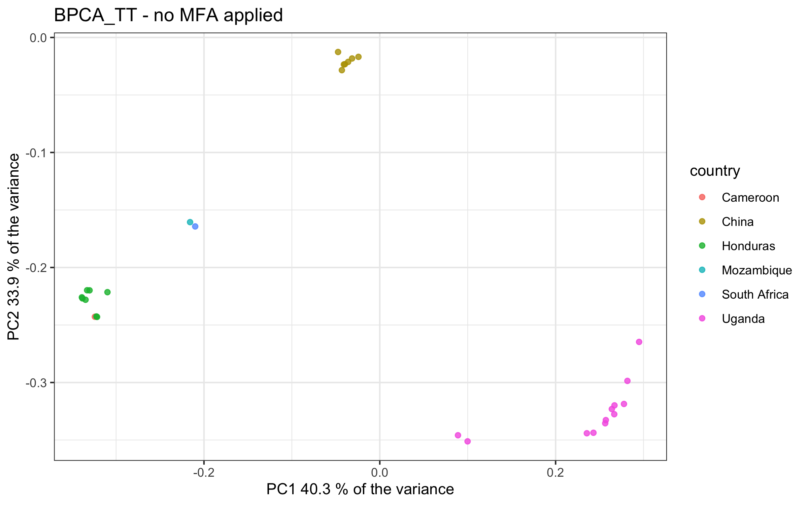

# Bayesian Principal Component Analysis 
Author: Marina Papaiakovou, mpapaiakovou[at]gmail.com 

## Contents: 
- R code for BPCA plotting 
- R code for colouring BPCA plots by coverage and changing size by missingness to rule out any biases
- Manuscript Supplementary Figures: XXXXX 
- Further beautifications done in Illustrator 

``` {r warning = FALSE}
library(tidyverse)
library(pcaMethods)

setwd("/Users/marinapapaiakovou/Documents/00.Cambridge_PhD/02.Science/02.Genome_skimming/07.Global_genome_skim_2023/02_DATA/02_TRIMMED_DATA/04_VARIANT_CALLING/01_MITOGENOME_VARS/05_FORMAT_AD_DATASETS_POST_MAX_MISSING_BOTH_HIGHQUAL_NO_FILTER/")

process_text_file <- function(file_path) {
  filename <- basename(file_path)
  # Read the text file
  df <- read.table(file_path, sep = '\t', header = TRUE)
  df$FilterType <- ifelse(grepl("NOFILTER", filename), "NOFILTER", 
                          ifelse(grepl("HIGHQUAL", filename), "HIGHQUAL", "UNKNOWN"))
  
#  df$chrom <- ifelse(grepl("ALUM", filename), "NC_016198_Ascaris_lumbricoides_mitochondrion_complete_genome", 
  #                   ifelse(grepl("TT", filename), "NC_017750_Trichuris_trichiura_mitochondrion_complete_genome",
 #                           ifelse(grepl("STRONGY", filename), "NC_028624_Strongyloides_stercoralis_isolate_PV001_mitochondrion",
 #                                  "NC_002545_Schistosoma_mansoni_mitochondrion_complete_genome")))
  df_1 <- df %>%
    dplyr::select(CHROM, POS, FilterType, everything()) 
  
  # Perform data cleaning and calculations
  df_out <- pivot_longer(df_1, cols = 4:ncol(df),
                         names_to = "sample.id",
                         values_to = "allele_depth")
  df_out_2 <- separate(data = df_out, col = allele_depth, into = c("REF_depth", "ALT_depth"), sep = ",")
  df_out_2[, 5:6] <- lapply(df_out_2[, 5:6], as.numeric)
  df_out_3 <- mutate(df_out_2, SUM_DEPTH = rowSums(df_out_2[, 5:6], na.rm = TRUE))
  df_out_4 <- df_out_3 %>% group_by(CHROM) %>% mutate(allele_frequency = ALT_depth / SUM_DEPTH)
  
  # Return the resulting dataframe
  return(df_out_4)
}

# List of text file paths - I am recalling the datasets here so I can rename them and put them on the global env 
ALL_FILES <- list.files(pattern = ".AD.FORMAT", path = ".", full.names = TRUE)

# Iterate over the list of text files, process each file, and create individual dataframes in the global environment
for (file_path in ALL_FILES) {
  file_name <- tools::file_path_sans_ext(basename(file_path))  # Get the filename without extension
  df <- process_text_file(file_path) 
  df_name_with_extension <- paste0(file_name, "_W_VAR_FREQUENCY")# Process the text file and get the dataframe
  assign(df_name_with_extension, df)  # Create a dataframe in the global environment with the filename as the variable name
}

#For PCA analysis using NA values, I will use BPCA method: 
#and will highlight in the plot the points that were missing some of the sites to see if there are any patterns. 
#If not, then no harm. If there is, then we will need to figure out what is going on. 

#Will try to identify all the files from the global env based on patterns and then will put them on a list 
VAR_FREQUENCY_PATTERN <-grep("FORMAT_AD.AD_W_VAR_FREQUENCY",names(.GlobalEnv),value=TRUE)
VAR_FREQUENCY_PATTERN_LIST<-do.call("list",mget(VAR_FREQUENCY_PATTERN))

TRANSFORM_FOR_ALL <- lapply(VAR_FREQUENCY_PATTERN_LIST, function(df) {
  data1 <- df[, c(2, 4, 8)]#  columns you want to select
  # data2 <- na.omit(data1) #remove NAs
  data2 <- data1 %>% tidyr::pivot_wider(names_from = sample.id, values_from = allele_frequency, values_fn = list) %>% tidyr::unnest() 
  data3 <- data2 %>% dplyr::select(!POS) %>% as.data.frame()
  data4 <- data3 %>% mutate_all(~ifelse(is.nan(.), NA, .))
})

# Define the country map
country_map <- c(
  "BEN" = "Benin","CMR" = "Cameroon","TZA" = "Tanzania","ETH" = "Ethiopia","UGA" = "Uganda","IND" = "India","MWI" = "Malawi","MMR" = "Myanmar", "HND" ="Honduras",   "NGA" = "Nigeria","ARG" = "Argentina","BGD" = "Bangladesh","CHN" = "China","ECU" = "Ecuador","GLP" = "Guadeloupe","FJI" = "Fiji","LKA" = "Sri Lanka",
  "MOZ" = "Mozambique","ITA" = "Italy","PR1" = "Puerto Rico","COD" = "DRC","SEN" = "Senegal","THA" = "Thailand","USA" = "U.S.A","ZAF" = "South Africa","MYS" = "Malaysia", 
  "KEN" = "Kenya")

#This function will run BPCA for all datasets in your list and will add country details
PCA_FOR_ALL <- function(data4) {
  data4_bpca <- pca(data4, method="bpca", nPcs=2)
  return (data4_bpca)
}

# Apply the create_pca_plots function to each processed dataset
bpca_results <- lapply(TRANSFORM_FOR_ALL, PCA_FOR_ALL) #this list has for every dataset: loadings, R2 etc 

#For PCA analysis using NA values, I will use BPCA method: 
#and will highlight in the plot the points that were missing some of the sites to see if there are any patterns. 
#If not, then no harm. If there is, then we will need to figure out what is going on. 

#I now have a list of the PCA results (which is what I need to access the loadings/R2 from each dataset)
TRANSFORM_PCA_DATASETS <- function(bpca_results) {
  pcamethods_bpca_dim1_dim2 <- as.data.frame(bpca_results@loadings)
  pcamethods_bpca_dim1_dim2_sample.id <- tibble::rownames_to_column(pcamethods_bpca_dim1_dim2, "sample.id")
  pcamethods_bpca_dim1_dim2_sample.id_country <- pcamethods_bpca_dim1_dim2_sample.id %>%
   mutate(country = country_map[substr(sample.id, 1, 3)])
  return(pcamethods_bpca_dim1_dim2_sample.id_country)
}

#apply to all datasets now
PROCESSED_PCA_OBJ <- lapply(bpca_results, TRANSFORM_PCA_DATASETS) #ok this works now. 
BPCA_TT <- PROCESSED_PCA_OBJ[[1]]
BPCA_ALUM_KOR  <- PROCESSED_PCA_OBJ[[3]]

```

- *Ascaris* BPCA plot, without any filter on allele frequency 

``` {r BPCA_ALUM_KOR, fig.path='./00_FIGURES/'}

png(filename = "00_FIGURES/BPCA_ALUM_KOR.png", height = 5, width = 8, units = "in", res = 300)

BPCA_ALUM_KOR_PLOT <- ggplot(BPCA_ALUM_KOR, aes(PC1, PC2, color = country)) +
  geom_point( alpha = 0.8) +
  #scale_shape_manual(values = c("Selected" = 4, "Not Selected" = 16), guide=FALSE) +  # Customize shapes
  scale_size_manual(values=c(4,2)) +
  xlab(paste("PC1", round(bpca_results[[3]]@R2[1] * 100, 1), "% of the variance")) +
  ylab(paste("PC2", round(bpca_results[[3]]@R2[2] * 100, 1), "% of the variance")) +
  ggtitle("ALUM_KOR_BPCA - no MFA applied")+
  theme_bw()

print(BPCA_ALUM_KOR_PLOT)
dev.off()
  
```

- *Trichuris* BPCA plot, without any filter on allele frequency 
``` {r BPCA_TT,fig.path='./00_FIGURES/'}

png(filename = "00_FIGURES/BPCA_TT.png", height = 5, width = 8, units = "in", res = 300)

BPCA_TT_PLOT <- ggplot(BPCA_TT, aes(PC1, PC2, color = country)) +
  geom_point( alpha = 0.8) +
  #scale_shape_manual(values = c("Selected" = 4, "Not Selected" = 16), guide=FALSE) +  # Customize shapes
  scale_size_manual(values=c(4,2)) +
  xlab(paste("PC1", round(bpca_results[[1]]@R2[1] * 100, 1), "% of the variance")) +
  ylab(paste("PC2", round(bpca_results[[1]]@R2[2] * 100, 1), "% of the variance")) +
  ggtitle("BPCA_TT - no MFA applied")+
  theme_bw()

print(BPCA_TT_PLOT)
dev.off()

```



### PLOTTING PC1/PC2 from BPCA, PER SPECIES 
-Colored by NORMALISED MAPPED READS
-Sized by missingness 

```{r warning = FALSE}
#I have a dataset I will import that includes the normalised reads per sample.id
#
sample.id_normalised_reads_mapped <- read.csv("/Users/marinapapaiakovou/Documents/00.Cambridge_PhD/02.Science/02.Genome_skimming/07.Global_genome_skim_2023/04_ANALYSIS/00_STATS_MAPPED/ALL_READS_MAPPED_matched_sample.id_normalised.csv")
#First turn it from long to wide 
sample.id_normalised_reads_mapped_w <- sample.id_normalised_reads_mapped %>%
  dplyr::select(1,4, 7, 10) %>% #select: species, sample_id, country, normalised reads
  pivot_wider (id_cols = c(sample_id, country),
               names_from = species,
               values_from = normalised)

#add "_trimmed" in the sample_id to match the PC1/PC2 components 
#sample.id_normalised_reads_mapped_w$sample_id <- paste(sample.id_normalised_reads_mapped_w$sample_id, "_trimmed", sep = "")

#rename the sample_id so it can match to the sample.id from PC1, PC2
colnames(sample.id_normalised_reads_mapped_w)[colnames(sample.id_normalised_reads_mapped_w) == "sample_id"] <- "sample.id"

#drop a column named NA
sample.id_normalised_reads_mapped_w <- sample.id_normalised_reads_mapped_w %>%
  dplyr::select(-'NA') 

#convert it to long
sample.id_normalised_reads_mapped_l <- sample.id_normalised_reads_mapped_w %>%
  pivot_longer(
    cols = -c(sample.id, country),
    names_to = "chrom",
    values_to = "normalised"
  )


#21 Oct 2023
#Need to now plot missingness along with normalised reads mapped per species
#File name that has individuals and missingness when filtered for 0.7 max missingness (HIGHUAL/5X)
#"merged_imiss_HIGHQUAL_0.7_max_missingness_2.txt" #this was wrong, because I need to have a CHROM column as I have more than one sample that has reads and missingness for > 1 cHROM

#remember from the combined.imiss file to edit the header and remove the samples (TT) that were positive for Ascaris
merged_imiss_files <- read.table("/Users/marinapapaiakovou/Documents/00.Cambridge_PhD/02.Science/02.Genome_skimming/07.Global_genome_skim_2023/02_DATA/02_TRIMMED_DATA/04_VARIANT_CALLING/01_MITOGENOME_VARS/06_FINAL_VCFs_SPECIES_BOTH_HIGHQUAL_NOFILTER_5X_MAX_MISSING_0.7/MAX_MISSINGNESS_imiss_FILES_ALL_SPECIES_5X/combined_imiss.imiss", header=T) #NEED TO GENERATE AGAIN WITH CHROM COLUMN
#will replace the INDV with sample.id so i can match the datasets
colnames(merged_imiss_files) <- c("sample.id", "N_DATA", "N_GENOTYPES_FILTERED", "N_MISS", "F_MISS", "chrom")


#change the name of the chromosomes 
merged_imiss_files$chrom <- ifelse(merged_imiss_files$chrom == "ALUM", "NC_016198_Ascaris_lumbricoides_mitochondrion_complete_genome", merged_imiss_files$chrom)
merged_imiss_files$chrom <- ifelse(merged_imiss_files$chrom == "SCHISTO", "NC_002545_Schistosoma_mansoni_mitochondrion_complete_genome", merged_imiss_files$chrom)
merged_imiss_files$chrom <- ifelse(merged_imiss_files$chrom == "STRONGY", "NC_028624_Strongyloides_stercoralis_isolate_PV001_mitochondrion", merged_imiss_files$chrom)
merged_imiss_files$chrom <- ifelse(merged_imiss_files$chrom == "TT", "NC_017750_Trichuris_trichiura_mitochondrion_complete_genome", merged_imiss_files$chrom)
 

# Define the new file extension
new_extension <- "_BPCA_objects"

# Save each object with the new extension
for (object_name in names(PROCESSED_PCA_OBJ)) {
  object <- PROCESSED_PCA_OBJ[[object_name]]
  filename <- paste0(object_name, new_extension)
  write.csv(object, file = filename)
} #this works 


#I need to import them as a new list of objects
ALL_BPCA_FILES <- list.files(pattern = "_BPCA_objects", path = ".", full.names = TRUE)

for (file_path in ALL_BPCA_FILES) {
  file_name <- tools::file_path_sans_ext(basename(file_path)) 
  df <- read.csv(file_path, sep = ',', header = TRUE) # Get the filename without extension
  df$chrom <- ifelse(grepl("ALUM", file_name), "NC_016198_Ascaris_lumbricoides_mitochondrion_complete_genome", 
                                       ifelse(grepl("TT", file_name), "NC_017750_Trichuris_trichiura_mitochondrion_complete_genome",
                                               ifelse(grepl("STRONGY", file_name), "NC_028624_Strongyloides_stercoralis_isolate_PV001_mitochondrion",
                                                      "NC_002545_Schistosoma_mansoni_mitochondrion_complete_genome")))
  df_name_with_extension <- paste0(file_name, "_BPCA_FILES")# Process the text file and get the dataframe
  assign(df_name_with_extension, df)  # Create a dataframe in the global environment with the filename as the variable name
}
# IT WORKS !!!!!!!!!!

#create a new list
BPCA_PATTERN <-grep("_BPCA_objects",names(.GlobalEnv),value=TRUE)
BPCA_PATTERN_LIST<-do.call("list",mget(BPCA_PATTERN))

# Match the above list with the reads_mapped_dataset
PROCESSED_PCA_OBJ_MISS_NORMALISED_READS <- lapply(BPCA_PATTERN_LIST, function(df) {
  df %>%
    left_join(sample.id_normalised_reads_mapped_l, by = c("sample.id", "country", "chrom")) %>%
    left_join(merged_imiss_files, by = c("sample.id", "chrom"))
})

# Flatten the list of data frames into a single data frame
final_df <- bind_rows(PROCESSED_PCA_OBJ_MISS_NORMALISED_READS)

# Unnest any list columns in the data frame
final_df <- unnest(final_df)

extension_again <- "_matched_reads_missingness"

# Save the final data frame with the new extension
write.csv(final_df, file = paste0("combined", extension_again), row.names = FALSE)

#will try to plot this now, by group and see 
#custom_colors <- c("Yes" = "yellow2", "No" = "purple4")
# Define breaks for the color scale
color_breaks <- c(100, 1000, 10000, 1000000)

#July 11 2024
#REMOVE STRONGY HERE CAUSE WE WILL NOT BE INLCUDING IT ON THE PAPER 
final_df_ALUM_TT <- final_df %>%
  filter(chrom!="NC_028624_Strongyloides_stercoralis_isolate_PV001_mitochondrion")

```


- *Ascaris* and *Trichuris* BPCA plot, without any filter on allele frequency, coloured by normalised reads and sized by missingnes 

``` {r BPCA_w_gradient_normalised_reads_and_missingness_ALUM_TT,fig.path='./00_FIGURES/'}

png(filename = "00_FIGURES/BPCA_w_gradient_normalised_reads_and_missingness_ALUM_TT.png", height = 5, width = 8, units = "in", res = 300)

plot_cov_missingness <- ggplot(final_df_ALUM_TT, aes(x = PC1, y = PC2, group = chrom, color = normalised, size = F_MISS)) +
  geom_point(position=position_jitter(h = 0.005, w = 0.005), alpha = 0.8) +
  facet_wrap(~chrom, scales = "free", ncol=2) +
  scale_size_continuous(range = c(4, 10), breaks = c(0, 0.01, 0.1, 0.5, 1)) + 
  scale_colour_continuous(
    low = "purple4",
    high = "yellow2",
    breaks = color_breaks,
    trans = "log"
  ) +  
  labs(
    x = "PC1",
    y = "PC2",
    #title = "Combined Dataset Plot",
   # subtitle = "Grouped by Species, Colored by Normalised, Sized by F_MISS"
  ) +
  theme_bw()

print(plot_cov_missingness)
dev.off()

```

s
