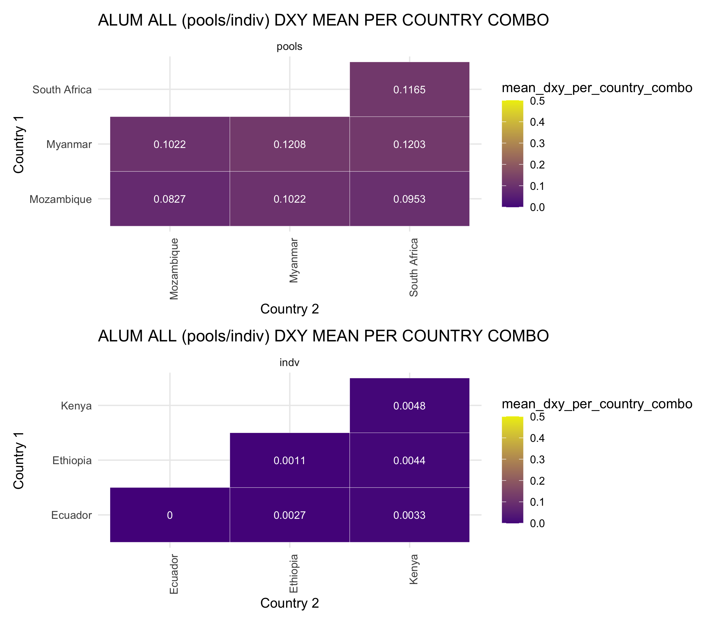
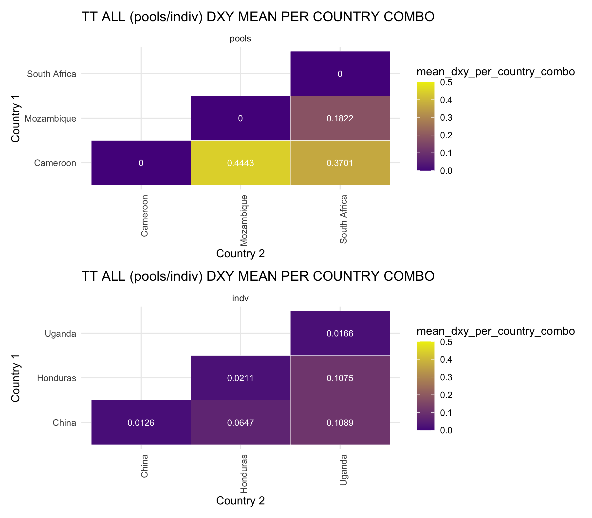

# Pairwise Dxy analysis for *Ascaris lum* and *Trichuris* 
Author: Marina Papaiakovou, mpapaiakovou[at]gmail.com 

## Contents: 
- R code for Dxy heatmaps for individual worms and pools of eggs (separately) using mitochondrial genomes
- Manuscript Supplementary Figures: XXXXX 
- Further beautifications done in Illustrator 

- Dxy for individuals was calculated with pixy 
```bash
conda create --name pixy2 python=3.8
conda activate pixy2 
conda install -c conda-forge pixy #worked 
bcftools mpileup  -f human_mito_ref.fasta -b bamlist_for_variant_call -d 100000 | bcftools call --ploidy 1 -m --skip-variants indels -Oz -f GQ -o all_bcftools_for_pixy.vcf.gz

#pixy needs a file that has ALL sites, not just the variant ones 

#Now need to filter for max alleles (only max!!)
vcftools --gzvcf all_bcftools_for_pixy.vcf.gz --max-alleles 2 --recode --recode-INFO-all --out all_bcftools_for_pixy_NOMINIMUMALLELEFREQ
#After filtering, kept 73645 out of a possible 73817 Sites
#output: all_bcftools_for_pixy_NOMINIMUMALLELEFREQ.recode.vcf
 #You cannot filter for min alleles to be 2 because it only has only allele if it's invariant !!!!
bgzip all_bcftools_for_pixy_NOMINIMUMALLELEFREQ.recode.vcf

#USED VCFTOOLS TO SPLIT PER CHROMOSOME THE PIXY VCF 
#AND THEN USED THE SPECIES SPECIFIC VCFs for pixy 
#NEED TO FILTER HERE FOR BED FILES BECAUSE IF I ADD THE BED FILE IN THE PIXY STAGE THEN IT CALCULATES PIXY STATS PER BED WINDOW #also have files as 'keeplists' to keep only the individuals 
vcftools --gzvcf all_bcftools_for_pixy_NOMINIMUMALLELEFREQ.recode.vcf.gz --chr NC_016198_Ascaris_lumbricoides_mitochondrion_complete_genome --keep ALUM_indvs --bed ALUM_mtDNA_genes.bed2 --recode --recode-INFO-all --out ALUM_bcftools_for_pixy_NOMINIMUMALLELEFREQ_mtDNA_genes_invds
#After filtering, kept 71 out of 1000 Individuals
#After filtering, kept 11925 out of a possible 73645 Sites
bgzip 
tabix 

vcftools --gzvcf all_bcftools_for_pixy_NOMINIMUMALLELEFREQ.recode.vcf.gz --chr NC_017750_Trichuris_trichiura_mitochondrion_complete_genome --keep TT_indvs --bed TT_mtDNA_genes.bed2 --recode --recode-INFO-all --out  TT_bcftools_for_pixy_NOMINIMUMALLELEFREQ_mtDNA_genes_invds
#After filtering, kept 28 out of 1000 Individuals
#After filtering, kept 12278 out of a possible 73645 Sites
bgzip 
tabix


#Note if helpful
#I had an issue with the bed file, so did this: 
cat ALUM_mtDNA_genes.bed | awk '{print $1,$2,$3}' OFS="\t"  > ALUM_mtDNA_genes.bed2

#running pixy
#Used hudson here too, because I also used hudson for the pi diversity
#Need a population file that you make manually 
#sample id and population (= country)
pixy --stats pi fst dxy --vcf ALUM_bcftools_for_pixy_NOMINIMUMALLELEFREQ_mtDNA_genes_invds.recode.vcf.gz --chromosomes 'NC_016198_Ascaris_lumbricoides_mitochondrion_complete_genome' --populations ALUM_INDV.pops --window_size 20000  --n_cores 4 --bypass_invariant_check 'yes' --fst_type 'hudson'  --output_prefix ALUM_indvs_pixy_output_hudson

pixy --stats pi fst dxy --vcf TT_bcftools_for_pixy_NOMINIMUMALLELEFREQ_mtDNA_genes_invds.recode.vcf.gz --chromosomes 'NC_017750_Trichuris_trichiura_mitochondrion_complete_genome' --populations TT_INDVs.pops --window_size 20000  --n_cores 4 --bypass_invariant_check 'yes' --fst_type 'hudson'  --output_prefix TT_indvs_pixy_output_hudson 


```
- Dxy for pools was calculated with Grenedalf

```bash
#used the bam files, so they have not been filtered 
#output looks like this
#chrom	snps	sample_1	sample_2	avg_dxy	country_1	country_2	sample_type
#NC_016198_Ascaris_lumbricoides_mitochondrion_complete_genome	511	MMR002_trimmed	MMR007_trimmed	0.192123	Myanmar	Myanmar	pools
#NC_016198_Ascaris_lumbricoides_mitochondrion_complete_genome	511	MMR002_trimmed	MMR013_trimmed	0.182155	Myanmar	Myanmar	pools

/home/marip3/apps/grenedalf/bin/grenedalf fst --write-pi-tables --sam-path . --filter-sample-min-count 2 --filter-sample-min-coverage 1 --filter-region-list ALUM_bcftools_mtDNA_HIGHQUAL_n500_FORMAT_AD_removeddups.recode_MAX_MISS_0.7_pools.kept.sites --window-type chromosomes --pool-sizes 1000 --method unbiased-hudson --file-prefix ALUM_pi_table_hudson_

/home/marip3/apps/grenedalf/bin/grenedalf fst --write-pi-tables --sam-path . --filter-sample-min-count 2 --filter-sample-min-coverage 1 --filter-region-list  TT_bcftools_mtDNA_HIGHQUAL_n500_FORMAT_AD_removeddups.recode_MAX_MISS_0.7_pools.kept.sites --window-type chromosomes --pool-sizes 1000 --method unbiased-hudson --file-prefix TT_pi_table_hudson_

#it outputs 3 tables, you need the 'between' table and then concatenate everything

```

``` {r warning = FALSE}
library(ggrepel)
library(ggbeeswarm)
library(tidyverse)
library(readxl)
library(patchwork)
setwd("/Users/marinapapaiakovou/Documents/00.Cambridge_PhD/02.Science/02.Genome_skimming/07.Global_genome_skim_2023/02_DATA/02_TRIMMED_DATA/04_VARIANT_CALLING/01_MITOGENOME_VARS/13_POPGEN_DATA_FOR_FIGURES/01_ALUM_KOREA_TT_DATA")


world_map <-map_data('world2', wrap=c(-30,330))
global_skim_countries <- world_map %>%
  filter(region == "Ethiopia" | region == "Cameroon" | region =="Myanmar" | region =="Mozambique" | region=="South Africa" |  region == "Kenya" | region == "Ecuador" | 
           region=="Mozambique" |  region=="South Africa" |  region=="Honduras" |  region=="China" |  region=="Uganda") %>%
  group_by(region) %>%
  mutate(mean_long = mean(long), mean_lat = mean(lat))

#rearrange the dataset global_skim_countries
global_skim_countries2 <- global_skim_countries %>%
  select(Country = region, mean_lat, mean_long) %>%
  unique()


#Need to add chromosome details here so I can use the entire dataframe as part of a function and not repeat the work for ASCARIS/TT twice
global_skim_countries3 <- bind_rows(
  global_skim_countries2 %>%
    filter(Country %in% c("Mozambique", "South Africa","Cameroon","Honduras" ,"China" ,"Uganda")) %>%
    mutate(chrom = "Trichuris trichiura"),
  global_skim_countries2 %>%
    filter(Country %in% c("Mozambique", "South Africa","Myanmar","Kenya" ,"Ecuador" ,"Ethiopia")) %>%
    mutate(chrom = "Ascaris lum - KOR")
)

DXY_HEATMAP <- function (dxy_data) {
  dxy_data <- read.table(dxy_data, sep = '\t', header =T)
  country_map <- c(
    "BEN" = "Benin","CMR" = "Cameroon","TZA" = "Tanzania","ETH" = "Ethiopia","UGA" = "Uganda","IND" = "India","MWI" = "Malawi","MMR" = "Myanmar", "HND" ="Honduras",   "NGA" = "Nigeria","ARG" = "Argentina","BGD" = "Bangladesh","CHN" = "China","ECU" = "Ecuador","GLP" = "Guadeloupe","FJI" = "Fiji","LKA" = "Sri Lanka",
    "MOZ" = "Mozambique","ITA" = "Italy","PR1" = "Puerto Rico","COD" = "DRC","SEN" = "Senegal","THA" = "Thailand","USA" = "U.S.A","ZAF" = "South Africa","MYS" = "Malaysia", 
    "KEN" = "Kenya")
  dxy_data_country <- dxy_data %>%
    mutate(country_1 = country_map[substr(sample_1, 1, 3)])
  dxy_data_country <- dxy_data_country %>%
    mutate(country_2 = country_map[substr(sample_2, 1, 3)])
  
  
  dxy_data_country$chrom[dxy_data_country$chrom =='NC_016198_Ascaris_lumbricoides_mitochondrion_complete_genome'] <- 'Ascaris lum - KOR'
  dxy_data_country$chrom[dxy_data_country$chrom =='NC_017750_Trichuris_trichiura_mitochondrion_complete_genome'] <- 'Trichuris trichiura'
  
  colnames(global_skim_countries3) <-c("country", "latitude", "longitude", "chrom")
  dxy_data2 <- merge(dxy_data_country, global_skim_countries3, by.x = c("country_1", "chrom"), by.y = c("country", "chrom"), all.x = TRUE)
  
  # Rename columns for country_1
 colnames(dxy_data2)[colnames(dxy_data2) %in% c("longitude", "latitude")] <- c("LONG_1", "LAT_1")
 # Merge for country_2 (LONG_2 and LAT_2)
 dxy_data2 <- merge(dxy_data2, global_skim_countries3, by.x = c("country_2", "chrom"), by.y = c("country", "chrom"), all.x = TRUE)
 colnames(dxy_data2)[colnames(dxy_data2) %in% c("longitude", "latitude")] <- c("LONG_2", "LAT_2")
 # Rename the columns
 dxy_data2_long_lat <- dxy_data2 %>%
   rename(LONG_1 = LAT_1, LAT_1 = LONG_1, LONG_2 = LAT_2, LAT_2 = LONG_2) #if you are stuck and you think this does not work, then restart R and reload the packages
# ##
# I don't think the below are needed'
# # Merge the longitude and latitude values for country_1
# dxy_data2_long_lat <- left_join(dxy_data2_long_lat, global_skim_countries3, by = c("country_1" = "country", "chrom" = "chrom"))
# # Merge the longitude and latitude values for country_2
# dxy_data2_long_lat <- left_join(dxy_data2_long_lat, global_skim_countries3, by = c("country_2" = "country", "chrom" = "chrom"))
 
 summarised_dxy_all <- dxy_data2_long_lat %>%
   select(LONG_1, LONG_2, LAT_1, LAT_2, avg_dxy, sample_type, country_1, country_2, chrom) %>%
      group_by(country_1, country_2, sample_type) %>%
      mutate(mean_dxy_per_country_combo = mean(avg_dxy)) %>%
    select(LONG_1, LONG_2, LAT_1, LAT_2, sample_type, country_1, country_2, chrom, mean_dxy_per_country_combo) %>%
    unique()
} 

#call the function
ALUM_DXY_HEATMAP <- DXY_HEATMAP("ALUM_DXY_KOR_REF_ALL_POOLS_INDV.txt")
TT_DXY_HEATMAP <- DXY_HEATMAP("TT_DXY_ALL.txt")

ALUM_DXY_between_countries <- ALUM_DXY_HEATMAP %>%
  select(5,6,7,8,9)

ALUM_DXY_simplified<- ALUM_DXY_between_countries %>%
  select(1,2,3,5)

ALUM_DXY_simplified_pools <- ALUM_DXY_simplified %>%
  filter(sample_type =="pools") %>%
  select(2,3,4)

ALUM_DXY_simplified_indv <- ALUM_DXY_simplified %>%
  filter(sample_type =="indv") %>%
  select(2,3,4)

#adding Ecuador as '0' since I only had one sample, so I will grey it out on illustrator
Ecuador <- data.frame(sample_type = "indv", country_1 = "Ecuador", country_2 = "Ecuador", mean_dxy_per_country_combo = 0)
ALUM_DXY_simplified_indv <- rbind(ALUM_DXY_simplified_indv, Ecuador) #this will do it

#tile of myanmar ends up in the wrong place (so the heatmap is not symmetrical, so need to fix that somehow)
Moz_Myan <- data.frame(sample_type = "pools", country_1 = "Mozambique", country_2 = "Myanmar", mean_dxy_per_country_combo =0.10217601  )
ALUM_DXY_simplified_pools <- rbind(ALUM_DXY_simplified_pools, Moz_Myan) #this will do it
#SORT OF WORKS, WILL DELETE THE DUPLICATE

ALUM_ALL_unique_countries_1_pools <- ALUM_DXY_simplified_pools  %>%
  distinct(country_1) %>%
  pull()

ALUM_ALL_unique_countries_2_pools <- ALUM_DXY_simplified_pools %>%
  distinct(country_2) %>%
  pull()

ALUM_ALL_unique_countries_1_indv <- ALUM_DXY_simplified_indv  %>%
  distinct(country_1) %>%
  pull()

ALUM_ALL_unique_countries_2_indv <- ALUM_DXY_simplified_indv %>%
  distinct(country_2) %>%
  pull()

ALUM_ALL_unique_countries_pools <- union(ALUM_ALL_unique_countries_1_pools, ALUM_ALL_unique_countries_2_pools)
ALUM_ALL_unique_countries_indv <- union(ALUM_ALL_unique_countries_1_indv, ALUM_ALL_unique_countries_2_indv)

```

*Ascaris lumbricoides* Dxy heatmaps 


``` {r ALUM_ALL_DXY_POOLS_INDIVIDUALS, fig.path='./00_FIGURES/'}

png(filename = "00_FIGURES/ALUM_ALL_DXY_POOLS_INDIVIDUALS.png", height = 7, width = 8, units = "in", res = 300)

ALUM_ALL_DXY_POOLS_PLOT <- ggplot(ALUM_DXY_simplified_pools, aes(x = factor(country_2, levels = ALUM_ALL_unique_countries_pools), y = factor(country_1, levels = ALUM_ALL_unique_countries_pools), fill = mean_dxy_per_country_combo, label = round(mean_dxy_per_country_combo, 4))) +
  geom_tile(color = "white") +
  geom_text(color = "white", size = 3) + 
  scale_fill_continuous(
    low = "purple4",
    high = "yellow2", limits = c(0, 0.5),
  ) + 
  theme_minimal() +
  # coord_fixed() +
  labs(title = "ALUM ALL (pools/indiv) DXY MEAN PER COUNTRY COMBO",
       x = "Country 2",
       y = "Country 1")+
  facet_grid(~sample_type) +
  theme(axis.text.x = element_text(angle = 90, vjust = 1, hjust=1))

#print(ALUM_ALL_DXY_POOLS_PLOT)
#dev.off()

ALUM_ALL_DXY_INDV_PLOT <- ggplot(ALUM_DXY_simplified_indv, aes(x = factor(country_2, levels = ALUM_ALL_unique_countries_indv), y = factor(country_1, levels = ALUM_ALL_unique_countries_indv), fill = mean_dxy_per_country_combo, label = round(mean_dxy_per_country_combo, 4))) +
  geom_tile(color = "white") +
  geom_text(color = "white", size = 3) + 
  scale_fill_continuous(
    low = "purple4",
    high = "yellow2", limits = c(0, 0.5), 
  ) + 
  theme_minimal() +
  # coord_fixed() +
  labs(title = "ALUM ALL (pools/indiv) DXY MEAN PER COUNTRY COMBO",
       x = "Country 2",
       y = "Country 1")+
  facet_grid(~sample_type) +
  theme(axis.text.x = element_text(angle = 90, vjust = 1, hjust=1))
#
#ALUM_ALL_DXY_INDV +ALUM_ALL_DXY_POOLS

ALUM_BOTH <- ALUM_ALL_DXY_POOLS_PLOT / ALUM_ALL_DXY_INDV_PLOT

print(ALUM_BOTH)
dev.off()
```

*Trichuris trichiura* Dxy heatmaps 

```{r warning=FALSE}
TT_DXY_between_countries <- TT_DXY_HEATMAP %>%
  select(5,6,7,8,9)

TT_DXY_simplified<- TT_DXY_between_countries %>%
  select(1,2,3,5)


TT_DXY_simplified_pools <- TT_DXY_simplified %>%
  filter(sample_type =="pools") %>%
  select(2,3,4)

Mozambique <- data.frame(sample_type = "pools", country_1 = "Mozambique", country_2 = "Mozambique", mean_dxy_per_country_combo = 0)
South_Africa <- data.frame(sample_type = "pools", country_1 = "South Africa", country_2 = "South Africa", mean_dxy_per_country_combo = 0)
Cameroon <- data.frame(sample_type = "pools", country_1 = "Cameroon", country_2 = "Cameroon", mean_dxy_per_country_combo = 0)
# Use rbind() to append the new rows to the original dataset
TT_DXY_simplified_pools <- rbind(TT_DXY_simplified_pools, Mozambique, South_Africa, Cameroon) #this will do it


TT_DXY_simplified_indv <- TT_DXY_simplified %>%
  filter(sample_type =="indv") %>%
  select(2,3,4)


TT_ALL_unique_countries_1_pools <- TT_DXY_simplified_pools  %>%
  distinct(country_1) %>%
  pull()

TT_ALL_unique_countries_2_pools <- TT_DXY_simplified_pools %>%
  distinct(country_2) %>%
  pull()

TT_ALL_unique_countries_1_indv <- TT_DXY_simplified_indv  %>%
  distinct(country_1) %>%
  pull()

TT_ALL_unique_countries_2_indv <- TT_DXY_simplified_indv %>%
  distinct(country_2) %>%
  pull()

TT_ALL_unique_countries_pools <- union(TT_ALL_unique_countries_1_pools, TT_ALL_unique_countries_2_pools)
TT_ALL_unique_countries_indv <- union(TT_ALL_unique_countries_1_indv, TT_ALL_unique_countries_2_indv)


```

``` {r TT_ALL_DXY_POOLS_INDIVIDUALS, fig.path='./00_FIGURES/'}

png(filename = "00_FIGURES/TT_ALL_DXY_POOLS_INDIVIDUALS.png", height = 7, width = 8, units = "in", res = 300)

TT_ALL_DXY_POOLS_PLOT <- ggplot(TT_DXY_simplified_pools, aes(x = factor(country_2, levels = TT_ALL_unique_countries_pools), y = factor(country_1, levels = TT_ALL_unique_countries_pools), fill = mean_dxy_per_country_combo, label = round(mean_dxy_per_country_combo, 4))) +
  geom_tile(color = "white") +
  geom_text(color = "white", size = 3) + 
  scale_fill_continuous(
    low = "purple4",
    high = "yellow2", limits = c(0, 0.5)
  ) + 
  theme_minimal() +
  # coord_fixed() +
  labs(title = "TT ALL (pools/indiv) DXY MEAN PER COUNTRY COMBO",
       x = "Country 2",
       y = "Country 1")+
  facet_grid(~sample_type) +
  theme(axis.text.x = element_text(angle = 90, vjust = 1, hjust=1))


TT_ALL_DXY_INDV_PLOT <- ggplot(TT_DXY_simplified_indv, aes(x = factor(country_2, levels = TT_ALL_unique_countries_indv), y = factor(country_1, levels = TT_ALL_unique_countries_indv), fill = mean_dxy_per_country_combo, label = round(mean_dxy_per_country_combo, 4))) +
  geom_tile(color = "white") +
  geom_text(color = "white", size = 3) + 
  scale_fill_continuous(
    low = "purple4",
    high = "yellow2", limits = c(0, 0.5)
  ) + 
  theme_minimal() +
  # coord_fixed() +
  labs(title = "TT ALL (pools/indiv) DXY MEAN PER COUNTRY COMBO",
       x = "Country 2",
       y = "Country 1")+
  facet_grid(~sample_type) +
  theme(axis.text.x = element_text(angle = 90, vjust = 1, hjust=1))


TT_BOTH <- TT_ALL_DXY_POOLS_PLOT / TT_ALL_DXY_INDV_PLOT
print(TT_BOTH)
dev.off()


```
