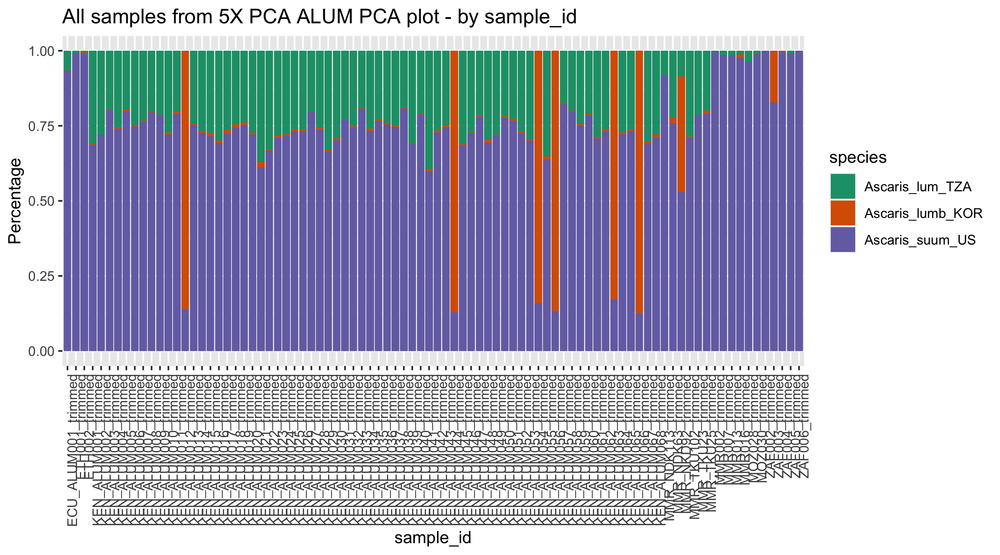
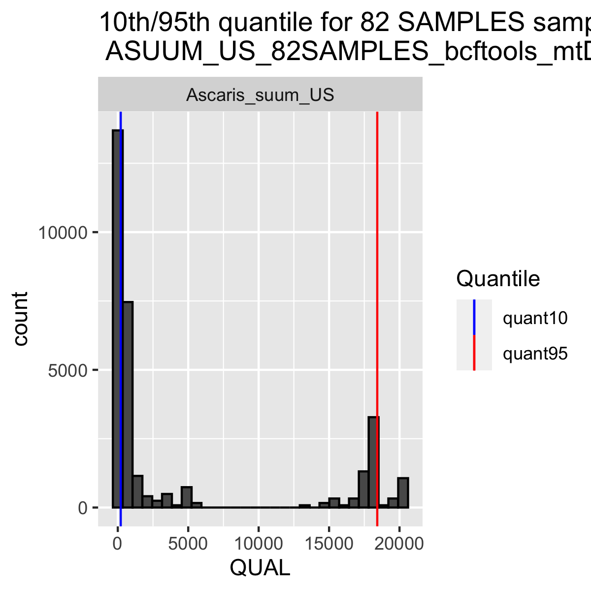

# Resolving genetic distance of *Ascaris*-positive samples in the cohort
Author: Marina Papaiakovou, mpapaiakovou[at]gmail.com 

## Contents: 
- R code for mapping of samples-positive for *Ascaris* to 3 *Ascaris* refs: 1 human from Tazania, 1 from pig (*Asuum*) and the original human (Korea)
- Resolved Dxy and PCA for for *A.suum* mapped samples
- Manuscript Supplementary and Main Figures: XXXXX 
- Further beautifications done in Illustrator 


- Samples positive for *Ascaris* (n=88) were mapped competitively to 3 refs according to: https://github.com/MarinaSci/Global_skim_analysis/blob/main/poo_worm_STH_global_skim_01_INDEX_MAPPING.md

```{r warning = FALSE}
library(tidyverse)
library(patchwork)
setwd("/Users/marinapapaiakovou/Documents/00.Cambridge_PhD/02.Science/02.Genome_skimming/07.Global_genome_skim_2023/02_DATA/02_TRIMMED_DATA/04_VARIANT_CALLING/01_MITOGENOME_VARS/OLD_TESTS_TO_BE_CLEANED/KENYAN_CLUSTERS_POP1POP2PO3_EXPLORING")

KOREA_US_TANZANIA_results <- read.table("ALL_PCA_5X_ALUM_SPECIES_SAMPLES_STATS.txt",  sep="\t", header=F )

#change col names 
colnames(KOREA_US_TANZANIA_results) <- c("species", "start", "end", "ECU_ALUM001_trimmed", "ETH001_trimmed", "ETH002_trimmed", "KEN_ALUM001_trimmed", "KEN_ALUM002_trimmed", "KEN_ALUM003_trimmed", "KEN_ALUM004_trimmed", "KEN_ALUM005_trimmed", "KEN_ALUM006_trimmed", "KEN_ALUM007_trimmed", "KEN_ALUM008_trimmed", "KEN_ALUM009_trimmed", "KEN_ALUM010_trimmed", "KEN_ALUM011_trimmed", "KEN_ALUM012_trimmed", "KEN_ALUM013_trimmed", "KEN_ALUM014_trimmed", "KEN_ALUM015_trimmed", "KEN_ALUM016_trimmed", "KEN_ALUM017_trimmed", "KEN_ALUM018_trimmed", "KEN_ALUM019_trimmed", "KEN_ALUM020_trimmed", "KEN_ALUM021_trimmed", "KEN_ALUM022_trimmed", "KEN_ALUM023_trimmed", "KEN_ALUM024_trimmed", "KEN_ALUM025_trimmed", "KEN_ALUM026_trimmed", "KEN_ALUM027_trimmed", "KEN_ALUM028_trimmed", "KEN_ALUM029_trimmed", "KEN_ALUM030_trimmed", "KEN_ALUM031_trimmed", "KEN_ALUM032_trimmed", "KEN_ALUM033_trimmed", "KEN_ALUM034_trimmed", "KEN_ALUM035_trimmed", "KEN_ALUM036_trimmed", "KEN_ALUM037_trimmed", "KEN_ALUM038_trimmed", "KEN_ALUM039_trimmed", "KEN_ALUM040_trimmed", "KEN_ALUM041_trimmed", "KEN_ALUM042_trimmed", "KEN_ALUM043_trimmed", "KEN_ALUM044_trimmed", "KEN_ALUM045_trimmed", "KEN_ALUM046_trimmed", "KEN_ALUM047_trimmed", "KEN_ALUM048_trimmed", "KEN_ALUM049_trimmed", "KEN_ALUM050_trimmed", "KEN_ALUM051_trimmed", "KEN_ALUM052_trimmed", "KEN_ALUM053_trimmed", "KEN_ALUM054_trimmed", "KEN_ALUM055_trimmed", "KEN_ALUM056_trimmed", "KEN_ALUM057_trimmed", "KEN_ALUM058_trimmed", "KEN_ALUM059_trimmed", "KEN_ALUM060_trimmed", "KEN_ALUM061_trimmed", "KEN_ALUM062_trimmed", "KEN_ALUM063_trimmed", "KEN_ALUM064_trimmed", "KEN_ALUM065_trimmed", "KEN_ALUM066_trimmed", "KEN_ALUM067_trimmed", "KEN_ALUM068_trimmed", "MMR002_trimmed", "MMR007_trimmed", "MMR013_trimmed", "MMR016_trimmed", "MMR026_trimmed", "MMR_NDK113_trimmed", "MMR_NDK63_trimmed", "MMR_NKD92_trimmed", "MMR_TKU102_trimmed", "MMR_TKU23_trimmed", "MMR_TKU25_trimmed",
                                         "MOZ028_trimmed", "MOZ030_trimmed", "ZAF002_trimmed", "ZAF003_trimmed", "ZAF004_trimmed", "ZAF005_trimmed", "ZAF006_trimmed")


KOREA_US_TANZANIA_results <- KOREA_US_TANZANIA_results %>%
  dplyr::select(-MMR026_trimmed) #removed here the MOZ028, because it does not survive the filtering for quality and missingness
#-MOZ028_trimmed if you want to remove MOZ028 too.  But in the original 88 samples MOZ was in. 


#convert to long format 
KOREA_US_TANZANIA_results_l <- pivot_longer(KOREA_US_TANZANIA_results, names_to = "sample_id", values_to = "raw_read_counts", cols=4:ncol(KOREA_US_TANZANIA_results))


# load data containing the total number of raw reads per sample
reads_n <- read.table("read_counts_for_all_samples_in_5X_ALUM_PCA_trimmed.txt", header=T, sep="\t")

# merged the dataframes
KOREA_US_TANZANIA_results_l <- full_join(KOREA_US_TANZANIA_results_l, reads_n, by="sample_id")
KOREA_US_TANZANIA_results_l <- na.omit(KOREA_US_TANZANIA_results_l)

# normalise the data
KOREA_US_TANZANIA_results_l2 <- KOREA_US_TANZANIA_results_l %>% mutate(normalised = (raw_read_counts) / (raw_reads_n / 1000000) / (end / 1e6))

KOREA_US_TANZANIA_results_l2$species[KOREA_US_TANZANIA_results_l2$species == 'NC_016198_Ascaris_lumbricoides_mitochondrion_genome_Korea'] <- "Ascaris_lumb_KOR"
KOREA_US_TANZANIA_results_l2$species[KOREA_US_TANZANIA_results_l2$species == 'NC_001327_Ascaris_suum_mitochondrion_genome_USA'] <- "Ascaris_suum_US"
KOREA_US_TANZANIA_results_l2$species[KOREA_US_TANZANIA_results_l2$species == 'KY045802_Ascaris_lumbricoides_isolate_G17_mitochondrion_genome_Tanzania'] <- "Ascaris_lum_TZA"

country_map <- c("BEN" = "Benin","CMR" = "Cameroon", "TZA" = "Tanzania","ETH" = "Ethiopia","UGA" = "Uganda", "IND" = "India",
                 "MWI" = "Malawi","MMR" = "Myanmar","NGA" = "Nigeria","ARG" = "Argentina", "BGD" = "Bangladesh","CHN" = "China",
                 "ECU" = "Ecuador", "GLP" = "Guadeloupe","FJI" = "Fiji","LKA" = "Sri Lanka","MOZ" = "Mozambique", "ITA" = "Italy",
                 "PR" = "Puerto Rico","COD" = "DRC","SEN" = "Senegal","THA" = "Thailand","USA" = "U.S.A","ZAF" = "South Africa",
                 "MYS" = "Malaysia", "KEN" ="Kenya")

#adding the country 
KOREA_US_TANZANIA_results_l3 <- KOREA_US_TANZANIA_results_l2 %>%
  mutate(country = country_map[substr(sample_id, 1, 3)]) #YAAAAAAS THAT WORKS !!!!!


# Calculate percentages for each species within a population
KOREA_US_TANZANIA_results_l4 <- KOREA_US_TANZANIA_results_l3 %>%
  group_by(country) %>%
  mutate(total_read_counts = sum(normalised),
         percentage = normalised / total_read_counts)

```

``` {r ALL_SAMPLES_PCA_ALUM_5X_bycountry_no_MMR026, fig.path='./00_FIGURES/'}

png(filename = "00_FIGURES/ALL_SAMPLES_PCA_ALUM_5X_bycountry_no_MMR026.png", height = 5, width = 9, units = "in", res = 300)

ggplot(KOREA_US_TANZANIA_results_l4, aes(sample_id, percentage, fill = species)) +
  geom_bar(stat = "identity", position = "fill", show.legend = TRUE) +
  scale_fill_brewer(palette = "Dark2") +
  theme(axis.text.x = element_text(angle = 90, vjust = 1, hjust = 1)) +
  labs(y = "Percentage")+
  ggtitle("All samples from 5X PCA ALUM PCA plot - by sample_id")

#note: later with all the variant filtering from samples mapping to A.suum best, MOZ028 was dropped too. 
dev.off()
```



### The competitive mapping showed that 82/88 samples map best to Ascaris summ sefrence and not the KOR/TZA. So I mapped again those 82 samples to the *Ascaris suum * reference as explained previously and:
- showing how the 88 samples map to the 3 different references
- called variants again 
- assessed QUAL
- regenerated BPCA plot 
- assessed if missingness/coverage affects the clustering
- ran new pairwise Dxy comparisons 

- original BPCA plot, colored by 3 different references

### PC1/PC2 components COLORED BY PERCENTAGE MAPPED TO ASCARIS REFERENCES
- running previous code to get the BPCA components
```{r warning = FALSE}
library(tidyverse)
library(pcaMethods)

setwd("/Users/marinapapaiakovou/Documents/00.Cambridge_PhD/02.Science/02.Genome_skimming/07.Global_genome_skim_2023/02_DATA/02_TRIMMED_DATA/04_VARIANT_CALLING/01_MITOGENOME_VARS/05_FORMAT_AD_DATASETS_POST_MAX_MISSING_BOTH_HIGHQUAL_NO_FILTER/")

process_text_file <- function(file_path) {
  filename <- basename(file_path)
  # Read the text file
  df <- read.table(file_path, sep = '\t', header = TRUE)
  df$FilterType <- ifelse(grepl("NOFILTER", filename), "NOFILTER", 
                          ifelse(grepl("HIGHQUAL", filename), "HIGHQUAL", "UNKNOWN"))
  
#  df$chrom <- ifelse(grepl("ALUM", filename), "NC_016198_Ascaris_lumbricoides_mitochondrion_complete_genome", 
  #                   ifelse(grepl("TT", filename), "NC_017750_Trichuris_trichiura_mitochondrion_complete_genome",
 #                           ifelse(grepl("STRONGY", filename), "NC_028624_Strongyloides_stercoralis_isolate_PV001_mitochondrion",
 #                                  "NC_002545_Schistosoma_mansoni_mitochondrion_complete_genome")))
  df_1 <- df %>%
    dplyr::select(CHROM, POS, FilterType, everything()) 
  
  # Perform data cleaning and calculations
  df_out <- pivot_longer(df_1, cols = 4:ncol(df),
                         names_to = "sample.id",
                         values_to = "allele_depth")
  df_out_2 <- separate(data = df_out, col = allele_depth, into = c("REF_depth", "ALT_depth"), sep = ",")
  df_out_2[, 5:6] <- lapply(df_out_2[, 5:6], as.numeric)
  df_out_3 <- mutate(df_out_2, SUM_DEPTH = rowSums(df_out_2[, 5:6], na.rm = TRUE))
  df_out_4 <- df_out_3 %>% group_by(CHROM) %>% mutate(allele_frequency = ALT_depth / SUM_DEPTH)
  
  # Return the resulting dataframe
  return(df_out_4)
}

# List of text file paths - I am recalling the datasets here so I can rename them and put them on the global env 
ALL_FILES <- list.files(pattern = ".AD.FORMAT", path = ".", full.names = TRUE)

# Iterate over the list of text files, process each file, and create individual dataframes in the global environment
for (file_path in ALL_FILES) {
  file_name <- tools::file_path_sans_ext(basename(file_path))  # Get the filename without extension
  df <- process_text_file(file_path) 
  df_name_with_extension <- paste0(file_name, "_W_VAR_FREQUENCY")# Process the text file and get the dataframe
  assign(df_name_with_extension, df)  # Create a dataframe in the global environment with the filename as the variable name
}

#For PCA analysis using NA values, I will use BPCA method: 
#and will highlight in the plot the points that were missing some of the sites to see if there are any patterns. 
#If not, then no harm. If there is, then we will need to figure out what is going on. 

#Will try to identify all the files from the global env based on patterns and then will put them on a list 
VAR_FREQUENCY_PATTERN <-grep("FORMAT_AD.AD_W_VAR_FREQUENCY",names(.GlobalEnv),value=TRUE)
VAR_FREQUENCY_PATTERN_LIST<-do.call("list",mget(VAR_FREQUENCY_PATTERN))

TRANSFORM_FOR_ALL <- lapply(VAR_FREQUENCY_PATTERN_LIST, function(df) {
  data1 <- df[, c(2, 4, 8)]#  columns you want to select
  # data2 <- na.omit(data1) #remove NAs
  data2 <- data1 %>% tidyr::pivot_wider(names_from = sample.id, values_from = allele_frequency, values_fn = list) %>% tidyr::unnest() 
  data3 <- data2 %>% dplyr::select(!POS) %>% as.data.frame()
  data4 <- data3 %>% mutate_all(~ifelse(is.nan(.), NA, .))
})

# Define the country map
country_map <- c(
  "BEN" = "Benin","CMR" = "Cameroon","TZA" = "Tanzania","ETH" = "Ethiopia","UGA" = "Uganda","IND" = "India","MWI" = "Malawi","MMR" = "Myanmar", "HND" ="Honduras",   "NGA" = "Nigeria","ARG" = "Argentina","BGD" = "Bangladesh","CHN" = "China","ECU" = "Ecuador","GLP" = "Guadeloupe","FJI" = "Fiji","LKA" = "Sri Lanka",
  "MOZ" = "Mozambique","ITA" = "Italy","PR1" = "Puerto Rico","COD" = "DRC","SEN" = "Senegal","THA" = "Thailand","USA" = "U.S.A","ZAF" = "South Africa","MYS" = "Malaysia", 
  "KEN" = "Kenya")

#This function will run BPCA for all datasets in your list and will add country details
PCA_FOR_ALL <- function(data4) {
  data4_bpca <- pca(data4, method="bpca", nPcs=2)
  return (data4_bpca)
}

# Apply the create_pca_plots function to each processed dataset
bpca_results <- lapply(TRANSFORM_FOR_ALL, PCA_FOR_ALL) #this list has for every dataset: loadings, R2 etc 

#For PCA analysis using NA values, I will use BPCA method: 
#and will highlight in the plot the points that were missing some of the sites to see if there are any patterns. 
#If not, then no harm. If there is, then we will need to figure out what is going on. 

#I now have a list of the PCA results (which is what I need to access the loadings/R2 from each dataset)
TRANSFORM_PCA_DATASETS <- function(bpca_results) {
  pcamethods_bpca_dim1_dim2 <- as.data.frame(bpca_results@loadings)
  pcamethods_bpca_dim1_dim2_sample.id <- tibble::rownames_to_column(pcamethods_bpca_dim1_dim2, "sample.id")
  pcamethods_bpca_dim1_dim2_sample.id_country <- pcamethods_bpca_dim1_dim2_sample.id %>%
   mutate(country = country_map[substr(sample.id, 1, 3)])
  return(pcamethods_bpca_dim1_dim2_sample.id_country)
}

#apply to all datasets now
PROCESSED_PCA_OBJ <- lapply(bpca_results, TRANSFORM_PCA_DATASETS) #ok this works now. 
``` 
```{r warning = FALSE}

ALUM_PC1_PC2 <- PROCESSED_PCA_OBJ$ALUM_bcftools_mtDNA_HIGHQUAL_n500_FORMAT_AD_removeddups.recode_MAX_MISS_0.7_w_filtered_Indiv.FORMAT_AD.AD_W_VAR_FREQUENCY

#run this script to get the PROCESSED_PCA_OBJ - /poo_worm_STH_global_skim_05_BPCA_PLOTS.md
#need to import the dataset i used to plot the multiple references after mapping the 89 samples 

setwd("/Users/marinapapaiakovou/Documents/00.Cambridge_PhD/02.Science/02.Genome_skimming/07.Global_genome_skim_2023/02_DATA/02_TRIMMED_DATA/04_VARIANT_CALLING/01_MITOGENOME_VARS/OLD_TESTS_TO_BE_CLEANED/KENYAN_CLUSTERS_POP1POP2PO3_EXPLORING")

ASCARIS_REFs_ALL <- read.table("/Users/marinapapaiakovou/Documents/00.Cambridge_PhD/02.Science/02.Genome_skimming/07.Global_genome_skim_2023/02_DATA/02_TRIMMED_DATA/04_VARIANT_CALLING/01_MITOGENOME_VARS/OLD_TESTS_TO_BE_CLEANED/KENYAN_CLUSTERS_POP1POP2PO3_EXPLORING/ALL_PCA_5X_ALUM_SPECIES_SAMPLES_STATS.txt", sep="\t", header=F )

#change col names 
colnames(ASCARIS_REFs_ALL) <- c("species", "start", "end", "ECU_ALUM001_trimmed", "ETH001_trimmed", "ETH002_trimmed", "KEN_ALUM001_trimmed", "KEN_ALUM002_trimmed", "KEN_ALUM003_trimmed", "KEN_ALUM004_trimmed", "KEN_ALUM005_trimmed", "KEN_ALUM006_trimmed", "KEN_ALUM007_trimmed", "KEN_ALUM008_trimmed", "KEN_ALUM009_trimmed", "KEN_ALUM010_trimmed", "KEN_ALUM011_trimmed", "KEN_ALUM012_trimmed", "KEN_ALUM013_trimmed", "KEN_ALUM014_trimmed", "KEN_ALUM015_trimmed", "KEN_ALUM016_trimmed", "KEN_ALUM017_trimmed", "KEN_ALUM018_trimmed", "KEN_ALUM019_trimmed", "KEN_ALUM020_trimmed", "KEN_ALUM021_trimmed", "KEN_ALUM022_trimmed", "KEN_ALUM023_trimmed", "KEN_ALUM024_trimmed", "KEN_ALUM025_trimmed", "KEN_ALUM026_trimmed", "KEN_ALUM027_trimmed", "KEN_ALUM028_trimmed", "KEN_ALUM029_trimmed", "KEN_ALUM030_trimmed", "KEN_ALUM031_trimmed", "KEN_ALUM032_trimmed", "KEN_ALUM033_trimmed", "KEN_ALUM034_trimmed", "KEN_ALUM035_trimmed", "KEN_ALUM036_trimmed", "KEN_ALUM037_trimmed", "KEN_ALUM038_trimmed", "KEN_ALUM039_trimmed", "KEN_ALUM040_trimmed", "KEN_ALUM041_trimmed", "KEN_ALUM042_trimmed", "KEN_ALUM043_trimmed", "KEN_ALUM044_trimmed", "KEN_ALUM045_trimmed", "KEN_ALUM046_trimmed", "KEN_ALUM047_trimmed", "KEN_ALUM048_trimmed", "KEN_ALUM049_trimmed", "KEN_ALUM050_trimmed", "KEN_ALUM051_trimmed", "KEN_ALUM052_trimmed", "KEN_ALUM053_trimmed", "KEN_ALUM054_trimmed", "KEN_ALUM055_trimmed", "KEN_ALUM056_trimmed", "KEN_ALUM057_trimmed", "KEN_ALUM058_trimmed", "KEN_ALUM059_trimmed", "KEN_ALUM060_trimmed", "KEN_ALUM061_trimmed", "KEN_ALUM062_trimmed", "KEN_ALUM063_trimmed", "KEN_ALUM064_trimmed", "KEN_ALUM065_trimmed", "KEN_ALUM066_trimmed", "KEN_ALUM067_trimmed", "KEN_ALUM068_trimmed", "MMR002_trimmed", "MMR007_trimmed", "MMR013_trimmed", "MMR016_trimmed", "MMR026_trimmed", "MMR_NDK113_trimmed", "MMR_NDK63_trimmed", "MMR_NKD92_trimmed", "MMR_TKU102_trimmed", "MMR_TKU23_trimmed", "MMR_TKU25_trimmed",
                                         "MOZ028_trimmed", "MOZ030_trimmed", "ZAF002_trimmed", "ZAF003_trimmed", "ZAF004_trimmed", "ZAF005_trimmed", "ZAF006_trimmed")

#remove MMR026 because it did not make it after all the filtering
ASCARIS_REFs_ALL <- ASCARIS_REFs_ALL %>%
  dplyr::select(-MMR026_trimmed)


#convert to long format 
ASCARIS_REFs_ALL_l <- pivot_longer(ASCARIS_REFs_ALL, names_to = "sample.id", values_to = "raw_read_counts", cols=4:ncol(ASCARIS_REFs_ALL))

head(ASCARIS_REFs_ALL_l)

# Sum the raw_read_counts for each sample
sum_by_sample <- ASCARIS_REFs_ALL_l %>%
  group_by(sample.id) %>%
  summarise(total_reads = sum(raw_read_counts))

# Join the original data with the summed counts
ASCARIS_REFs_ALL_l_SUM <- ASCARIS_REFs_ALL_l %>%
  left_join(sum_by_sample, by = "sample.id")

ASCARIS_REFs_ALL_l_SUM_w <- ASCARIS_REFs_ALL_l_SUM %>%
  dplyr::select(1,4,5,6) %>%
  pivot_wider(names_from = "species", values_from = "raw_read_counts")


#need to create percentages now, divide the values 
ASCARIS_REFs_ALL_l_SUM_w$Ascaris_lum_KOR_percentage <- (ASCARIS_REFs_ALL_l_SUM_w$NC_016198_Ascaris_lumbricoides_mitochondrion_genome_Korea/ASCARIS_REFs_ALL_l_SUM_w$total_reads)*100
ASCARIS_REFs_ALL_l_SUM_w$Ascaris_lum_TZA_percentage <- (ASCARIS_REFs_ALL_l_SUM_w$KY045802_Ascaris_lumbricoides_isolate_G17_mitochondrion_genome_Tanzania/ASCARIS_REFs_ALL_l_SUM_w$total_reads)*100
ASCARIS_REFs_ALL_l_SUM_w$Ascaris_suum_US_percentage <- (ASCARIS_REFs_ALL_l_SUM_w$NC_001327_Ascaris_suum_mitochondrion_genome_USA/ASCARIS_REFs_ALL_l_SUM_w$total_reads)*100
#this works

#Now need to match the PC1, PC2 dataset with the above
ALUM_PC1_PC2_JOINED <- left_join(ALUM_PC1_PC2, ASCARIS_REFs_ALL_l_SUM_w, by = "sample.id")


```

``` {r ALUM_PCA_88_SAMPLES_COLORED_BY_3REFs, fig.path='./00_FIGURES/'}

png(filename = "00_FIGURES/ALUM_PCA_88_SAMPLES_COLORED_BY_3REFs.png", height = 5, width = 14, units = "in", res = 300)


ALUM_KOR <- ggplot(ALUM_PC1_PC2_JOINED, aes(x = PC1, y = PC2,  color = Ascaris_lum_KOR_percentage)) +
  geom_point(position=position_jitter(h = 0.005, w = 0.005), size=2, alpha = 0.8) +
 # facet_wrap(~chrom, scales = "free", ncol=2) +
  #scale_colour_gradient(low = "purple4", high = "yellow2") +
  scale_size_continuous(range = c(0, 100)) + 
  scale_colour_continuous(
    low = "purple4",
    high = "yellow2",
    limits = c(0, 100),
    labels = scales::number_format(scale = 1, accuracy = 1)
  ) +  
  labs(
    x = "PC1",
    y = "PC2",
    title = "PCA plot ALUM 88 samples ",
    subtitle = "colored BY KOR"
  ) +
  theme_bw()+
  theme(legend.position = "bottom")


ALUM_TZA <- ggplot(ALUM_PC1_PC2_JOINED, aes(x = PC1, y = PC2,  color = Ascaris_lum_TZA_percentage)) +
  geom_point(position=position_jitter(h = 0.005, w = 0.005), size=2, alpha = 0.8) +
  # facet_wrap(~chrom, scales = "free", ncol=2) +
  #scale_colour_gradient(low = "purple4", high = "yellow2") +
 # scale_size_continuous(range = c(0, 100)) + 
  scale_colour_continuous(
    low = "purple4",
    high = "yellow2",
    limits = c(0, 100),
    labels = scales::number_format(scale = 1, accuracy = 1)
  ) +  
  labs(
    x = "PC1",
    y = "PC2",
    title = "PCA plot ALUM 88 samples ",
    subtitle = "colored BY TZA"
  ) +
  theme_bw()+
  theme(legend.position = "bottom")

ASUUM <- ggplot(ALUM_PC1_PC2_JOINED, aes(x = PC1, y = PC2,  color = Ascaris_suum_US_percentage)) +
  geom_point(position=position_jitter(h = 0.005, w = 0.005), size=2, alpha = 0.8) +
  # facet_wrap(~chrom, scales = "free", ncol=2) +
  #scale_colour_gradient(low = "purple4", high = "yellow2") +
  scale_size_continuous(range = c(0, 100)) + 
  scale_colour_continuous(
    low = "purple4",
    high = "yellow2", limits = c(0, 100),
    labels = scales::number_format(scale = 1, accuracy = 1)
    ) +  
  labs(
    x = "PC1",
    y = "PC2",
    title = "PCA plot ALUM 88 samples ",
    subtitle = "colored BY ASUUM/US"
  ) +
  theme_bw()+
 theme(legend.position = "bottom")

ALL_3_REFs <- ALUM_KOR + ALUM_TZA +ASUUM #WORKS!
print (ALL_3_REFs)

dev.off()
```


- call variants 
```bash 
bcftools mpileup  --annotate FORMAT/AD -Ov -f NC_001327_Ascaris_suum_mitochondrion_genome_USA.fasta -d 100000 -b sample_list_ASUUM | bcftools call --ploidy 1 -mv --skip-variants indels -o ASUUM_US_82SAMPLES_bcftools.vcf

#count variants 
cat ASUUM_US_82SAMPLES_bcftools.vcf | grep -v "#" | cut -f1 | uniq -c
#487 NC_001327_Ascaris_suum_mitochondrion_genome_USA

#filtered for min max alleles 
vcftools --vcf ASUUM_US_82SAMPLES_bcftools.vcf --min-alleles 2 --max-alleles 2 --recode --recode-INFO-all --out ASUUM_US_82SAMPLES_bcftools_NOMINIMUMALLELEFREQ
#After filtering, kept 483 out of a possible 487 Sites

#filter for mitochondrial gene variant sites only 
vcftools --vcf ASUUM_US_82SAMPLES_bcftools_NOMINIMUMALLELEFREQ.recode.vcf --bed ASUUM_US_mtDNA_genes_only.bed --recode --recode-INFO-all --out ASUUM_US_82SAMPLES_bcftools_mtDNA_coding_genes_NOMINIMUMALLELEFREQUENCY
##MOST UPDATED: After filtering, kept 384 out of a possible 483 Sites

#also calling here invariant VCF (all sites) for pixy 
#INVARIANT CALLING FOR A.SUUM BUT FOR 82 SAMPLES
bcftools mpileup  -f NC_001327_Ascaris_suum_mitochondrion_genome_USA.fasta  -b sample_list_ASUUM -d 100000 -r NC_001327_Ascaris_suum_mitochondrion_genome_USA | bcftools call --ploidy 1 -m --skip-variants indels -Oz -f GQ -o ASUUM_US_82SAMPLES_bcftools_for_pixy.vcf.gz
```

```{r warning = FALSE}
library(vcfR)
library(tidyverse)
library(VariantAnnotation)
library(stringr)
library(patchwork)
setwd("/Users/marinapapaiakovou/Documents/00.Cambridge_PhD/02.Science/02.Genome_skimming/07.Global_genome_skim_2023/02_DATA/02_TRIMMED_DATA/04_VARIANT_CALLING/01_MITOGENOME_VARS/09_ASCARIS_SPP_VARS/")
#ALUM_TZA_vars <- read.vcfR("ALUM_TZA_bcftools_mtDNA_coding_genes_NOMINIMUMALLELEFREQUENCY.recode.vcf")
#ASUUM_US_vars <-read.vcfR ("ASUUM_US_bcftools_mtDNA_coding_genes_NOMINIMUMALLELEFREQUENCY.recode.vcf")
ASUUM_US_82SAMPLES_vars <- read.vcfR("ASUUM_US_82SAMPLES_bcftools_mtDNA_coding_genes_NOMINIMUMALLELEFREQUENCY.recode.vcf")


ASUUM_US_82SAMPLES_vars_bcftools_df <- vcfR2tidy(ASUUM_US_82SAMPLES_vars, single_frame = TRUE, toss_INFO_column = TRUE, alleles =TRUE)
ASUUM_US_82SAMPLES_vars_bcftools_df_2 <- ASUUM_US_82SAMPLES_vars_bcftools_df$dat
ASUUM_US_82SAMPLES_vars_bcftools_df_3 <- ASUUM_US_82SAMPLES_vars_bcftools_df_2 %>%
  dplyr::select(CHROM, POS, QUAL, REF, ALT,  DP4, Indiv)


ASUUM_US_82SAMPLES_vars_bcftools_df_3$CHROM[ASUUM_US_82SAMPLES_vars_bcftools_df_3$CHROM =='NC_001327_Ascaris_suum_mitochondrion_genome_USA'] <- 'Ascaris_suum_US'
  
q <- c(0.05, 0.10, 0.25, 0.50, 0.75, 0.95)

ASUUM_US_82SAMPLES_QUAL_QUANTILES <- ASUUM_US_82SAMPLES_vars_bcftools_df_3 %>%
  #group_by(CHROM) %>%
  summarize(quant5 = quantile(QUAL, probs = q[1]), 
            quant10 = quantile(QUAL, probs = q[2]),
            quant25 = quantile(QUAL, probs = q[3]), 
            quant50 = quantile(QUAL, probs = q[4]),
            quant75 = quantile(QUAL, probs = q[5]),
            quant95 = quantile(QUAL, probs = q[6]))

```

```{r Quantile_quality_plots_bcftools_ASUUM_82SAMPLES_NOMINIMUMALLELEFREQUENCY_10_95_Quantile, fig.path='./00_FIGURES/'}

png(filename = "00_FIGURES/Quantile_quality_plots_bcftools_ASUUM_82SAMPLES_NOMINIMUMALLELEFREQUENCY_10_95_Quantile.png", height = 3, width = 4, units = "in", res = 300)

p1 <- ggplot(ASUUM_US_82SAMPLES_vars_bcftools_df_3, aes (x = QUAL)) +
  geom_histogram(color = 'black') +
  geom_vline(data = ASUUM_US_82SAMPLES_QUAL_QUANTILES, aes(xintercept = quant10, color="quant10")) +
  geom_vline(data = ASUUM_US_82SAMPLES_QUAL_QUANTILES, aes(xintercept = quant95, color ="quant95"))+
  scale_color_manual("Quantile", values = c(quant10 = "blue", quant95 = "red"), labels= c("quant10","quant95"))+
  facet_wrap(CHROM~.,scales="free")+
  ggtitle("10th/95th quantile for 82 SAMPLES samples that mapped ALUM_TZA, QUAL scores from  \n ASUUM_US_82SAMPLES_bcftools_mtDNA_coding_genes_NOMINIMUMALLELEFREQUENCY.recode.vcf")

print(p1)

dev.off()
```

- filtered variants by the 10th quantile (removed below the 10th)

``` {r warning = FALSE}

#take the ASUUM_US_vars_bcftools_df_3 and filter based on the above number
ASUUM_US_82SAMPLES_HIGHQUAL <- ASUUM_US_82SAMPLES_vars_bcftools_df_3 %>%
  filter(QUAL >= 208.87) 
ASUUM_US_82SAMPLES_HIGHQUAL_uniq <- ASUUM_US_82SAMPLES_HIGHQUAL %>%
  distinct(POS) %>%
  group_walk(~ write.table(.x, paste0(.y, "_ASUUM_US_82SAMPLES_HIGH_quality_uniq.csv"), row.names=FALSE, col.names=FALSE, quote=FALSE)) #save independent csv per species for that condition
#346 SNPs

```

```bash
#copy the positions above and put them in a txt file named ASUUM_US_highqual
#then add the CHROM
awk '{gsub(/ /,"\t",$0); print "NC_001327_Ascaris_suum_mitochondrion_genome_USA", $0}' ASUUM_US_82SAMPLES_highqual > ASUUM_US_82_SAMPLES_highqual_CHROM

#Use the above to filter the VCF. 
vcftools --vcf ASUUM_US_82SAMPLES_bcftools_mtDNA_coding_genes_NOMINIMUMALLELEFREQUENCY.recode.vcf --positions ASUUM_US_82_SAMPLES_highqual_CHROM --recode --recode-INFO-all --out ASUUM_US_82SAMPLES_bcftools_mtDNA_HIGHQUAL_n500_NOMINIMUMALLELEFREQ_nodups
#After filtering, kept 346 out of a possible 384 Sites
#5X coverage samples are already in the VCF because I only used the samples in the PCA (that were already filtered) to remap and i have checked for duplicates

```

### Run new BPCA for *Asuum* positive samples 
```{r warning =FALSE}
setwd("/Users/marinapapaiakovou/Documents/00.Cambridge_PhD/02.Science/02.Genome_skimming/07.Global_genome_skim_2023/02_DATA/02_TRIMMED_DATA/04_VARIANT_CALLING/01_MITOGENOME_VARS/09_ASCARIS_SPP_VARS/03_ASUUM_US_82SAMPLES/")
library(tidyverse)
library(pcaMethods)


transform_dataset_run_BPCA_ALL_IN_ONE <- function(file) {
  df_1 <- read.delim(file, header=T, sep="\t")
  # Perform data cleaning and calculations of allele frequency
  df_out <- pivot_longer(df_1, cols = 3:ncol(df_1),
                         names_to = "sample.id",
                         values_to = "allele_depth")
  df_2<- separate(data = df_out, col = allele_depth, into = c("REF_depth", "ALT_depth"), sep = ",")
  df_2[, 4:5] <- lapply(df_2[, 4:5], as.numeric)
  df_3 <- mutate(df_2, SUM_DEPTH = rowSums(df_2[, 4:5], na.rm = TRUE))
  df_4 <- df_3 %>% group_by(CHROM) %>% mutate(allele_frequency = ALT_depth / SUM_DEPTH)
  df_5 <- df_4[, c(2, 3, 7)]
  df_6 <- df_5 %>% tidyr::pivot_wider(names_from = sample.id, values_from = allele_frequency)
  df_7 <- df_6 %>% dplyr::select(!POS) %>% as.data.frame()
  df_8 <- df_7 %>% mutate_all(~ifelse(is.nan(.), NA, .))
  
  df_8_bpca <- pca(df_8, method="bpca", nPcs=2)
  df_8_bpca_dim1.dim2 <- as.data.frame(df_8_bpca@loadings)
  df_8_bpca_dim1.dim2_sample.id <- tibble::rownames_to_column(df_8_bpca_dim1.dim2, "sample.id")
  # Define the country map
  country_map <- c(
    "BEN" = "Benin","CMR" = "Cameroon","TZA" = "Tanzania","ETH" = "Ethiopia","UGA" = "Uganda","IND" = "India","MWI" = "Malawi","MMR" = "Myanmar", "HND" = "Honduras",
    "NGA" = "Nigeria","ARG" = "Argentina","BGD" = "Bangladesh","CHN" = "China","ECU" = "Ecuador","GLP" = "Guadeloupe","FJI" = "Fiji","LKA" = "Sri Lanka",
    "MOZ" = "Mozambique","ITA" = "Italy","PR1" = "Puerto Rico","COD" = "DRC","SEN" = "Senegal","THA" = "Thailand","USA" = "U.S.A","ZAF" = "South Africa","MYS" = "Malaysia", 
    "KEN" = "Kenya")
  df_8_bpca_dim1.dim2_sample.id_country <- df_8_bpca_dim1.dim2_sample.id %>%
    mutate(country = country_map[substr(sample.id, 1, 3)])
  ggplot(df_8_bpca_dim1.dim2_sample.id_country, aes(PC1, PC2, color = country)) +
    geom_point(alpha=0.8) +
    #scale_shape_manual(values = c(“Selected” = 4, “Not Selected” = 16), guide=FALSE) +  # Customize shapes
    scale_size_manual(values=c(4,2)) +
    xlab(paste("PC1", round(df_8_bpca@R2[1] * 100, 1), "% of the variance")) +
    ylab(paste("PC2", round(df_8_bpca@R2[2] * 100, 1), "% the variance"))+
    theme_bw()
  
}

#You can shorten the function and stop it up to the point where NAs are removed, and then plot the allele frequency distribution: 

#plot it per dataset 
transform_dataset_run_BPCA_ALL_IN_ONE("ASUUM_US_82SAMPLES_bcftools_mtDNA_HIGHQUAL_n500_NOMINIMUMALLELEFREQ_nodups.recode_MAX_MISS_0.7_w_filtered_Indiv.FORMAT_AD.AD.FORMAT")+
  ggtitle("Samples + for Ascaris mapped to A.suum/USA strain \n BPCA, high qual, 0.7 missingness")

```