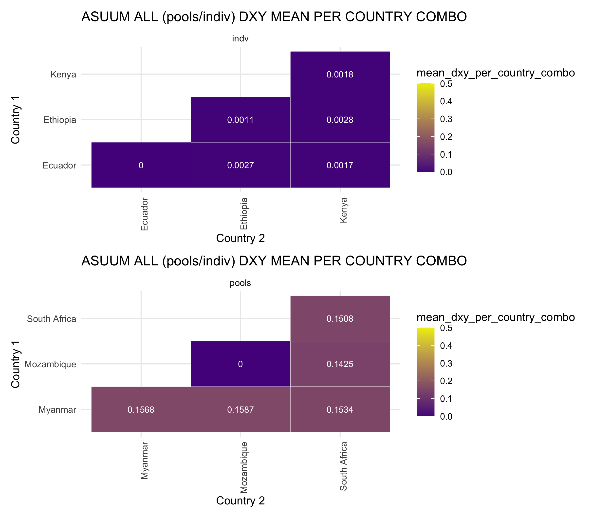

# Resolving genetic distance of *Ascaris*-positive samples in the cohort - part II
Author: Marina Papaiakovou, mpapaiakovou[at]gmail.com 

## Contents: 
- R code for updated pairwise Dxy for pools and individuals for Ascaris positive samples

```{r warning = FALSE}

library(ggrepel)
library(ggbeeswarm)
library(tidyverse)
library(readxl)
library(patchwork)


setwd("/Users/marinapapaiakovou/Documents/00.Cambridge_PhD/02.Science/02.Genome_skimming/07.Global_genome_skim_2023/02_DATA/02_TRIMMED_DATA/04_VARIANT_CALLING/01_MITOGENOME_VARS/13_POPGEN_DATA_FOR_FIGURES/02_ASUUM_US_TT_DATA/")


world_map <-map_data('world2', wrap=c(-30,330))
global_skim_countries <- world_map %>%
  filter(region == "Ethiopia" | region == "Cameroon" | region =="Myanmar" | region =="Mozambique" | region=="South Africa" |  region == "Kenya" | region == "Ecuador" | 
           region=="Mozambique" |  region=="South Africa" |  region=="Honduras" |  region=="China" |  region=="Uganda") %>%
  group_by(region) %>%
  mutate(mean_long = mean(long), mean_lat = mean(lat))

#rearrange the dataset global_skim_countries
global_skim_countries2 <- global_skim_countries %>%
  dplyr::select(Country = region, mean_lat, mean_long) %>%
  unique()


#Need to add chromosome details here so I can use the entire dataframe as part of a function and not repeat the work for ASCARIS/TT twice
global_skim_countries3 <- bind_rows(
  global_skim_countries2 %>%
    filter(Country %in% c("Mozambique", "South Africa","Cameroon","Honduras" ,"China" ,"Uganda")) %>%
    mutate(chrom = "Trichuris trichiura"),
  global_skim_countries2 %>%
    filter(Country %in% c("Mozambique", "South Africa","Myanmar","Kenya" ,"Ecuador" ,"Ethiopia")) %>%
    mutate(chrom = "Ascaris suum - US")
)

DXY_HEATMAP <- function (dxy_data) {
  dxy_data <- read.table(dxy_data, sep = '\t', header =T)
  country_map <- c(
    "BEN" = "Benin","CMR" = "Cameroon","TZA" = "Tanzania","ETH" = "Ethiopia","UGA" = "Uganda","IND" = "India","MWI" = "Malawi","MMR" = "Myanmar", "HND" ="Honduras",   "NGA" = "Nigeria","ARG" = "Argentina","BGD" = "Bangladesh","CHN" = "China","ECU" = "Ecuador","GLP" = "Guadeloupe","FJI" = "Fiji","LKA" = "Sri Lanka",
    "MOZ" = "Mozambique","ITA" = "Italy","PR1" = "Puerto Rico","COD" = "DRC","SEN" = "Senegal","THA" = "Thailand","USA" = "U.S.A","ZAF" = "South Africa","MYS" = "Malaysia", 
    "KEN" = "Kenya")
  dxy_data_country <- dxy_data %>%
    mutate(country_1 = country_map[substr(sample_1, 1, 3)])
  dxy_data_country <- dxy_data_country %>%
    mutate(country_2 = country_map[substr(sample_2, 1, 3)])
  
  
  dxy_data_country$chrom[dxy_data_country$chrom =='NC_001327_Ascaris_suum_mitochondrion_genome_USA'] <- 'Ascaris suum - US'
  dxy_data_country$chrom[dxy_data_country$chrom =='NC_017750_Trichuris_trichiura_mitochondrion_complete_genome'] <- 'Trichuris trichiura'
  
  colnames(global_skim_countries3) <-c("country", "latitude", "longitude", "chrom")
  dxy_data2 <- merge(dxy_data_country, global_skim_countries3, by.x = c("country_1", "chrom"), by.y = c("country", "chrom"), all.x = TRUE)
  
  # Rename columns for country_1
  colnames(dxy_data2)[colnames(dxy_data2) %in% c("longitude", "latitude")] <- c("LONG_1", "LAT_1")
  # Merge for country_2 (LONG_2 and LAT_2)
  dxy_data2 <- merge(dxy_data2, global_skim_countries3, by.x = c("country_2", "chrom"), by.y = c("country", "chrom"), all.x = TRUE)
  colnames(dxy_data2)[colnames(dxy_data2) %in% c("longitude", "latitude")] <- c("LONG_2", "LAT_2")
  # Rename the columns
  dxy_data2_long_lat <- dxy_data2 %>%
    rename(LONG_1 = LAT_1, LAT_1 = LONG_1, LONG_2 = LAT_2, LAT_2 = LONG_2) #if you are stuck and you think this does not work, then restart R and reload the packages
  # ##
  # I don't think the below are needed'
  # # Merge the longitude and latitude values for country_1
  # dxy_data2_long_lat <- left_join(dxy_data2_long_lat, global_skim_countries3, by = c("country_1" = "country", "chrom" = "chrom"))
  # # Merge the longitude and latitude values for country_2
  # dxy_data2_long_lat <- left_join(dxy_data2_long_lat, global_skim_countries3, by = c("country_2" = "country", "chrom" = "chrom"))
  
  summarised_dxy_all <- dxy_data2_long_lat %>%
    dplyr::select(LONG_1, LONG_2, LAT_1, LAT_2, avg_dxy, sample_type, country_1, country_2, chrom) %>%
    group_by(country_1, country_2, sample_type) %>%
    mutate(mean_dxy_per_country_combo = mean(avg_dxy)) %>%
    dplyr::select(LONG_1, LONG_2, LAT_1, LAT_2, sample_type, country_1, country_2, chrom, mean_dxy_per_country_combo) %>%
    unique()
} 

ASUUM_DXY_HEATMAP <- DXY_HEATMAP("ASUUM_DXY_ALL_POOLS_INDV.txt")

#select specific columns from ASUUM_DXY
ASUUM_DXY_between_countries <- ASUUM_DXY_HEATMAP %>%
  dplyr::select(5,6,7,8,9)

ASUUM_DXY_simplified<- ASUUM_DXY_between_countries %>%
  dplyr::select(1,2,3,5)

ASUUM_DXY_simplified_pools <- ASUUM_DXY_simplified %>%
  filter(sample_type =="pools") %>%
  dplyr::select(2,3,4)
# Create two new data frames with the same column names as the original dataset
Mozambique <- data.frame(sample_type = "pools", country_1 = "Mozambique", country_2 = "Mozambique", mean_dxy_per_country_combo = 0)

# Use rbind() to append the new rows to the original dataset
ASUUM_DXY_simplified_pools <- rbind(ASUUM_DXY_simplified_pools, Mozambique) #this will do it


ASUUM_DXY_simplified_indv <- ASUUM_DXY_simplified %>%
  filter(sample_type =="indv") %>%
  dplyr::select(2,3,4)

#adding Ecuador as '0' since I only had one sample, so I will grey it out on illustrator
Ecuador <- data.frame(sample_type = "indv", country_1 = "Ecuador", country_2 = "Ecuador", mean_dxy_per_country_combo = 0)

ASUUM_DXY_simplified_indv <- rbind(ASUUM_DXY_simplified_indv, Ecuador) #this will do it


ASUUM_ALL_unique_countries_1_pools <- ASUUM_DXY_simplified_pools  %>%
  distinct(country_1) %>%
  pull()

ASUUM_ALL_unique_countries_2_pools <- ASUUM_DXY_simplified_pools %>%
  distinct(country_2) %>%
  pull()

ASUUM_ALL_unique_countries_1_indv <- ASUUM_DXY_simplified_indv  %>%
  distinct(country_1) %>%
  pull()

ASUUM_ALL_unique_countries_2_indv <- ASUUM_DXY_simplified_indv %>%
  distinct(country_2) %>%
  pull()

ASUUM_ALL_unique_countries_pools <- union(ASUUM_ALL_unique_countries_1_pools, ASUUM_ALL_unique_countries_2_pools)
ASUUM_ALL_unique_countries_indv <- union(ASUUM_ALL_unique_countries_1_indv, ASUUM_ALL_unique_countries_2_indv)


```

```{r POPGEN_ASUUM_POOLS_INDV_HEATMAP_DXY,  fig.path='./00_FIGURES/' }

png(filename = "00_FIGURES/POPGEN_ASUUM_POOLS_INDV_HEATMAP_DXY.png", height = 7, width = 8, units = "in", res = 300)


ASUUM_ALL_DXY_POOLS <- ggplot(ASUUM_DXY_simplified_pools, aes(x = factor(country_2, levels = ASUUM_ALL_unique_countries_pools), y = factor(country_1, levels = ASUUM_ALL_unique_countries_pools), fill = mean_dxy_per_country_combo, label = round(mean_dxy_per_country_combo, 4))) +
  geom_tile(color = "white") +
  geom_text(color = "white", size = 3) + 
  scale_fill_continuous(
    low = "purple4",
    high = "yellow2", limits = c(0, 0.5),
  ) + 
  theme_minimal() +
  # coord_fixed() +
  labs(title = "ASUUM ALL (pools/indiv) DXY MEAN PER COUNTRY COMBO",
       x = "Country 2",
       y = "Country 1")+
 # facet_grid(~sample_type) +
  theme(axis.text.x = element_text(angle = 90, vjust = 1, hjust=1))
#

#PLOT HEATMAP FOR INDVs
ASUUM_ALL_DXY_INDV <- ggplot(ASUUM_DXY_simplified_indv, aes(x = factor(country_2, levels = ASUUM_ALL_unique_countries_indv), y = factor(country_1, levels = ASUUM_ALL_unique_countries_indv), fill = mean_dxy_per_country_combo, label = round(mean_dxy_per_country_combo, 4))) +
  geom_tile(color = "white") +
  geom_text(color = "white", size = 3) + 
  scale_fill_continuous(
    low = "purple4",
    high = "yellow2", limits = c(0, 0.5), 
  ) + 
  theme_minimal() +
  # coord_fixed() +
  labs(title = "ASUUM ALL (pools/indiv) DXY MEAN PER COUNTRY COMBO",
       x = "Country 2",
       y = "Country 1")+
 # facet_grid(~sample_type) +
  theme(axis.text.x = element_text(angle = 90, vjust = 1, hjust=1))
#
ASUUM_BOTH <- ASUUM_ALL_DXY_INDV / ASUUM_ALL_DXY_POOLS

print(ASUUM_BOTH)

dev.off()

```


