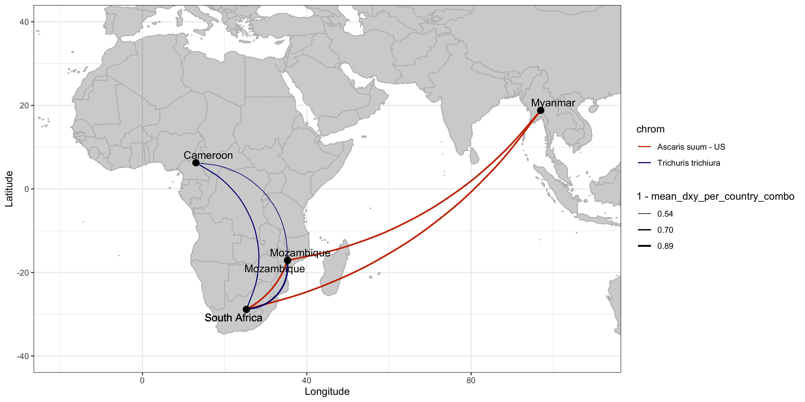
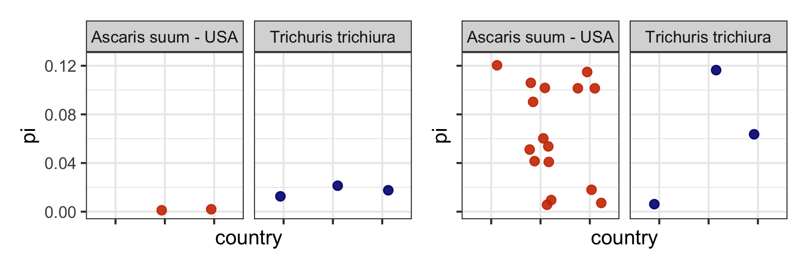

# Population genetic analysis for *Ascaris spp* and *Trichuris* using mitochondrial variants
Author: Marina Papaiakovou, mpapaiakovou[at]gmail.com 

## Contents: 
- R code to recreate one of the main figures in this paper: (doi to follow)
- R code for: geomap with mean Dxy values per country comparison (for pooled samples)
- R code for π (pi) diversity for individual worms and pools of eggs (separately) 
- R code for frequency of alleles (pools) or SNPs (individuals)
- Further beautifications done in Illustrator 

### Dxy geomap for pools of eggs; *Ascaris spp* and *Trichuris* 
```{r warning = FALSE}
library(ggrepel)
library(ggbeeswarm)
library(tidyverse)
library(readxl)
library(patchwork)
#setwd("/Users/marinapapaiakovou/Documents/00.Cambridge_PhD/02.Science/02.Genome_skimming/07.Global_genome_skim_2023/02_DATA/02_TRIMMED_DATA/04_VARIANT_CALLING/01_MITOGENOME_VARS/13_POPGEN_DATA_FOR_FIGURES/02_ASUUM_US_TT_DATA/")


world_map <-map_data('world2', wrap=c(-30,330))
global_skim_countries <- world_map %>%
  filter(region == "Ethiopia" | region == "Cameroon" | region =="Myanmar" | region =="Mozambique" | region=="South Africa" |  region == "Kenya" | region == "Ecuador" | 
           region=="Mozambique" |  region=="South Africa" |  region=="Honduras" |  region=="China" |  region=="Uganda") %>%
  group_by(region) %>%
  mutate(mean_long = mean(long), mean_lat = mean(lat))

#rearrange the dataset global_skim_countries
global_skim_countries2 <- global_skim_countries %>%
  select(Country = region, mean_lat, mean_long) %>%
  unique()


#Need to add chromosome details here so I can use the entire dataframe as part of a function and not repeat the work for ASCARIS/TT twice
global_skim_countries3 <- bind_rows(
  global_skim_countries2 %>%
    filter(Country %in% c("Mozambique", "South Africa","Cameroon","Honduras" ,"China" ,"Uganda")) %>%
    mutate(chrom = "Trichuris trichiura"),
  global_skim_countries2 %>%
    filter(Country %in% c("Mozambique", "South Africa","Myanmar","Kenya" ,"Ecuador" ,"Ethiopia")) %>%
    mutate(chrom = "Ascaris suum - US")
)


#dxy_data <- read.delim("ALUM_KOR_REF_ALL_POOLS_INDV.txt" , sep = "\t", header=T) #make sure the data have these columns: 
#You need a file with: chrom	snps	sample_1	sample_2	avg_dxy	country_1	country_2	sample_type
#And collate results from pools and individuals in one go
ASUUM_dxy_data <- read.table("/Users/marinapapaiakovou/Documents/00.Cambridge_PhD/02.Science/02.Genome_skimming/07.Global_genome_skim_2023/02_DATA/02_TRIMMED_DATA/04_VARIANT_CALLING/01_MITOGENOME_VARS/13_POPGEN_DATA_FOR_FIGURES/02_ASUUM_US_TT_DATA/ASUUM_DXY_ALL_POOLS_INDV.txt", sep = '\t', header =T)
#
country_map <- c(
  "BEN" = "Benin","CMR" = "Cameroon","TZA" = "Tanzania","ETH" = "Ethiopia","UGA" = "Uganda","IND" = "India","MWI" = "Malawi","MMR" = "Myanmar", "HND" ="Honduras",   "NGA" = "Nigeria","ARG" = "Argentina","BGD" = "Bangladesh","CHN" = "China","ECU" = "Ecuador","GLP" = "Guadeloupe","FJI" = "Fiji","LKA" = "Sri Lanka",
  "MOZ" = "Mozambique","ITA" = "Italy","PR1" = "Puerto Rico","COD" = "DRC","SEN" = "Senegal","THA" = "Thailand","USA" = "U.S.A","ZAF" = "South Africa","MYS" = "Malaysia", 
  "KEN" = "Kenya")
ASUUM_dxy_data_country <- ASUUM_dxy_data %>%
  mutate(country_1 = country_map[substr(sample_1, 1, 3)])
ASUUM_dxy_data_country <- ASUUM_dxy_data_country %>%
  mutate(country_2 = country_map[substr(sample_2, 1, 3)])


ASUUM_dxy_data_country$chrom[ASUUM_dxy_data_country$chrom =='NC_001327_Ascaris_suum_mitochondrion_genome_USA'] <- 'Ascaris suum - US'
ASUUM_dxy_data_country$chrom[ASUUM_dxy_data_country$chrom =='NC_017750_Trichuris_trichiura_mitochondrion_complete_genome'] <- 'Trichuris trichiura'

colnames(global_skim_countries3) <-c("country", "latitude", "longitude", "chrom")
ASUUM_dxy_data2 <- merge(ASUUM_dxy_data_country, global_skim_countries3, by.x = c("country_1", "chrom"), by.y = c("country", "chrom"), all.x = TRUE)

# Rename columns for country_1
colnames(ASUUM_dxy_data2)[colnames(ASUUM_dxy_data2) %in% c("longitude", "latitude")] <- c("LONG_1", "LAT_1")
# Merge for country_2 (LONG_2 and LAT_2)
ASUUM_dxy_data2 <- merge(ASUUM_dxy_data2, global_skim_countries3, by.x = c("country_2", "chrom"), by.y = c("country", "chrom"), all.x = TRUE)
colnames(ASUUM_dxy_data2)[colnames(ASUUM_dxy_data2) %in% c("longitude", "latitude")] <- c("LONG_2", "LAT_2")
# Rename the columns
ASUUM_dxy_data2_long_lat <- ASUUM_dxy_data2 %>%
  rename(LONG_1 = LAT_1, LAT_1 = LONG_1, LONG_2 = LAT_2, LAT_2 = LONG_2) #if you are stuck and you think this does not work, then restart R and reload the packages

ASUUM_mean_dxy_all <- ASUUM_dxy_data2_long_lat %>%
  filter(sample_type == "pools") %>%
  #select(LONG_1, LONG_2, LAT_1, LAT_2, sample_type, country_1, country_2, chrom) %>%
  group_by(country_1, country_2, sample_type) %>%
  mutate(mean_dxy_per_country_combo = mean(avg_dxy)) %>%
  select(LONG_1, LONG_2, LAT_1, LAT_2, sample_type, country_1, country_2, chrom, mean_dxy_per_country_combo) %>%
  unique()

#NOW RUN THE DXY FOR TRICHURIS 

TT_dxy_data <- read.table("/Users/marinapapaiakovou/Documents/00.Cambridge_PhD/02.Science/02.Genome_skimming/07.Global_genome_skim_2023/02_DATA/02_TRIMMED_DATA/04_VARIANT_CALLING/01_MITOGENOME_VARS/13_POPGEN_DATA_FOR_FIGURES/02_ASUUM_US_TT_DATA/TT_DXY_ALL.txt", sep = '\t', header =T) 
country_map <- c(
  "BEN" = "Benin","CMR" = "Cameroon","TZA" = "Tanzania","ETH" = "Ethiopia","UGA" = "Uganda","IND" = "India","MWI" = "Malawi","MMR" = "Myanmar", "HND" ="Honduras",   "NGA" = "Nigeria","ARG" = "Argentina","BGD" = "Bangladesh","CHN" = "China","ECU" = "Ecuador","GLP" = "Guadeloupe","FJI" = "Fiji","LKA" = "Sri Lanka",
  "MOZ" = "Mozambique","ITA" = "Italy","PR1" = "Puerto Rico","COD" = "DRC","SEN" = "Senegal","THA" = "Thailand","USA" = "U.S.A","ZAF" = "South Africa","MYS" = "Malaysia", 
  "KEN" = "Kenya")
TT_dxy_data_country <- TT_dxy_data %>%
  mutate(country_1 = country_map[substr(sample_1, 1, 3)])
TT_dxy_data_country <- TT_dxy_data_country %>%
  mutate(country_2 = country_map[substr(sample_2, 1, 3)])


#TT_dxy_data_country$chrom[TT_dxy_data_country$chrom =='NC_016198_Ascaris_lumbricoides_mitochondrion_complete_genome'] <- 'Ascaris lum - KOR'
TT_dxy_data_country$chrom[TT_dxy_data_country$chrom =='NC_017750_Trichuris_trichiura_mitochondrion_complete_genome'] <- 'Trichuris trichiura'

colnames(global_skim_countries3) <-c("country", "latitude", "longitude", "chrom")
TT_dxy_data2 <- merge(TT_dxy_data_country, global_skim_countries3, by.x = c("country_1", "chrom"), by.y = c("country", "chrom"), all.x = TRUE)

# Rename columns for country_1
colnames(TT_dxy_data2)[colnames(TT_dxy_data2) %in% c("longitude", "latitude")] <- c("LONG_1", "LAT_1")
# Merge for country_2 (LONG_2 and LAT_2)
TT_dxy_data2 <- merge(TT_dxy_data2, global_skim_countries3, by.x = c("country_2", "chrom"), by.y = c("country", "chrom"), all.x = TRUE)
colnames(TT_dxy_data2)[colnames(TT_dxy_data2) %in% c("longitude", "latitude")] <- c("LONG_2", "LAT_2")
# Rename the columns
TT_dxy_data2_long_lat <- TT_dxy_data2 %>%
  rename(LONG_1 = LAT_1, LAT_1 = LONG_1, LONG_2 = LAT_2, LAT_2 = LONG_2) #if you are stuck and you think this does not work, then restart R and reload the packages


#need to take the mean here of dxy per country combo, so it does not overplot
TT_mean_dxy_all <- TT_dxy_data2_long_lat %>%
  filter(sample_type == "pools") %>%
  #select(LONG_1, LONG_2, LAT_1, LAT_2, sample_type, country_1, country_2, chrom) %>%
  group_by(country_1, country_2, sample_type) %>%
  mutate(mean_dxy_per_country_combo = mean(avg_dxy)) %>%
  select(LONG_1, LONG_2, LAT_1, LAT_2, sample_type, country_1, country_2, chrom, mean_dxy_per_country_combo) %>%
  unique()

#Keep only the countries that are mutual between the two species pools
global_skim_countries4 <- global_skim_countries3 %>% 
  filter(country %in% c("Mozambique", "South Africa","Cameroon", "Myanmar"))

```
- Plot the Dxy geomap 

```{r FIG2_POPGEN_grenedalf_pools_bit_ASUUM_TT, fig.path='./00_FIGURES/'}
png(filename = "00_FIGURES/FIG2_POPGEN_grenedalf_pools_bit_ASUUM_TT.png", height = 6, width = 12, units = "in", res = 300)

#Run the plot for ASCARIS 
POOLS_BOTH_DXY_GEOMAP <- ggplot() +
  geom_polygon(data = world_map,
    
               mapping = aes(x = long,
                             y = lat,
                             group = group), fill = 'lightgray',
               col = "grey")+
  geom_curve(data = ASUUM_mean_dxy_all, aes(x = LONG_1, y = LAT_1, xend = LONG_2, yend = LAT_2 + runif(nrow(ASUUM_mean_dxy_all), min = 0.001, max = 0.01), size = 1-mean_dxy_per_country_combo, color = chrom),linetype = "solid" , curvature = -0.2) +
  geom_curve(data = TT_mean_dxy_all, aes(x = LONG_1, y = LAT_1, xend = LONG_2, yend = LAT_2 + runif(nrow(TT_mean_dxy_all), min = 0.001, max = 0.04), size = 1-mean_dxy_per_country_combo, color = chrom),linetype = "solid" , curvature = -0.45) +
  
  #UNCOMMENT THE BELOW, geom_beeswarm for Ascaris.
  # geom_beeswarm(data = ref_data,
  #              aes(x = longitude, y = latitude, shape = chrom), size = 2.5, method = "hex") + 
  geom_point(data = global_skim_countries4,  
             aes(x = longitude, y = latitude), size = 3) + #comment it out if you are running Ascaris
  geom_text_repel(data = global_skim_countries4  %>% filter(chrom == "Ascaris suum - US"), mapping = aes (x=longitude, y = latitude, label = country), size = 4, max.overlaps = Inf) +
  geom_text_repel(data = global_skim_countries4  %>% filter(chrom == "Trichuris trichiura"), mapping = aes (x=longitude, y = latitude, label = country), size = 4, max.overlaps = Inf) +
  
  #, min.segment.length = 0, segment.angle = 90, segment.square = TRUE, hjust = "outward", force = 5, force_pull = 1, segment.size  = 0.2, max.overlaps = 10,
  #                   segment.color = "black", direction  = "both")+
  #scale_color_manual(values = c("red", "blue", "green", "purple", ...)) +  # Customize point colors
  scale_size_continuous(range = c(0,1), limits = c(0.5, 1),  breaks= c( 0.54, 0.7, 0.89), name = "1 - mean_dxy_per_country_combo") +  # Customize the range of line thickness
  #  coord_fixed() +  # Aspect ratio to keep the correct proportions on the map
  # coord_fixed(xlim = c(-100,125), ylim=c(-50, 50)) +  # Aspect ratio to keep the correct proportions on the map, if you don’t want to zoom in, add: coord_fixed()+
  coord_cartesian(xlim = c(-20,110), ylim=c(-40, 40))+
 # xlim = c(-20,110)+
  #ylim(-55,25) +
#xlim(-20,110)+
  theme_bw() + theme(legend.position="right") +
  scale_color_manual(values = c("Trichuris trichiura" = "navyblue", "Ascaris suum - US" = "orangered3"),
                     name = "chrom") +
  labs(
    x = "Longitude",
    y = "Latitude")
 # ggtitle("GEOMAP; DXY VALUES; POOLED DATA; ASUUM/TT")

print(POOLS_BOTH_DXY_GEOMAP)
dev.off()
```

- beautified the above in Illustrator

### Nucleotide diversity (π) for both pools and individuals
-Pi for individuals was calculated using pixy (and an all-positions VCF)
-Pi for pools was calculated using grenedalf (and bam files)

```{r, warning = FALSE}

require("knitr")
opts_knit$set(root.dir = "/Users/marinapapaiakovou/Documents/00.Cambridge_PhD/02.Science/02.Genome_skimming/07.Global_genome_skim_2023/02_DATA/02_TRIMMED_DATA/04_VARIANT_CALLING/01_MITOGENOME_VARS/13_POPGEN_DATA_FOR_FIGURES/02_ASUUM_US_TT_DATA")

#setwd("/Users/marinapapaiakovou/Documents/00.Cambridge_PhD/02.Science/02.Genome_skimming/07.Global_genome_skim_2023/02_DATA/02_TRIMMED_DATA/04_VARIANT_CALLING/01_MITOGENOME_VARS/13_POPGEN_DATA_FOR_FIGURES/02_ASUUM_US_TT_DATA")

#add sample_type (pools/indvs) before you import

#simplify the pi data to be like that
#COUNTRY
Pi_function <- function(pi_data) {
  
    pi_data <- read.table(pi_data,sep = "\t", header=T)
#return(pi_data)
    
  colnames(pi_data) <- c("chrom", "snp_count", "pi", "sample_id", "country", "sample_type")
pi_data$chrom[pi_data$chrom == 'NC_017750_Trichuris_trichiura_mitochondrion_complete_genome'] <- 'Trichuris trichiura'
pi_data$chrom[pi_data$chrom =='NC_016198_Ascaris_lumbricoides_mitochondrion_complete_genome'] <- 'Ascaris lum - KOR'
pi_data$chrom[pi_data$chrom =='NC_001327_Ascaris_suum_mitochondrion_genome_USA'] <- 'Ascaris suum - USA'
#pi_data$chrom[pi_data$chrom =='KY045802_Ascaris_lumbricoides_isolate_G17_mitochondrion_genome_Tanzania'] <- 'Ascaris lum - TZA'
#add country 
  country_map <- c(
    "BEN" = "Benin","CMR" = "Cameroon","TZA" = "Tanzania","ETH" = "Ethiopia","UGA" = "Uganda","IND" = "India","MWI" = "Malawi","MMR" = "Myanmar", "HND" ="Honduras",
    "NGA" = "Nigeria","ARG" = "Argentina","BGD" = "Bangladesh","CHN" = "China","ECU" = "Ecuador","GLP" = "Guadeloupe","FJI" = "Fiji","LKA" = "Sri Lanka",
    "MOZ" = "Mozambique","ITA" = "Italy","PR1" = "Puerto Rico","COD" = "DRC","SEN" = "Senegal","THA" = "Thailand","USA" = "U.S.A","ZAF" = "South Africa","MYS" = "Malaysia", 
    "KEN" = "Kenya")
  
  pi_data2 <- pi_data %>%
    mutate(country = country_map[substr(sample_id, 1, 3)])
  
  return(pi_data2)
  
}
  #comment this out so I can access the plots later with ggsave
 # ggplot(data = pi_data2, aes(x = country, y = pi, color=species)) +
 #   ggtitle("Pi diversity for pools/Indvs") +
 #   theme_bw() +
 #    facet_grid(. ~ sample_type, scales = "free_x", space = "free_x", drop=TRUE) +
 #   geom_jitter(size = 2, alpha = 0.9, width=0.25) +
 #   theme(axis.text.x = element_text(angle = 90, hjust = 1)) +
 #   ylim(min(0), max(0.125))

#TT_pi_ALL <- Pi_function("TT_pi_ALL.txt")
#ALUM_pi_ALL <- Pi_function("ASUUM_Pi_ALL.txt")

#INDV_Pi_ALL <- Pi_function("/Users/marinapapaiakovou/Documents/00.Cambridge_PhD/02.Science/02.Genome_skimming/07.Global_genome_skim_2023/02_DATA/02_TRIMMED_DATA/04_VARIANT_CALLING/01_MITOGENOME_VARS/13_POPGEN_DATA_FOR_FIGURES/02_ASUUM_US_TT_DATA/INDV_Pi_ASUUM_TT.txt")
#POOLS_Pi_ALL <- Pi_function("/Users/marinapapaiakovou/Documents/00.Cambridge_PhD/02.Science/02.Genome_skimming/07.Global_genome_skim_2023/02_DATA/02_TRIMMED_DATA/04_VARIANT_CALLING/01_MITOGENOME_VARS/13_POPGEN_DATA_FOR_FIGURES/02_ASUUM_US_TT_DATA/POOLS_Pi_ASUUM_TT.txt")
```
- load the datasets on your global env
- plot both Pi

```{r FIG2_POPGEN_part_pi_diversity_ASUUM_TT_jitter, fig.path='./00_FIGURES/'}

library(patchwork)
INDV_Pi_ALL <- Pi_function("/Users/marinapapaiakovou/Documents/00.Cambridge_PhD/02.Science/02.Genome_skimming/07.Global_genome_skim_2023/02_DATA/02_TRIMMED_DATA/04_VARIANT_CALLING/01_MITOGENOME_VARS/13_POPGEN_DATA_FOR_FIGURES/02_ASUUM_US_TT_DATA/INDV_Pi_ASUUM_TT.txt")
POOLS_Pi_ALL <- Pi_function("/Users/marinapapaiakovou/Documents/00.Cambridge_PhD/02.Science/02.Genome_skimming/07.Global_genome_skim_2023/02_DATA/02_TRIMMED_DATA/04_VARIANT_CALLING/01_MITOGENOME_VARS/13_POPGEN_DATA_FOR_FIGURES/02_ASUUM_US_TT_DATA/POOLS_Pi_ASUUM_TT.txt")


png(filename = "00_FIGURES/FIG2_POPGEN_part_pi_diversity_ASUUM_TT_jitter.png", height = 7, width = 8, units = "in", res = 300)


INDV_Pi_plot <- ggplot(data = INDV_Pi_ALL, aes(x = country, y = pi, color= chrom)) +
#ggtitle("INDV") +
 theme_bw() +
 facet_grid(. ~ chrom, scales = "free_x", space = "free_x", drop=TRUE) +
 geom_jitter(size = 2, alpha = 0.9, width=0.25) +
 scale_color_manual(values = c("Trichuris trichiura" = "navyblue", "Ascaris suum - USA" = "orangered3"),
                    name = "chrom")+
 #theme(axis.text.x = element_text(angle = 90, hjust = 1),legend.position = "right") +
  theme(axis.text.x=element_blank(),legend.position = "none") + #I wanted to turn off the x axis, because it shares it with the SNP frequency axis
 ylim(min(0), max(0.125))
  
POOLS_Pi_plot <- ggplot(data = POOLS_Pi_ALL, aes(x = country, y = pi, color= chrom)) +
 #ggtitle("POOLS") +
  theme_bw() +
  facet_grid(. ~ chrom, scales = "free_x", space = "free_x", drop=TRUE) +
  geom_jitter(size = 2, alpha = 0.9, width=0.25) +
  scale_color_manual(values = c("Trichuris trichiura" = "navyblue", "Ascaris suum - USA" = "orangered3"),
                     name = "chrom")+
 # theme(axis.text.x = element_text(angle = 90, hjust = 1),legend.position = "right") +
  theme(axis.text.x=element_blank(), axis.text.y=element_blank(),legend.position = "none") + #and turned off the y axis as well, because I will combine them
  ylim(min(0), max(0.125))

#185 x 130 
BOTH_Pi <- INDV_Pi_plot + POOLS_Pi_plot

print(BOTH_Pi)
blah <- dev.off()

```

