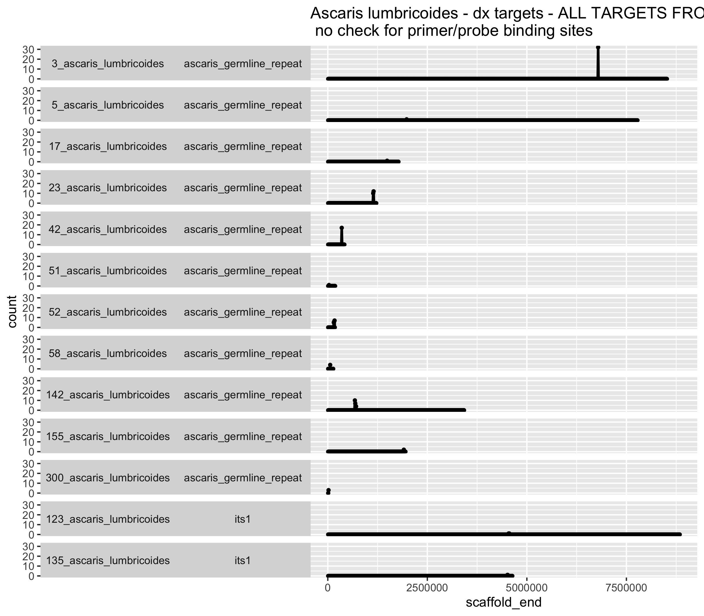
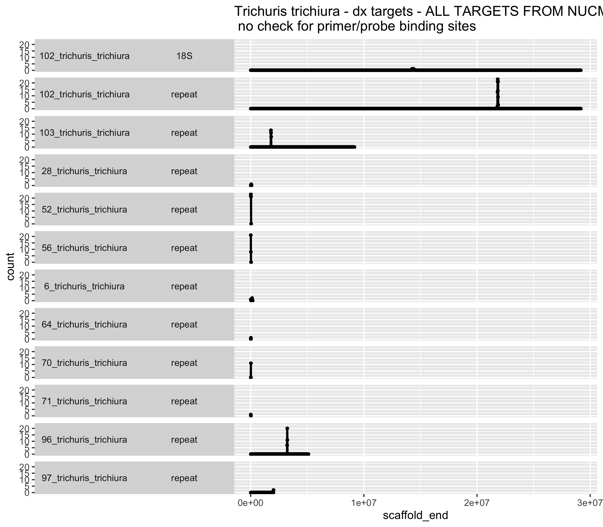
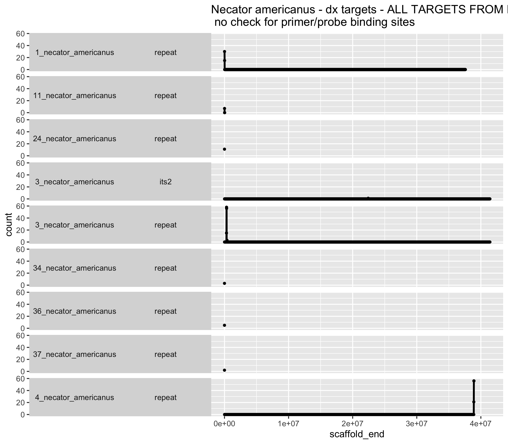

# Nuclear genome formatting, mapping and repeat finding 
Author: Marina Papaiakovou, mpapaiakovou[at]gmail.com 

## Contents: 
- Formatting genomes for nuclear mapping (code not shown for mapping; use the one for mtDNA mapping)
- Repeat/target finding using *nucmer* 
- Assess repeat/target similarity in the genome

- Downloaded updated genomes from ENA/Wormbase ParaSite
- renamed them with fastaq enumerate

```bash
fastaq enumerate_names duodenale.fa duodenale_renamed.fa --suffix _duodenale
#https://github.com/sanger-pathogens/Fastaq

#renamed the contigs from 1 --- number_of_Contigs

#For matching the old and the new names: 
paste <(grep '^>' file1.txt) <(grep '^>' file1_renamed.txt) > matched_files.txt 

cat *renamed* >> all_genomes.fasta #to use for nuclear mapping
#ancylostoma_ceylanicum_renamed.fasta
#ascaris_lumbricoides_renamed.fasta
#duodenale_renamed.fa
#necator_americanus_renamed.fasta
#schistosoma_mansoni_renamed.fa
#strongyloides_stercoralis_renamed.fasta
#trichuris_trichiura_renamed.fa


bwa index all_genomes.fasta #took 30 min

#create a sample list for the array 
ls -1 *_1.fq.gz | sed 's/_1.fq.gz//' > sample_list.txt
#start mapping  with BWA MEM, using this script but with nuclear genomes

[MTDNA_BWA_MEM_MAPPING](https://github.com/MarinaSci/Global_skim_analysis/blob/main/poo_worm_STH_global_skim_01_INDEX_MAPPING.md)
```
### Nucmer analysis for repeat finding 
```bash
#mummer version v3.23
#tested various cluster values, conclused that 15 is ok for my data
#conda activate mummer-env
nucmer --prefix ascaris_15 -c 15 --maxmatch ascaris.fasta ascaris_lumbricoides_renamed.fasta

#do for all species
#ascaris.fasta - has all the targets you are looking for 
#ascaris_lumbricoides_renamed.fasta #your genome 
#max match allows for more matches to go through
#--maxmatch = “Use all anchor matches regardless of their uniqueness”
#the default of the clusters is 65, so likely with small targets, the program  ignores them

#might need to also filter here for coverage, at least 90. 
show-coords -lTHc -I 90 ascaris_15.delta | awk '{if($10>90) print}' > ascaris_15_cov90.coords #min coverage 90, cluster 15
#and count directly how many times each target appears: 
show-coords -lTHc -I 90 ascaris_15.delta  | awk '{if($10>90) print}' | cut -f12 | sort | uniq -c #that meets the criteria of 90% identity and 90% coverage


#the -H means leave the header out
##where [S1] and [E1] represent respectively the start and the end alignment coordinates of the reference contig/scaffold/chromosome while [S2] and [E2] of the query contig/scaffold/chromosome.
header [S1]    [E1]    [S2]     [E2]     [LEN 1]   [LEN 2]   [% IDY]   [LEN R]   [LEN Q]   [COV R]   [COV Q]   [TAGS]
#i think nucmer calls reference the sequences I give the programm and query the genomes I am querying... Which is the opposite of what we call them in BLAST.

```
- Bedtools getfasta to get actual sequences using the above coordinates and assess similarity 

```bash
#the FASTA targets have not been screened for primer/probe sites. It includes everything
#I need a modified verion of the nucmer coords file here, that has the start, end, scaffold, target_name columns, without reordering them
#If you reorder them, then all will be + and you want the column to have both + and - for getfasta to know what to do

cat ascaris_15_cov90.coords | awk '{print $13, $3, $4, $12}' > ascaris_15_cov90.coords.bed

#check if tab delimited 
sed 's/ /\t/g' ascaris_15_cov90.coords.bed > ascaris_15_cov90.coords_formatted.bed

#still need to do that here 
awk '{if ($2 > $3) print $1, $3, $2, $4, ".", "-"; else print $1, $2, $3, $4, ".",  "+"}'  OFS="\t" ascaris_15_cov90.coords_formatted.bed  > ascaris_15_cov90.coords_formatted_FINAL.bed #add if it's on a positive or negative strand 

#index
samtools faidx ascaris_lumbricoides_renamed.fasta

#extract the sequences to align them and plot them in R 
bedtools getfasta -s -fi ascaris_lumbricoides_renamed.fasta -bed ascaris_15_cov90.coords_formatted_FINAL.bed -fo ascaris_15_cov90_extracted_targets_ALL_REPEATS.fasta -name+
#you now have the targets, you need to split them by their name and transfer them to the local computer to align and plot

```
- Script to split the targets by name in the fasta file
```bash
#you need to give it the extracted fasta matched from the genome
#!/bin/bash
input_file="ascaris_15_cov90_extracted_targets_ALL_REPEATS.fasta"
output_prefix="TARGET"

# Read each line in the file
while IFS= read -r line; do
# Check if the line contains each target string
if [[ $line == *"ascaris_germline_repeat"* ]]; then
echo -e "$line\n$(IFS= read -r next_line && echo "$next_line")" >> "${output_prefix}_ascaris_germline_repeat_FASTA.txt"
elif [[ $line == *"ascaris_wang_repeat"* ]]; then
echo -e "$line\n$(IFS= read -r next_line && echo "$next_line")" >> "${output_prefix}_ascaris_wang_repeat_FASTA.txt"
elif [[ $line == *"ascaris_its1_amplicon_b"* ]]; then
echo -e "$line\n$(IFS= read -r next_line && echo "$next_line")" >> "${output_prefix}_ascaris_its1_amplicon_b_FASTA.txt"
elif [[ $line == *"ascaris_its1_amplicon"* ]]; then
echo -e "$line\n$(IFS= read -r next_line && echo "$next_line")" >> "${output_prefix}_ascaris_its1_amplicon_FASTA.txt"
fi
done < "$input_file"

echo "Filtered output written to individual files."
####################################################################################################
```

```{r warning = FALSE}
#BiocManager::install("Biostrings")
library(Biostrings)
library(seqinr)
library(ComplexHeatmap)
library(msa)
library(gplots)

#A FEW WARNINGS:
#I solved the issue with all the error messages. Heatmap did not like all the values being equal across all rows/columns (zero in my case) #I added '0.01' to the matrix and seemed to resolve it
#I was getting this error: Error in (function (side, at = NULL, labels = TRUE, tick = TRUE, line = NA,  : 
#no locations are finite; so I found a solution: #this did the trick! if all the values are the same, heatmap2 cacks itself!!!!!
#https://github.com/shenlab-sinai/GeneOverlap/issues/3
#and I will do this for all targets/species to be consistent
# !!!!!!!!!! IF YOU HAVE A BROKEN/CORRUPT FASTA FILE, R WILL CRASH WITHOUT GIVING YOU ANY ERROR.   !!!!!!!!!! #
#IT IS LIKELY THE MSA PACKAGE.

heatmap_for_aligned_seq_function <- function(data1, title, filename) {
  # run multiple sequence alignment
  data_aln <- msaClustalOmega(data1) #had to move away from muscle because it was crashing 
  data_aln_conv <- msaConvert(data_aln, type = "seqinr::alignment")
  data_aln_conv_d <- dist.alignment(data_aln_conv, "identity")
  data_aln_conv_d_matrix <- as.matrix(data_aln_conv_d)
  
  if(!all(data_aln_conv_d_matrix[1,1] == data_aln_conv_d_matrix)) {
    print ("data not the same") 
  } else {
    data_aln_conv_d_matrix[1, 2] <- 0.01
  }
  
  # replace any number
  #data_aln_conv_d_matrix[1, 2] <- 0.01 #this did the trick!!!!!!!! if all the values are the same, heatmap2 cacks itself!!!!!
  #https://github.com/shenlab-sinai/GeneOverlap/issues/3
  # Save the plot as a PNG or PDF with a unique filename
  save_filename <- paste0(filename, ".pdf")
  
  # Specify the desired width and height for the plot in inches
  plot_width <- 12
  plot_height <- 12
  # Specify the font size for the title
  title_font_size <- 14
  # par(oma=c(10,6,6,4))
  pdf(save_filename, width = plot_width, height = plot_height)
  # Specify the font size for the title
  title_font_size <- 14

heatmap.2(data_aln_conv_d_matrix, 
            symkey=FALSE, cexCol=0.5, srtCol=90, col = colorRampPalette(c("white", "lightblue", "blue"))(100), margins=c(12,8),
            main = title, ylab = "", key.ylab = "",cexRow=0.5, na.color = "White", dendrogram="none",
            keysize=1, labRow = NA, trace = "none") #Colv = NA, Rowv = NA, turn off dendrograms, cexRow=0.5 change font size of x y labels (with cexCol)
  dev.off()
}

#assign the path for all targets, in a loop and then read all the FASTA in 
# Specify the directory containing your files
ALL_TARGETS_DIR <- "/Users/marinapapaiakovou/Documents/00.Cambridge_PhD/02.Science/02.Genome_skimming/07.Global_genome_skim_2023/02_DATA/02_TRIMMED_DATA/03_NUCLEAR_MAPPING/01_BEDTOOLS_GETFASTA_OUTPUT/ALL/"

# Get a list of file names in the directory
ALL_TARGETS <- list.files(ALL_TARGETS_DIR, full.names = TRUE)

# Loop through each file and read it into R
for (file_path in ALL_TARGETS) {
  # Extract the file name without extension
  ALL_TARGET <- tools::file_path_sans_ext(basename(file_path))
  
  # Read the DNA sequences from the file
  assign(paste0(ALL_TARGET, "_fasta"), readDNAStringSet(file_path))
  
  # Optionally, print information about the read operation
  cat("Read", length(get(paste0(ALL_TARGET, "_fasta"))), "sequences from", file_path, "\n")
}

#now run the function for all: 
#Ascaris
heatmap_for_aligned_seq_function(TARGET_ascaris_germline_repeat_FASTA_fasta, "ALUM GERMLINE \n > 90% similarity, > 90% coverage", "ALUM_germline_function") #this works
heatmap_for_aligned_seq_function(TARGET_ascaris_wang_repeat_FASTA_fasta, "ALUM WANG \n > 90% similarity, > 90% coverage", "ALUM_WANG_function") #this works
heatmap_for_aligned_seq_function(TARGET_ascaris_its1_amplicon_FASTA_fasta, "ALUM ITS1 \n > 90% similarity, > 90% coverage ", "ALUM_ITS1_function") #this works

#Trichuris
heatmap_for_aligned_seq_function(TARGET_trichuris_trichiura_repeat_FASTA_fasta, "TT_repeat \n > 90% similarity, > 90% coverage", "TT_repeat_function")
heatmap_for_aligned_seq_function(TARGET_18S_trichuris_trichiura_FASTA_fasta, "TT - 18S \n > 90% similarity, > 90% coverage ", "TT_18S_function") #this works

#Necator
heatmap_for_aligned_seq_function(TARGET_necator_its2_amplicon_FASTA_fasta, "NEC-ITS2 \n > 90% similarity, > 90% coverage", "NEC_its2_function")
heatmap_for_aligned_seq_function(TARGET_necator_smith_repeat_FASTA_fasta, "NEC-repeat \n > 90% similarity, > 90% coverage", "NEC_repeat_function")

```
- 
- 
- 
- 
- 
- 
- 


### Target coverage and scaffold location 

```bash
#Make windows of the genome; it needs a genome file, not the genome per se. 
#Take the .fai output of 
samtools faidx ascaris_lumbricoides_renamed.fasta 
#and take the first two columns (name of scaffold and size)
#Use that for makewindows
cut -f1,2 ascaris_lumbricoides_renamed.fasta.fai > ascaris_genome_file.fa

#bedtools v2.30.0
#break the genome into 10KB chunks
bedtools makewindows -g ascaris_genome_file.fa -w 10000 > ascaris_10KB_window.bed

#break down the nucmer coords by target
#run the XXX_SPLIT.sh in the folder

#and then run a loop for all the files
#the .txt files are essentially the bed files, after splitting the "ascaris_15_cov90_edited_reordered_FINAL.bed" (and equivalents) 
#based on the name of the repeat
for bed in *.txt; do bedtools coverage -a ascaris_10KB_window.bed -b "$bed" -counts > "${bed%.*}_coverage.txt"; done
```

- Location and counts of targets in genomes
- *Ascaris* targets
```{r, warning= FALSE}
#######################
#ASCARIS LUMBRICOIDES #
#######################

setwd("/Users/marinapapaiakovou/Documents/00.Cambridge_PhD/02.Science/02.Genome_skimming/07.Global_genome_skim_2023/02_DATA/02_TRIMMED_DATA/03_NUCLEAR_MAPPING/03_BEDTOOLS_TARGET_WINDOW_COVERAGE/01_ALUM/")

ALUM_GERMLINE_TARGET_COV_1OKB_W <- read.table("TARGET_ascaris_germline_repeat_coverage.txt")
colnames(ALUM_GERMLINE_TARGET_COV_1OKB_W) <- c("scaffold", "scaffold_start", "scaffold_end", "count")
ALUM_GERMLINE_TARGET_COV_1OKB_W$target <- 'ascaris_germline_repeat'

ALUM_WANG_TARGET_COV_1OKB_W <- read.table("TARGET_ascaris_wang_repeat_coverage.txt")
colnames(ALUM_WANG_TARGET_COV_1OKB_W) <- c("scaffold", "scaffold_start", "scaffold_end", "count")
ALUM_WANG_TARGET_COV_1OKB_W$target <- 'ascaris_wang_repeat'

ALUM_ITS_TARGET_COV_1OKB_W <- read.table("TARGET_ascaris_its1_amplicon_coverage.txt")
colnames(ALUM_ITS_TARGET_COV_1OKB_W) <- c("scaffold", "scaffold_start", "scaffold_end", "count")
ALUM_ITS_TARGET_COV_1OKB_W$target <- 'its1'
#didn't load the other ITS because it's the same..?

ALUM_ITSb_TARGET_COV_1OKB_W <- read.table("TARGET_ascaris_its1_amplicon_b_coverage.txt")
colnames(ALUM_ITSb_TARGET_COV_1OKB_W) <- c("scaffold", "scaffold_start", "scaffold_end", "count")
ALUM_ITSb_TARGET_COV_1OKB_W$target  <- 'its1b'

#select now the scaffolds for which counts >0 
unique_chr_germline <- unique(ALUM_GERMLINE_TARGET_COV_1OKB_W$scaffold[ALUM_GERMLINE_TARGET_COV_1OKB_W$count > 0])
unique_chr_wang <- unique(ALUM_WANG_TARGET_COV_1OKB_W$scaffold[ALUM_WANG_TARGET_COV_1OKB_W$count > 0])
unique_chr_its1 <- unique(ALUM_ITS_TARGET_COV_1OKB_W$scaffold[ALUM_ITS_TARGET_COV_1OKB_W$count > 0])
unique_chr_its1b <- unique(ALUM_ITSb_TARGET_COV_1OKB_W$scaffold[ALUM_ITSb_TARGET_COV_1OKB_W$count > 0])

#select only the scaffolds that have the repeats and then bind the rows
ALUM_GERMLINE_TARGET_COV_1OKB_W2 <- ALUM_GERMLINE_TARGET_COV_1OKB_W[ALUM_GERMLINE_TARGET_COV_1OKB_W$scaffold %in% unique_chr_germline, ]
#ALUM_GERMLINE_TARGET_COV_1OKB_W3 <- ALUM_GERMLINE_TARGET_COV_1OKB_W2[order(ALUM_GERMLINE_TARGET_COV_1OKB_W2$scaffold),]

custom_order <- c(
  "3_ascaris_lumbricoides", "5_ascaris_lumbricoides", "17_ascaris_lumbricoides",
  "23_ascaris_lumbricoides", "42_ascaris_lumbricoides", "51_ascaris_lumbricoides",
  "52_ascaris_lumbricoides", "58_ascaris_lumbricoides", "142_ascaris_lumbricoides",
  "155_ascaris_lumbricoides", "300_ascaris_lumbricoides"
)

ALUM_GERMLINE_TARGET_COV_1OKB_W2$scaffold <- factor(ALUM_GERMLINE_TARGET_COV_1OKB_W2$scaffold, levels = custom_order)

ALUM_WANG_TARGET_COV_1OKB_W2 <- ALUM_WANG_TARGET_COV_1OKB_W[ALUM_WANG_TARGET_COV_1OKB_W$scaffold %in% unique_chr_wang, ]
ALUM_ITS_TARGET_COV_1OKB_W2 <- ALUM_ITS_TARGET_COV_1OKB_W[ALUM_ITS_TARGET_COV_1OKB_W$scaffold %in% unique_chr_its1, ]
ALUM_ITSb_TARGET_COV_1OKB_W2 <- ALUM_ITSb_TARGET_COV_1OKB_W[ALUM_ITSb_TARGET_COV_1OKB_W$scaffold %in% unique_chr_its1b, ]

#bind them all
#ALL_ASCARIS_TARGETS_10KB_W <- rbind(ALUM_GERMLINE_TARGET_COV_1OKB_W2,ALUM_WANG_TARGET_COV_1OKB_W2, ALUM_ITS_TARGET_COV_1OKB_W2, ALUM_ITSb_TARGET_COV_1OKB_W2)
ALL_ASCARIS_TARGETS_10KB_W <- rbind(ALUM_GERMLINE_TARGET_COV_1OKB_W2, ALUM_ITS_TARGET_COV_1OKB_W2)


```

- *Ascaris* plot
```{r ASCARIS_TARGETS_STRUCTURE_GERMLINE_ITS_ONLY, fig.path='./00_FIGURES/}
png(filename = "00_FIGURES/ASCARIS_TARGETS_STRUCTURE_GERMLINE_ITS_ONLY.png", height = 7, width = 8, units = "in", res = 300)

ggplot(ALL_ASCARIS_TARGETS_10KB_W,aes(scaffold_end, count))+
  geom_point(size=1)+
  geom_line(size=1)+
  facet_grid(scaffold+ target ~.,  switch = "y")+#this will facet by both!! 
  #  scale_color_viridis_d()+
  theme(strip.text.y.left = element_text(angle = 0))+
#scale_color_manual(values = c( "darkorchid4", "darkorange2")) +
 # scale_color_manual(values = c("ascaris_germline_repeat" = "darkorange2", "its1" = "darkorchid4"))+
  ggtitle("Ascaris lumbricoides - dx targets - ALL TARGETS FROM NUCMER \n no check for primer/probe binding sites")

dev.off()

```


- *Trichuris* targets 
```{r warning = FALSE}
setwd("/Users/marinapapaiakovou/Documents/00.Cambridge_PhD/02.Science/02.Genome_skimming/07.Global_genome_skim_2023/02_DATA/02_TRIMMED_DATA/03_NUCLEAR_MAPPING/03_BEDTOOLS_TARGET_WINDOW_COVERAGE/02_TT/")

TT_REPEAT_TARGET_COV_1OKB_W <- read.table("TARGET_trichuris_trichiura_repeat_coverage.txt")
colnames(TT_REPEAT_TARGET_COV_1OKB_W) <- c("scaffold", "scaffold_start", "scaffold_end", "count")
TT_REPEAT_TARGET_COV_1OKB_W$target <- 'repeat'


TT_18S_TARGET_COV_1OKB_W <- read.table("TARGET_18S_trichuris_trichiura_coverage.txt")
colnames(TT_18S_TARGET_COV_1OKB_W) <- c("scaffold", "scaffold_start", "scaffold_end", "count")
TT_18S_TARGET_COV_1OKB_W$target <- '18S'

unique_chr_tt_repeat <- unique(TT_REPEAT_TARGET_COV_1OKB_W$scaffold[TT_REPEAT_TARGET_COV_1OKB_W$count > 0])
unique_chr_tt_18S <- unique(TT_18S_TARGET_COV_1OKB_W$scaffold[TT_18S_TARGET_COV_1OKB_W$count > 0])

TT_REPEAT_TARGET_COV_1OKB_W2 <-TT_REPEAT_TARGET_COV_1OKB_W[TT_REPEAT_TARGET_COV_1OKB_W$scaffold %in% unique_chr_tt_repeat, ]
TT_18S_TARGET_COV_1OKB_W2 <-TT_18S_TARGET_COV_1OKB_W[TT_18S_TARGET_COV_1OKB_W$scaffold %in% unique_chr_tt_18S, ]

ALL_TT_TARGETS_10KB_W <- rbind(TT_REPEAT_TARGET_COV_1OKB_W2,TT_18S_TARGET_COV_1OKB_W2 )

```

- *Trichuris* plot
```{r TRICHURIS_TARGETS_STRUCTURE, fig.path='./00_FIGURES/}
png(filename = "00_FIGURES/TRICHURIS_TARGETS_STRUCTURE.png", height = 7, width = 8, units = "in", res = 300)

ggplot(ALL_TT_TARGETS_10KB_W,aes(scaffold_end, count))+
  geom_point(size=1)+
  geom_line(size=1)+
  facet_grid(scaffold+ target ~.,  switch = "y")+#this will facet by both!! 
  #  scale_color_viridis_d()+
  theme(strip.text.y.left = element_text(angle = 0))+
#scale_color_manual(values = c( "darkorchid4", "darkorange2")) +
 # scale_color_manual(values = c("ascaris_germline_repeat" = "darkorange2", "its1" = "darkorchid4"))+
  ggtitle("Trichuris trichiura - dx targets - ALL TARGETS FROM NUCMER \n no check for primer/probe binding sites")

dev.off()

```


- *Necator* targets 

```{r warning = FALSE}
######################
#NECATOR AMERICANUS  #
######################
setwd("/Users/marinapapaiakovou/Documents/00.Cambridge_PhD/02.Science/02.Genome_skimming/07.Global_genome_skim_2023/02_DATA/02_TRIMMED_DATA/03_NUCLEAR_MAPPING/03_BEDTOOLS_TARGET_WINDOW_COVERAGE/04_NEC/")

NEC_REPEAT_TARGET_COV_10KB_W <- read.table("TARGET_necator_smith_repeat_coverage.txt")
colnames(NEC_REPEAT_TARGET_COV_10KB_W) <- c("scaffold", "scaffold_start", "scaffold_end", "count")
NEC_REPEAT_TARGET_COV_10KB_W$target <- 'repeat'

NEC_ITS2_TARGET_COV_10KB_W <- read.table("TARGET_necator_its2_amplicon_coverage.txt")
colnames(NEC_ITS2_TARGET_COV_10KB_W) <- c("scaffold", "scaffold_start", "scaffold_end", "count")
NEC_ITS2_TARGET_COV_10KB_W$target <- 'its2'

unique_chr_na_repeat <- unique(NEC_REPEAT_TARGET_COV_10KB_W$scaffold[NEC_REPEAT_TARGET_COV_10KB_W$count > 0])
unique_chr_na_ITS2 <- unique(NEC_ITS2_TARGET_COV_10KB_W$scaffold[NEC_ITS2_TARGET_COV_10KB_W$count > 0])

NEC_REPEAT_TARGET_COV_10KB_W2 <- NEC_REPEAT_TARGET_COV_10KB_W[NEC_REPEAT_TARGET_COV_10KB_W$scaffold %in% unique_chr_na_repeat, ]
NEC_ITS2_TARGET_COV_10KB_W2 <- NEC_ITS2_TARGET_COV_10KB_W[NEC_ITS2_TARGET_COV_10KB_W$scaffold %in% unique_chr_na_ITS2, ]

ALL_NEC_TARGETS_10KB_W3 <- rbind(NEC_REPEAT_TARGET_COV_10KB_W2,NEC_ITS2_TARGET_COV_10KB_W2 )

```

- *Necator* plot

```{r NECATOR_TARGETS_STRUCTURE, fig.path='./00_FIGURES/}
png(filename = "00_FIGURES/NECATOR_TARGETS_STRUCTURE.png", height = 7, width = 8, units = "in", res = 300)

ggplot(ALL_NEC_TARGETS_10KB_W3,aes(scaffold_end, count))+
  geom_point(size=1)+
  geom_line(size=1)+
  facet_grid(scaffold+ target ~.,  switch = "y")+#this will facet by both!! 
  #  scale_color_viridis_d()+
  theme(strip.text.y.left = element_text(angle = 0))+
#scale_color_manual(values = c( "darkorchid4", "darkorange2")) +
 # scale_color_manual(values = c("ascaris_germline_repeat" = "darkorange2", "its1" = "darkorchid4"))+
  ggtitle("Necator americanus - dx targets - ALL TARGETS FROM NUCMER \n no check for primer/probe binding sites")

dev.off()

```

