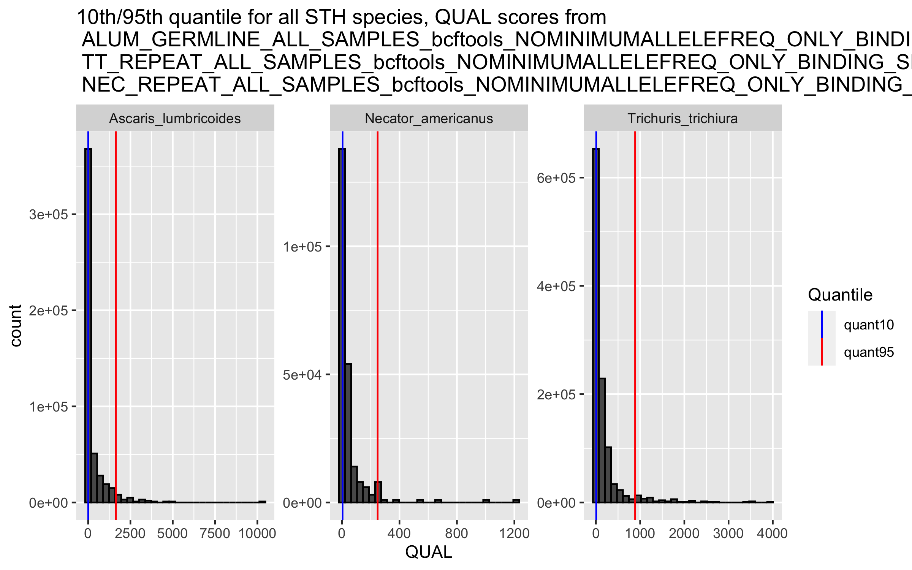
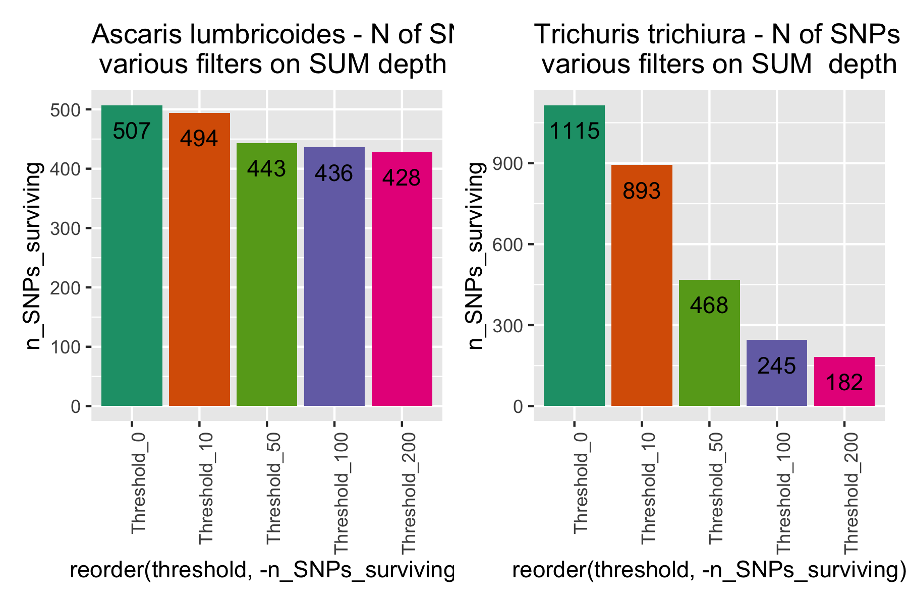

# Nuclear repeat variants and filters
Author: Marina Papaiakovou, mpapaiakovou[at]gmail.com 

## Contents: 
- Nuclear repeat variant calling 
- Filter on repeats with primer/probe binding sites, quality, sum depth, missingness 


- Assess primer/probe bindings sites on the repeats/targets you found with nucmer

```bash
#starting with nucmer coords
awk '{if ($3 > $4) print $13, $4, $3, $12; else print $13, $3, $4, $12}'  OFS="\t" ascaris_15_cov90.coords | grep -e "germline" > ascaris_15_cov90.coords_GERMLINE_reordered.bed
#also generated a bed file (tab delimited) with all the targets - ascaris_15_cov90.coords_formatted_FINAL.bed
#for other species too
awk '{if ($3 > $4) print $13, $4, $3, $12; else print $13, $3, $4, $12}'  OFS="\t" trichuris_15_cov90.coords | grep -e "repeat" > trichuris_15_cov90.coords_REPEAT_reordered.bed
awk '{if ($3 > $4) print $13, $4, $3, $12; else print $13, $3, $4, $12}'  OFS="\t" necator_15_cov90.coords | grep -e "repeat" > necator_15_cov90.coords_REPEAT_reordered.bed

```
- run seqkit to find where the oligos bind, allowing up to 5 mismatches
```bash 
#run seqkit by giving it manually the primer sequences and the probe, per species (could have given it a list too)

conda create --name seqkit
conda activate seqkit

conda install -c bioconda seqkit

#https://bioinf.shenwei.me/seqkit/usage/#locate
#this works. Do it for each oligo separately and remove —m 5 if you don’t want any mismatches
cat ascaris_lumbricoides_renamed.fasta | seqkit locate -p TCTGTGCATTATTGCTGCAATTGGGA --bed > ALUM_PROBE_NO_MISMATCHES.txt
#with mismatches
cat ascaris_lumbricoides_renamed.fasta | seqkit locate -p CTTGTACCACGATAAAGGGCAT -m 5 --bed > ALUM_FWD_MAX_5_MISMATCHES.txt
cat ascaris_lumbricoides_renamed.fasta | seqkit locate -p TCCCTTCCAATTGATCATCGAATAA -m 5 --bed > ALUM_REV_MAX_5_MISMATCHES.txt

#do it for the other species too 

#add a column in each of the seqkit files before you concetenate them
#awk 'BEGIN {OFS="\t"} {print $0, "FWD_primer"}' input.txt > output.txt

awk 'BEGIN {OFS="\t"} {print $0, "FWD_primer"}' ALUM_FWD_MAX_5_MISMATCHES.txt > ALUM_FWD_MAX_5_MISMATCHES_EDITED.txt
#doing a test, to see if start is before end here and if that would cause an issue without bedtools telling me that 
awk '($2 < $3) {print "true"}; ($2 >= $3) {print "false"}' ALUM_PROBE_MAX_5_MISMATCHES_EDITED.txt #all returned true
awk 'BEGIN {OFS="\t"} {print $0, "PROBE"}' ALUM_PROBE_MAX_5_MISMATCHES.txt > ALUM_PROBE_MAX_5_MISMATCHES_EDITED.txt
awk 'BEGIN {OFS="\t"} {print $0, "REV_primer"}' ALUM_REV_MAX_5_MISMATCHES.txt > ALUM_REV_MAX_5_MISMATCHES_EDITED.txt


# Perform bedtools intersect and select specific columns
#ASCARIS ----
bedtools intersect -a ALUM_FWD_MAX_5_MISMATCHES_EDITED.txt -b ascaris_15_cov90.coords_GERMLINE_reordered.bed -wb |  cut -f 8,9,10,11 > ascaris_15_cov90.coords_GERMLINE_FWD_POS_edited.bed

# Perform bedtools intersect and select specific columns
bedtools intersect -a ALUM_REV_MAX_5_MISMATCHES_EDITED.txt -b ascaris_15_cov90.coords_GERMLINE_FWD_POS_edited.bed -wb | cut -f 8,9,10,11 > ascaris_15_cov90.coords_GERMLINE_FWD_REV_POS_edited.bed

# Perform bedtools intersect and select specific columns
bedtools intersect -a ALUM_PROBE_MAX_5_MISMATCHES_EDITED.txt -b ascaris_15_cov90.coords_GERMLINE_FWD_REV_POS_edited.bed -wb | cut -f 8,9,10,11 > ascaris_15_cov90.coords_GERMLINE_FWD_REV_PROBE_POS_FINAL.bed

#the above gives me 80 results - so 80 repeats 
#I looked at some of the results in scaffold 300... Clearly the in silico shows that primers/probe could be mapping elsewhere.. But they have quite a lot of mismatches... 
#FROM THE ABOVE, I HAVE THE BED FILE TO USE FOR COVERAGE CALCULATIONS (filename: ascaris_15_cov90.coords_GERMLINE_FWD_REV_PROBE_POS_FINAL.bed)
#i needed to find the positions of the primers and the probes on those repeats 
bedtools intersect -a ALUM_PROBE_MAX_5_MISMATCHES_EDITED.txt -b ascaris_15_cov90.coords_GERMLINE_FWD_REV_PROBE_POS_FINAL.bed  > intersected_probes.bed
bedtools intersect -a ALUM_FWD_MAX_5_MISMATCHES_EDITED.txt -b ascaris_15_cov90.coords_GERMLINE_FWD_REV_PROBE_POS_FINAL.bed  > intersected_fwd_primers.bed
bedtools intersect -a ALUM_REV_MAX_5_MISMATCHES_EDITED.txt -b ascaris_15_cov90.coords_GERMLINE_FWD_REV_PROBE_POS_FINAL.bed  > intersected_rev_primers.bed
#so will concatenate the file and filter the VCF
#final file: ALUM_REPEAT_OLIGOS_COORDS_FOR_VCF.txt, use it to filter the VCF and keep the VAR POS that are in binding sites ONLY

#repeat for all species

```
- Assessing coverage on those repeats using bedtools multicov 
- merged bams by country because the signal was very low for some samples
- 0.51 to avoid calculating coverage for the same repeat twice if the repeats are near each other
```bash 

bedtools multicov -bams *merged.bam -f 0.51 -bed ascaris_15_cov90.coords_GERMLINE_FWD_REV_PROBE_POS_FINAL.bed  > ascaris_15_cov90_GERMLINE_W_FWD_REV_PRIMER_PROBE_SITES_BEDTOOLS_MULTICOV_PER_COUNTRY_NO_OVERLAP.txt

bedtools multicov -bams *merged.bam -f 0.51 -bed trichuris_15_cov90.coords_REPEAT_FWD_REV_PROBE_POS_FINAL.bed  > trichuris_15_cov90_REPEAT_W_FWD_REV_PRIMER_PROBE_SITES_BEDTOOLS_MULTICOV_PER_COUNTRY_NO_OVERLAP.txt

bedtools multicov -bams *merged.bam -f 0.51 -bed necator_15_cov90.coords_REPEAT_FWD_REV_PROBE_POS_FINAL.bed  > necator_15_cov90_REPEAT_W_FWD_REV_PRIMER_PROBE_SITES_BEDTOOLS_MULTICOV_PER_COUNTRY_NO_OVERLAP.txt

# bedtools multicov per sample now as well 
#/home/marip3/mbl_genome_skimming/03.GLOBAL_SKIM/04.ANALYSIS/02.NUCLEAR_MAPPING/03_BEDTOOLS_MULTICOV

bedtools multicov -bams *_filtered_CIGAR_final.bam -f 0.51 -bed ascaris_15_cov90.coords_GERMLINE_FWD_REV_PROBE_POS_FINAL.bed  > ascaris_15_cov90_GERMLINE_W_FWD_REV_PRIMER_PROBE_SITES_BEDTOOLS_MULTICOV_PER_SAMPLE_NO_OVERLAP.txt

bedtools multicov -bams *_filtered_CIGAR_final.bam -f 0.51 -bed trichuris_15_cov90.coords_REPEAT_FWD_REV_PROBE_POS_FINAL.bed  > trichuris_15_cov90_REPEAT_W_FWD_REV_PRIMER_PROBE_SITES_BEDTOOLS_MULTICOV_PER_SAMPLE_NO_OVERLAP.txt

#necator 
bedtools multicov -bams *_filtered_CIGAR_final.bam -f 0.51 -bed necator_15_cov90.coords_REPEAT_FWD_REV_PROBE_POS_FINAL.bed  > necator_15_cov90_REPEAT_W_FWD_REV_PRIMER_PROBE_SITES_BEDTOOLS_MULTICOV_PER_SAMPLE_NO_OVERLAP.txt

```

### Call variants only on the repeat sites

```bash
#Called variants here: 
/home/marip3/mbl_genome_skimming/03.GLOBAL_SKIM/04.ANALYSIS/02.NUCLEAR_MAPPING
#copied bed files from here:
/home/marip3/mbl_genome_skimming/03.GLOBAL_SKIM/04.ANALYSIS/03.REPEAT_ANALYSIS/01_ALUM
#they were checked for 1-based system and they were filtered for the repeats that did not have binding sites
#moved them here: 
/home/marip3/mbl_genome_skimming/03.GLOBAL_SKIM/04.ANALYSIS/02.NUCLEAR_MAPPING/01_VARIANT_CALLING

#call the variants
bcftools mpileup --annotate FORMAT/AD -Ou --targets-file ascaris_15_cov90.coords_GERMLINE_reordered.bed -f all_genomes.fasta -d 100000 -b bamlist_for_variant_calling | bcftools call -mv --skip-variants indels -o ALUM_GERMLINE_ALL_SAMPLES_bcftools.vcf
bcftools mpileup --annotate FORMAT/AD -Ou --targets-file trichuris_15_cov90.coords_REPEAT_reordered.bed -f  all_genomes.fasta -d 100000 -b bamlist_for_variant_calling | bcftools call -mv --skip-variants indels -o TT_REPEAT_ALL_SAMPLES_bcftools.vcf
bcftools mpileup --annotate FORMAT/AD -Ou --targets-file necator_15_cov90.coords_REPEAT_reordered.bed -f  all_genomes.fasta -d 100000 -b bamlist_for_variant_calling | bcftools call -mv --skip-variants indels -o NEC_REPEAT_ALL_SAMPLES_bcftools.vcf

#count how many variants you start with 
#ascaris
marip3@franklin:~/mbl_genome_skimming/03.GLOBAL_SKIM/04.ANALYSIS/02.NUCLEAR_MAPPING$ less ALUM_GERMLINE_ALL_SAMPLES_bcftools.vcf | grep -v "#"  | cut -f1 | uniq -c


#filter for min/max alleles 
vcftools --vcf ALUM_GERMLINE_ALL_SAMPLES_bcftools.vcf --min-alleles 2 --max-alleles 2 --recode --recode-INFO-all --out ALUM_GERMLINE_ALL_SAMPLES_bcftools_NOMINIMUMALLELEFREQ
#After filtering, kept 688 out of a possible 716 Sites

#now filter for the primer/probe sites
vcftools --vcf ALUM_GERMLINE_ALL_SAMPLES_bcftools_NOMINIMUMALLELEFREQ.recode.vcf --bed ALUM_REPEAT_OLIGOS_COORDS_FOR_VCF.txt --recode --recode-INFO-all --out ALUM_GERMLINE_ALL_SAMPLES_bcftools_NOMINIMUMALLELEFREQ_ONLY_BINDING_SITES
#After filtering, kept 507 out of a possible 688 Sites

#trichuris
#repeat for all species
marip3@franklin:~/mbl_genome_skimming/03.GLOBAL_SKIM/04.ANALYSIS/02.NUCLEAR_MAPPING$ less TT_REPEAT_ALL_SAMPLES_bcftools.vcf | grep -v "#" | cut -f1 | uniq -c

vcftools --vcf TT_REPEAT_ALL_SAMPLES_bcftools.vcf --min-alleles 2 --max-alleles 2 --recode --recode-INFO-all --out TT_REPEAT_ALL_SAMPLES_bcftools_NOMINIMUMALLELEFREQ
#After filtering, kept 1958 out of a possible 2214 Sites
(bcftools) marip3@franklin:~/mbl_genome_skimming/03.GLOBAL_SKIM/04.ANALYSIS/02.NUCLEAR_MAPPING$ cat TT_REPEAT_ALL_SAMPLES_bcftools_NOMINIMUMALLELEFREQ.recode.vcf |grep -v "#" | cut -f1 | uniq -c

#now filter for the primer/probe sites
vcftools --vcf TT_REPEAT_ALL_SAMPLES_bcftools_NOMINIMUMALLELEFREQ.recode.vcf --bed TT_REPEAT_OLIGOS_COORDS_FOR_VCF.txt --recode --recode-INFO-all --out TT_REPEAT_ALL_SAMPLES_bcftools_NOMINIMUMALLELEFREQ_ONLY_BINDING_SITES


#necator
marip3@franklin:~/mbl_genome_skimming/03.GLOBAL_SKIM/04.ANALYSIS/02.NUCLEAR_MAPPING$ less NEC_REPEAT_ALL_SAMPLES_bcftools.vcf | grep -v "#"  | cut -f1 | uniq -c

vcftools --vcf NEC_REPEAT_ALL_SAMPLES_bcftools.vcf --min-alleles 2 --max-alleles 2 --recode --recode-INFO-all --out NEC_REPEAT_ALL_SAMPLES_bcftools_NOMINIMUMALLELEFREQ
#After filtering, kept 284 out of a possible 290 Sites

(bcftools) marip3@franklin:~/mbl_genome_skimming/03.GLOBAL_SKIM/04.ANALYSIS/02.NUCLEAR_MAPPING$ cat NEC_REPEAT_ALL_SAMPLES_bcftools_NOMINIMUMALLELEFREQ.recode.vcf | grep -v "#" | cut -f1 | uniq -c

#now filter for the primer/probe sites
vcftools --vcf NEC_REPEAT_ALL_SAMPLES_bcftools_NOMINIMUMALLELEFREQ.recode.vcf --bed NEC_REPEAT_OLIGOS_COORDS_FOR_VCF.txt --recode --recode-INFO-all --out NEC_REPEAT_ALL_SAMPLES_bcftools_NOMINIMUMALLELEFREQ_ONLY_BINDING_SITES

```
### Filter variants 
- Quality
```{r warning = FALSE}
library(vcfR)
library(tidyverse)
library(VariantAnnotation)
library(stringr)
library(patchwork)

#setwd("/Users/marinapapaiakovou/Documents/00.Cambridge_PhD/02.Science/02.Genome_skimming/07.Global_genome_skim_2023/02_DATA/02_TRIMMED_DATA/04_VARIANT_CALLING/03_NUCLEAR_VARIANTS/02_ORIGINAL_VCFs_FILTERED_FOR_MIN_MAX_ALLELELS_BINDING_SITES/")

ALUM_GERMLINE_VARS <- read.vcfR("/Users/marinapapaiakovou/Documents/00.Cambridge_PhD/02.Science/02.Genome_skimming/07.Global_genome_skim_2023/02_DATA/02_TRIMMED_DATA/04_VARIANT_CALLING/03_NUCLEAR_VARIANTS/02_ORIGINAL_VCFs_FILTERED_FOR_MIN_MAX_ALLELELS_BINDING_SITES/ALUM_GERMLINE_ALL_SAMPLES_bcftools_NOMINIMUMALLELEFREQ_ONLY_BINDING_SITES.recode.vcf")

TT_REPEAT_VARS <- read.vcfR("/Users/marinapapaiakovou/Documents/00.Cambridge_PhD/02.Science/02.Genome_skimming/07.Global_genome_skim_2023/02_DATA/02_TRIMMED_DATA/04_VARIANT_CALLING/03_NUCLEAR_VARIANTS/02_ORIGINAL_VCFs_FILTERED_FOR_MIN_MAX_ALLELELS_BINDING_SITES/TT_REPEAT_ALL_SAMPLES_bcftools_NOMINIMUMALLELEFREQ_ONLY_BINDING_SITES.recode.vcf")
NEC_REPEAT_VARS <- read.vcfR("/Users/marinapapaiakovou/Documents/00.Cambridge_PhD/02.Science/02.Genome_skimming/07.Global_genome_skim_2023/02_DATA/02_TRIMMED_DATA/04_VARIANT_CALLING/03_NUCLEAR_VARIANTS/02_ORIGINAL_VCFs_FILTERED_FOR_MIN_MAX_ALLELELS_BINDING_SITES/NEC_REPEAT_ALL_SAMPLES_bcftools_NOMINIMUMALLELEFREQ_ONLY_BINDING_SITES.recode.vcf")

ALUM_GERMLINE_VARS_df <- vcfR2tidy(ALUM_GERMLINE_VARS, single_frame = TRUE, toss_INFO_column = TRUE, alleles =TRUE)
TT_REPEAT_VARS_df <- vcfR2tidy(TT_REPEAT_VARS, single_frame = TRUE, toss_INFO_column = TRUE, alleles =TRUE)
NEC_REPEAT_VARS_df  <-vcfR2tidy(NEC_REPEAT_VARS,single_frame = TRUE, toss_INFO_column = TRUE, alleles =TRUE )


ALUM_GERMLINE_VARS_df_2 <- ALUM_GERMLINE_VARS_df$dat
TT_REPEAT_VARS_df_2 <- TT_REPEAT_VARS_df$dat
NEC_REPEAT_VARS_df_2 <- NEC_REPEAT_VARS_df$dat


ALUM_GERMLINE_VARS_df_2$species  <- "Ascaris_lumbricoides"
TT_REPEAT_VARS_df_2$species <- "Trichuris_trichiura"
NEC_REPEAT_VARS_df_2$species <- "Necator_americanus"

#bind them all together and then select specific columns 
ALL_SPECIES <- rbind(ALUM_GERMLINE_VARS_df_2, TT_REPEAT_VARS_df_2, NEC_REPEAT_VARS_df_2)

#will need to plot the QUALITY SCORES pper species
ALL_SPECIES_2 <- ALL_SPECIES %>%
  dplyr::select(CHROM, POS, QUAL, REF, ALT,  DP4, Indiv, species)


#set the quantile breaks
q <- c(0.05, 0.1, 0.25, 0.5, 0.75, 0.95)

#calculate the quantiles, for these 5 species 
d2 <- ALL_SPECIES_2 %>%
  group_by(species) %>%
  summarize(quant5 = quantile(QUAL, probs = q[1]), 
            quant10 =quantile(QUAL, probs = q[2]),
            quant25 = quantile(QUAL, probs = q[3]), 
            quant50 = quantile(QUAL, probs = q[4]),
            quant75 = quantile(QUAL, probs = q[5]),
            quant95 = quantile(QUAL, probs = q[6]))


```

- plotting quality distributions
```{r VAR_QUAL_distributions_for_all_species_variants_only_on_binding_sites, fig.path='./00_FIGURES/'}
png(filename = "00_FIGURES/VAR_QUAL_distributions_for_all_species_variants_only_on_binding_sites.png", height = 5, width = 8, units = "in", res = 300)


ggplot(ALL_SPECIES_2, aes (x = QUAL)) +
  geom_histogram(color = 'black') +
  #geom_density(alpha=.3) +
  geom_vline(data = d2, aes(xintercept = quant10, color="quant10")) +
  geom_vline(data = d2, aes(xintercept = quant95, color ="quant95"))+
  scale_color_manual("Quantile", values = c(quant10 = "blue", quant95 = "red"), labels= c("quant10","quant95"))+
  facet_wrap(species~.,scales="free")+
  ggtitle("10th/95th quantile for all STH species, QUAL scores from  \n ALUM_GERMLINE_ALL_SAMPLES_bcftools_NOMINIMUMALLELEFREQ_ONLY_BINDING_SITES.recode.vcf \n TT_REPEAT_ALL_SAMPLES_bcftools_NOMINIMUMALLELEFREQ_ONLY_BINDING_SITES.recode.vcf \n NEC_REPEAT_ALL_SAMPLES_bcftools_NOMINIMUMALLELEFREQ_ONLY_BINDING_SITES.recode.vcf")

dev.off()
```


- Filter based on 10th quantile of the quality 
```{r warning =FALSE}
#filter for high quality, by the 10th quantile
#select CHROM, species, POS, QUAL, sample_id
QUAL_POS_FILTER <- ALL_SPECIES_2 %>%
  dplyr::select(1,2,3,7,8)


#Ascaris filtering, high quality -----
ALUM_high_quality <- QUAL_POS_FILTER %>%
  filter(species == "Ascaris_lumbricoides") %>% #species == was not working, needed %in% 
  filter(QUAL >= 5.71) #filtering for 10th quantile QUAL =5.71

ALUM_high_quality_uniq <- ALUM_high_quality %>%
  distinct(CHROM, POS) %>% #group by both scaffold and position 
  group_walk(~ write.table(.x, paste0(.y, "ALUM_GERMLINE_REPEAT_high_quality_uniq.csv"), row.names=FALSE, col.names=FALSE, quote=FALSE, sep = '\t')) #save independent csv per species for that condition
#457 SNPs for the 10th quantile

#Trichuris filtering, high quality -----
TT_high_quality <- QUAL_POS_FILTER %>%
  filter(species == "Trichuris_trichiura") %>% #species == was not working, needed %in% 
  filter(QUAL >= 5.45) # 10th quantile QUAL =5.45

TT_high_quality_uniq <- TT_high_quality %>%
  distinct(CHROM, POS) %>% #group by both scaffold and position 
  group_walk(~ write.table(.x, paste0(.y, "TT_REPEAT_high_quality_uniq.csv"), row.names=FALSE, col.names=FALSE, quote=FALSE, sep = '\t')) #save independent csv per species for that condition
#1005 SNPs 10th quantile

#Necator filtering, high quality -----
NEC_high_quality <- QUAL_POS_FILTER %>%
  filter(species == "Necator_americanus") %>% #species == was not working, needed %in% 
  filter(QUAL >= 3.75) #10th quantile QUAL = 3.75

NEC_high_quality_uniq <- NEC_high_quality %>%
  distinct(CHROM, POS) %>% #group by both scaffold and position 
  group_walk(~ write.table(.x, paste0(.y, "NEC_REPEAT_high_quality_uniq.csv"), row.names=FALSE, col.names=FALSE, quote=FALSE, sep = '\t')) #save independent csv per species for that condition
#212 SNPs for 10th quantile 

```

- Filter VCFs for HIGH_QUAL positions
```bash
########################################################################
##TURNING THE POSITIONS INTO A FILTER FOR HIGHQUAL FOR ALL REPEATS
########################################################################
#I have checked for duplicates, but did not include it in the name
vcftools --vcf ALUM_GERMLINE_ALL_SAMPLES_bcftools_NOMINIMUMALLELEFREQ_ONLY_BINDING_SITES_removeddups.recode.vcf --positions ALUM_REPEAT_highqual --recode --recode-INFO-all --out ALUM_GERMLINE_bcftools_HIGHQUAL_removeddups
#After filtering, kept 457 out of a possible 507 Sites

vcftools --vcf TT_REPEAT_ALL_SAMPLES_bcftools_NOMINIMUMALLELEFREQ_ONLY_BINDING_SITES_removeddups.recode.vcf --positions TT_REPEAT_highqual --recode --recode-INFO-all --out TT_REPEAT_bcftools_HIGHQUAL_removeddups
#After filtering, kept 1005 out of a possible 1115 Sites

vcftools --vcf NEC_REPEAT_ALL_SAMPLES_bcftools_NOMINIMUMALLELEFREQ_ONLY_BINDING_SITES_removeddups.recode.vcf --positions NEC_REPEAT_highqual --recode --recode-INFO-all --out NEC_REPEAT_bcftools_HIGHQUAL_removeddups
#After filtering, kept 212 out of a possible 237 Sites

#IF YOU WANT TO EXPORT THE FORMAT/AD COLUMNS TO CALCULATE ALLELE FREQUENCY AND PLOT
#for vcf in *HIGHQUAL_removeddups.recode.vcf; do vcf_base_name=$(basename "$vcf" .vcf); vcftools --vcf $vcf  --extract-FORMAT-info AD --out "${vcf_base_name}.FORMAT_AD";done

```
- Calculate sum_depth 
- Explored thresholds on sum_depth (both REF+ALT allele) and assess how many SNPs remain (optional)
- note; ended up dropping Necator for SNP assessment because only 2 countries survived all all the filters that follow: QUAL, SUM_depth, missingness etc


```{r warning=FALSE}
transform_dataset_for_allele_frequency <- function(file) {
  df_1 <- read.delim(file, header=T, sep="\t")
  # Perform data cleaning and calculations of allele frequency
  df_out <- pivot_longer(df_1, cols = 3:ncol(df_1),
                         names_to = "sample_id",
                         values_to = "allele_depth")
  df_2<- separate(data = df_out, col = allele_depth, into = c("REF_depth", "ALT_depth"), sep = ",")
  df_2[, 4:5] <- lapply(df_2[, 4:5], as.numeric)
  df_3 <- mutate(df_2, SUM_DEPTH = rowSums(df_2[, 4:5], na.rm = TRUE))
  df_4 <- df_3 %>% group_by(CHROM) %>% mutate(allele_frequency = ALT_depth / SUM_DEPTH)
  country_map <- c(
    "BEN" = "Benin","CMR" = "Cameroon","TZA" = "Tanzania","ETH" = "Ethiopia","UGA" = "Uganda","IND" = "India","MWI" = "Malawi","MMR" = "Myanmar", "HND" ="Honduras",   "NGA" = "Nigeria","ARG" = "Argentina","BGD" = "Bangladesh","CHN" = "China","ECU" = "Ecuador","GLP" = "Guadeloupe","FJI" = "Fiji","LKA" = "Sri_Lanka",
    "MOZ" = "Mozambique","ITA" = "Italy","PR1" = "Puerto_Rico","COD" = "DRC","SEN" = "Senegal","THA" = "Thailand","USA" = "USA","ZAF" = "South_Africa","MYS" = "Malaysia", 
    "KEN" = "Kenya")
  df_5 <- df_4 %>%
    mutate(country = country_map[substr(sample_id, 1, 3)])
  
}

ALLELE_FREQ_ALUM_REPEAT <- transform_dataset_for_allele_frequency("/Users/marinapapaiakovou/Documents/00.Cambridge_PhD/02.Science/02.Genome_skimming/07.Global_genome_skim_2023/02_DATA/02_TRIMMED_DATA/04_VARIANT_CALLING/03_NUCLEAR_VARIANTS/05_FORMAT_AD_FILES_MIN_MAX_BINDING_SITES/ALUM_GERMLINE_ALL_SAMPLES_bcftools_NOMINIMUMALLELEFREQ_ONLY_BINDING_SITES.recode.FORMAT_AD.AD.FORMAT")
colnames(ALLELE_FREQ_ALUM_REPEAT) <- c('scaffold', 'POS','sample_id', 'REF_depth', 'ALT_depth', 'SUM_depth', 'allele_frequency', 'country')
ALLELE_FREQ_ALUM_REPEAT$species <- 'Ascaris_lumbricoides'

ALLELE_FREQ_TT_REPEAT <- transform_dataset_for_allele_frequency("/Users/marinapapaiakovou/Documents/00.Cambridge_PhD/02.Science/02.Genome_skimming/07.Global_genome_skim_2023/02_DATA/02_TRIMMED_DATA/04_VARIANT_CALLING/03_NUCLEAR_VARIANTS/05_FORMAT_AD_FILES_MIN_MAX_BINDING_SITES/TT_REPEAT_ALL_SAMPLES_bcftools_NOMINIMUMALLELEFREQ_ONLY_BINDING_SITES.recode.FORMAT_AD.AD.FORMAT")
colnames(ALLELE_FREQ_TT_REPEAT) <- c('scaffold', 'POS','sample_id', 'REF_depth', 'ALT_depth', 'SUM_depth', 'allele_frequency', 'country')
ALLELE_FREQ_TT_REPEAT$species <- 'Trichuris_trichiura'

#ended up dropping Necator, low number of variants/countries

ALL_SPECIES_SUM_DEPTHs <- rbind(ALLELE_FREQ_ALUM_REPEAT, ALLELE_FREQ_TT_REPEAT)

# set the quantile breaks
q <- c(0.05, 0.1, 0.25, 0.5, 0.75, 0.95)

s2 <- ALL_SPECIES_SUM_DEPTHs %>%
 filter(SUM_depth>0) %>% #had to do this otherwise I was getting 0s
  group_by(species) %>%
  summarize(quant5 = quantile(SUM_depth, probs = q[1]), 
            quant10 = quantile(SUM_depth, probs = q[2]),
            quant25 = quantile(SUM_depth, probs = q[3]), 
            quant50 = quantile(SUM_depth, probs = q[4]),
            quant75 = quantile(SUM_depth, probs = q[5]),
            quant95 = quantile(SUM_depth, probs = q[6]))

```
```{r VAR_SUM_DEPTH_distributions_for_all_species_variants_only_on_binding_sites, fig.path='./00_FIGURES/'}
png(filename = "00_FIGURES/VAR_SUM_DEPTH_distributions_for_all_species_variants_only_on_binding_sites.png", height = 5, width = 8, units = "in", res = 300)


ggplot(ALL_SPECIES_SUM_DEPTHs, aes (x = SUM_depth)) +
  geom_histogram(color = 'black') +
  #geom_density(alpha=.3) +
  geom_vline(data = s2, aes(xintercept = quant10, color="quant10")) +
  geom_vline(data = s2, aes(xintercept = quant95, color ="quant95"))+
  scale_color_manual("Quantile", values = c(quant10 = "blue", quant95 = "red"), labels= c("quant10","quant95"))+
  facet_wrap(species~.,scales="free")+
  ggtitle("10th/95th quantile for all STH species, SUM_depth scores from ALUM, TT, filtered depths > 0")+
  scale_x_log10()

dev.off()
```

- Filtered by the 10th quantile on sum_depth as well 

```{r warning = FALSE}

#To get the unique sample id for which SUM_depth > 10 
#and then filter your VCF for these samples
ALUM_unique_sample_ids <- ALLELE_FREQ_ALUM_REPEAT %>%
  filter(SUM_depth >= 1) %>%
  group_by(sample_id) %>%
  summarize()#%>%
#group_walk(~ write.table(.x, paste0(.y, "ALUM_REPEAT_sample_ids_SUM_depth_10th_quantile.csv"), row.names=FALSE, col.names=FALSE, quote=FALSE, sep = '\t')) #save independent csv per species for that condition
#170 individuals 

TT_unique_sample_ids <- ALLELE_FREQ_TT_REPEAT %>%
filter(SUM_depth >= 1) %>%
  group_by(sample_id) %>%
  summarize()# %>%
 # group_walk(~ write.table(.x, paste0(.y, "TT_REPEAT_sample_ids_SUM_depth_10th_quantile.csv"), row.names=FALSE, col.names=FALSE, quote=FALSE, sep = '\t')) #save independent csv per species for that condition
#41 individuals 

########################################################################################
####################### NUMBER OF SNPs surviving AFTER THRESHOLD ON SUM_DEPTH  ----
########################################################################################
# Define the datasets and their names
dataset_names <- c("ALLELE_FREQ_ALUM_REPEAT", "ALLELE_FREQ_TT_REPEAT", "ALLELE_FREQ_NEC_REPEAT")

# Initialize a list to store the results
results <- list()

# Loop over the dataset names
for (dataset_name in dataset_names) {
  # Check if the dataset exists in the environment
  if (!exists(dataset_name)) {
    warning(paste("Dataset", dataset_name, "does not exist. Skipping..."))
    next
  }
  
  dataset <- get(dataset_name)
  
  # Initialize a list to store the results for this dataset
  unique_pos_counts <- list()
  
  # Loop over the thresholds
  thresholds <- c(0, 10, 50, 100, 200)
  for (threshold in thresholds) {
    # Filter the dataset based on the threshold conditions
    filtered_data <- dataset %>%
      filter(SUM_depth > threshold) %>%
      distinct(POS)
    
    # Count the number of unique positions
    unique_pos_count <- nrow(filtered_data)
    
    # Store the result
    unique_pos_counts[[paste0("Threshold_", threshold)]] <- unique_pos_count
  }
  
  # Store the results for this dataset
  results[[dataset_name]] <- unique_pos_counts
}

# Print the results
print(results)

#unnest the list
# Flatten the results dataset while preserving the names
# Apply unlist to each dataset in the results list
unlisted_results <- lapply(results, unlist)

# Print the unlisted results
print(unlisted_results)

# Convert the unlisted dataset to a dataframe with row names
ALUM_SNPS_THRESHOLDS <- as.data.frame(unlisted_results$ALLELE_FREQ_ALUM_REPEAT, row.names = TRUE)
# Add the row names as a separate column named "column1"
ALUM_SNPS_THRESHOLDS$threshold <- row.names(ALUM_SNPS_THRESHOLDS)
colnames(ALUM_SNPS_THRESHOLDS) <- c('n_SNPs_surviving', 'threshold')

TT_SNPS_THRESHOLDS <- as.data.frame(unlisted_results$ALLELE_FREQ_TT_REPEAT, row.names = T)
TT_SNPS_THRESHOLDS$threshold <- row.names(TT_SNPS_THRESHOLDS)
colnames(TT_SNPS_THRESHOLDS) <- c('n_SNPs_surviving', 'threshold')

```

```{r SNPs_SURVIVING_SUM_DEPTH_THRESHOLDS, fig.path='./00_FIGURES/'}

png(filename = "00_FIGURES/SNPs_SURVIVING_SUM_DEPTH_THRESHOLDS.png", height =4, width = 6, units = "in", res = 300)


TT_plot <- ggplot(TT_SNPS_THRESHOLDS, aes(reorder(threshold, -n_SNPs_surviving), n_SNPs_surviving, fill=threshold)) +
  geom_bar(stat="identity", show.legend = FALSE) +
  geom_text(aes(label=n_SNPs_surviving),position="stack",vjust=2)+
  scale_fill_brewer(palette="Dark2")+
  theme(axis.text.x = element_text(angle = 90, hjust = 1))  +
  ggtitle("Trichuris trichiura - N of SNPs surviving \n various filters on SUM  depth")

ALUM_plot <- ggplot(ALUM_SNPS_THRESHOLDS, aes(reorder(threshold, -n_SNPs_surviving), n_SNPs_surviving, fill=threshold)) +
  geom_bar(stat="identity", show.legend = FALSE) +
  geom_text(aes(label=n_SNPs_surviving),position="stack",vjust=2)+
  scale_fill_brewer(palette="Dark2")+
  theme(axis.text.x = element_text(angle = 90, hjust = 1))  +
  ggtitle("Ascaris lumbricoides - N of SNPs surviving \n various filters on SUM depth")


BOTH_SPECIES_SNPs_SUM_DEPTH <- ALUM_plot + TT_plot 

print(BOTH_SPECIES_SNPs_SUM_DEPTH)


```



- filter VCF based on 10th quantile of SUM_depth 

```bash
#Filtered for SUM_DEPTH (> 10)
vcftools --vcf ALUM_GERMLINE_bcftools_HIGHQUAL_removeddups.recode.vcf  --keep ALUM_REPEAT_sample_ids_SUM_depth_10th_quantile.txt --recode --recode-INFO-all --out ALUM_GERMLINE_bcftools_HIGHQUAL_removeddups_SUM_DEPTH_OVER_10
#170 indiv, 457

vcftools --vcf TT_REPEAT_bcftools_HIGHQUAL_removeddups.recode.vcf  --keep TT_REPEAT_sample_ids_SUM_depth_10th_quantile.txt --recode --recode-INFO-all --out TT_REPEAT_bcftools_HIGHQUAL_removeddups_SUM_DEPTH_OVER_10
#41 indiv, 1005 sites
```

- Sample missingness (optional to explore)
```bash
#indv_missingness = and so that is the proportion of sites per individual with missing data
for vcf in *HIGHQUAL_removeddups_SUM_DEPTH_OVER_10.recode.vcf; do vcftools --vcf $vcf --missing-indv --out $vcf; done

```


```{r warning = FALSE}

library(tidyverse)
directory <- "/Users/marinapapaiakovou/Documents/00.Cambridge_PhD/02.Science/02.Genome_skimming/07.Global_genome_skim_2023/02_DATA/02_TRIMMED_DATA/04_VARIANT_CALLING/03_NUCLEAR_VARIANTS/04_IMISS_FILES_FROM_VCFs_MIN_MAX_BINDING_SITES_SUM_DEPTH_FILTERED/"

# Use list.files to get a list of .imiss files in the directory
imiss_file_list <- list.files(directory, pattern = "*.imiss", full.names = TRUE)

# Create an empty data frame to store the results
ALL_SPECIES_IMISS <- data.frame()

# Define a function to map species based on prefixes
map_species <- function(filename) {
  prefix <- sub("_.*", "", basename(filename))  # Get the first part of the filename before the first underscore
  
  # Map prefixes to species
  species <- switch(
    tolower(prefix),
    "alum" = "Ascaris_lumbricoides",
    "tt" = "Trichuris_trichiura",
    "nec" = "Necator_americanus",
    NA  # Default to NA if no match
  )
  
  return(species)
}

# Loop through each file
for (i in 1:length(imiss_file_list)) {
  # Read the file content as a table
  df <- read.table(imiss_file_list[i], header = TRUE, sep = "\t")
  
  # Map species based on prefixes in the filename
  species <- map_species(imiss_file_list[i])
  
  # Add 'condition' and 'species' columns to the data frame
  df$species <- species
  
  # Combine the data frame with the overall result data frame
  ALL_SPECIES_IMISS <- rbind(ALL_SPECIES_IMISS, df)
}

#FILTER ALL THE DATA that are 0
ALL_SPECIES_IMISS_NOZEROS <- ALL_SPECIES_IMISS %>%
  filter(F_MISS > 0)

#You know what, I will do the independe
ALUM_F_MISS <- ALL_SPECIES_IMISS_NOZEROS %>%
  filter(species == "Ascaris_lumbricoides")

#order the data
#ALUM_F_MISS2 <- arrange(ALUM_F_MISS, F_MISS)

TT_F_MISS <- ALL_SPECIES_IMISS_NOZEROS %>%
  filter(species == "Trichuris_trichiura")


#set the quantile breaks
q <- c(0.05, 0.1, 0.25, 0.5, 0.75, 0.95)

#run quantiles for ALL SPECIES and plot barplots with 10th/95th
#calculate the quantiles, for these 5 species 
ALUM_quantile <- ALUM_F_MISS %>%
  # group_by(species) %>%
  summarize(quant5 = quantile(F_MISS, probs = q[1]), 
            quant10 =quantile(F_MISS, probs = q[2]),
            quant25 = quantile(F_MISS, probs = q[3]), 
            quant50 = quantile(F_MISS, probs = q[4]),
            quant75 = quantile(F_MISS, probs = q[5]),
            quant95 = quantile(F_MISS, probs = q[6]))
TT_quantile <- TT_F_MISS %>%
  # group_by(species) %>%
  summarize(quant5 = quantile(F_MISS, probs = q[1]), 
            quant10 =quantile(F_MISS, probs = q[2]),
            quant25 = quantile(F_MISS, probs = q[3]), 
            quant50 = quantile(F_MISS, probs = q[4]),
            quant75 = quantile(F_MISS, probs = q[5]),
            quant95 = quantile(F_MISS, probs = q[6]))


```

```{r ALL_SPECIES_BARPLOTS_FILTERED_BY_QUAL_SUM_DEPTH_10th_95_th_QUANTILE_SAMPLE_MISSINGNESS, fig.path='./00_FIGURES/'}

png(filename = "00_FIGURES/ALL_SPECIES_BARPLOTS_FILTERED_BY_QUAL_SUM_DEPTH_10th_95_th_QUANTILE_SAMPLE_MISSINGNESS.png", height =4, width = 6, units = "in", res = 300)


#plotting them individually
ALUM_FMISS_plot <- ggplot(ALUM_F_MISS, aes(x=1-F_MISS))+
         geom_histogram(color = 'black') +ggtitle("1-F_MISS - ALUM w/ 10th-95th quantile \n (plotted 1-quantile)")+  theme(axis.text.x = element_text(angle = 90, hjust = 1))+
  geom_vline(data = ALUM_quantile, aes(xintercept = 1-quant10, color="quant10")) +
  geom_vline(data = ALUM_quantile, aes(xintercept = 1-quant95, color ="quant95"))+
  scale_color_manual("Quantile", values = c(quant10 = "blue", quant95 = "red"), labels= c("quant10","quant95"))
 
TT_FMISS_plot <- ggplot(TT_F_MISS, aes(x=1-F_MISS))+
  geom_histogram(color = 'black') +ggtitle("1-F_MISS- TT w/ 10th-95th quantile \n (plotted 1-quantile)")+theme(axis.text.x = element_text(angle = 90, hjust = 1))+
  geom_vline(data = TT_quantile, aes(xintercept = 1-quant10, color="quant10")) +
  geom_vline(data = TT_quantile, aes(xintercept = 1-quant95, color ="quant95"))+
  scale_color_manual("Quantile", values = c(quant10 = "blue", quant95 = "red"), labels= c("quant10","quant95"))


ALL_SPECIES_BARPLOTS_FILTERED_BY_QUAL_SUM_DEPTH_10th_95_th_QUANTILE_SAMPLE_MISSINGNESS <- ALUM_FMISS_plot+TT_FMISS_plot

print(ALL_SPECIES_BARPLOTS_FILTERED_BY_QUAL_SUM_DEPTH_10th_95_th_QUANTILE_SAMPLE_MISSINGNESS)
dev.off()

```

- Take the imiss files and filter them as per the missingnss you want to tolerate (filtered based on the 50th percentile)
- Then filter the imiss file, then use it as a keeplist and filter the VCf for max missingness 

```bash
###############
#ASCARIS ----
###############
#> ALUM_quantile
#quant5   quant10  quant25   quant50   quant75   quant95
#1 0.09660838 0.2380744 0.643873 0.8391685 0.9349018 0.9858864

#1-0.643873 = 0.356127 #25TH QUANTILE
#1-0.8391685=0.1608315 #50TH QUANTILE
#1-0.2380744=0.7619256, quant10
#1-0.09660838=0.9033916, quant5
##create keeplist from imiss file:
awk -F'\t' '($5 < 0.356127){print $1}' ALUM_GERMLINE_bcftools_HIGHQUAL_removeddups_SUM_DEPTH_OVER_10.recode.vcf.imiss > ALUM_SAMPLES_SURVIVE_MISSINGNESS_25_quantile.txt
awk -F'\t' '($5 < 0.1608315){print $1}' ALUM_GERMLINE_bcftools_HIGHQUAL_removeddups_SUM_DEPTH_OVER_10.recode.vcf.imiss > ALUM_SAMPLES_SURVIVE_MISSINGNESS_50th_quantile.txt
awk -F'\t' '($5 < 0.7619256){print $1}' ALUM_GERMLINE_bcftools_HIGHQUAL_removeddups_SUM_DEPTH_OVER_10.recode.vcf.imiss > ALUM_SAMPLES_SURVIVE_MISSINGNESS_10th_quantile.txt
awk -F'\t' '($5 < 0.9033916){print $1}' ALUM_GERMLINE_bcftools_HIGHQUAL_removeddups_SUM_DEPTH_OVER_10.recode.vcf.imiss > ALUM_SAMPLES_SURVIVE_MISSINGNESS_5th_quantile.txt

#I will assess all missingness filters 
##create a new vcf applying max missing 0.7 with keeplist from above
vcftools --vcf ALUM_GERMLINE_bcftools_HIGHQUAL_removeddups_SUM_DEPTH_OVER_10.recode.vcf --max-missing 0.7 --keep ALUM_SAMPLES_SURVIVE_MISSINGNESS.txt --recode --recode-INFO-all --out ALUM_GERMLINE_bcftools_HIGHQUAL_removeddups_SUM_DEPTH_OVER_10_MAX_MISSINGNESS_0.7_w_filtered_indvs
#After filtering, kept 12 out of 170 Individuals
#After filtering, kept 416 out of a possible 457 Sites


###############
#TRICHURIS ----
###############
#> TT_quantile
#quant5 quant10  quant25  quant50  quant75 quant95
#1 0.187065 0.21592 0.322388 0.410945 0.923383 0.99403

#create keeplist from imiss file:
#1-0.410945=0.58905, quant50
#1-0.322388=0.677612, quant25
#1-0.21592=0.78408, quant10
#1-0.187065=0.812935, quant5
awk -F'\t' '($5 < 0.58905){print $1}' TT_REPEAT_bcftools_HIGHQUAL_removeddups_SUM_DEPTH_OVER_10.recode.vcf.imiss > TT_SAMPLES_SURVIVE_MISSINGNESS_50th_quantile.txt
awk -F'\t' '($5 < 0.677612){print $1}' TT_REPEAT_bcftools_HIGHQUAL_removeddups_SUM_DEPTH_OVER_10.recode.vcf.imiss > TT_SAMPLES_SURVIVE_MISSINGNESS_25_quantile.txt
awk -F'\t' '($5 < 0.78408){print $1}' TT_REPEAT_bcftools_HIGHQUAL_removeddups_SUM_DEPTH_OVER_10.recode.vcf.imiss > TT_SAMPLES_SURVIVE_MISSINGNESS_10_quantile.txt
awk -F'\t' '($5 < 0.812935){print $1}' TT_REPEAT_bcftools_HIGHQUAL_removeddups_SUM_DEPTH_OVER_10.recode.vcf.imiss > TT_SAMPLES_SURVIVE_MISSINGNESS_5_quantile.txt

##create a new vcf applying max missing 0.7 with keeplist from above
vcftools --vcf TT_REPEAT_bcftools_HIGHQUAL_removeddups_SUM_DEPTH_OVER_10.recode.vcf --max-missing 0.7 --keep TT_SAMPLES_SURVIVE_MISSINGNESS.txt --recode --recode-INFO-all --out TT_REPEAT_bcftools_HIGHQUAL_removeddups_SUM_DEPTH_OVER_10_MAX_MISSINGNESS_0.7_w_filtered_indvs
#After filtering, kept 28 out of 41 Individuals
#Outputting VCF file...
#After filtering, kept 528 out of a possible 1005 Sites
```
- this VCF now is done with all filtered and SNPs can be visualised on Geneious or equivalent 
- Select SNPs for testing 
