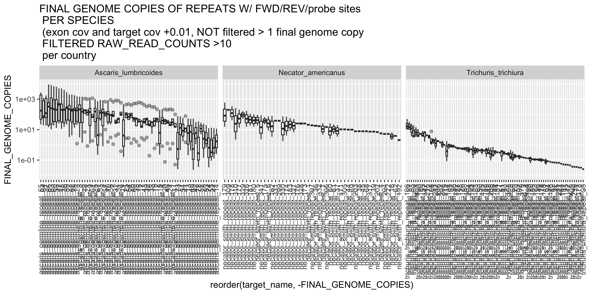

# Normalised repeat coverage by exon coverage
Author: Marina Papaiakovou, mpapaiakovou[at]gmail.com 

## Contents: 
- bash code to assess single copy exon coverage in merged-by-country bam files
- bash code to assess repeat coverage in merged-by-country bam files
- R code to normalise repeat coverage by single copy exon coverage (both the above)
- Visualise in R
- Main figure in MS - to be updated with doi 
- Beautifications on illustrator 


```bash
#Run BUSCO for repeat normalisation 

#https://busco.ezlab.org/busco_userguide.html#installation-with-conda
conda create --name busco2

mamba install -c conda-forge -c bioconda busco=5.6.1

#run BUSCO
#Running both genomes, the original and the renamed because I have done the analysis of the repeat with the renamed on
busco -i ascaris_lumbricoides.fasta -o ./01_ALUM_BUSCO_OUTPUT -l nematoda_odb10 -m geno
#busco -i ascaris_lumbricoides_renamed.fasta -o ./01_ALUM_RENAMED_BUSCO_OUTPUT -l nematoda_odb10 -m geno
busco -i trichuris_trichiura.fa -o ./02_TT_BUSCO_OUTPUT -l nematoda_odb10 -m geno
#busco -i trichuris_trichiura_renamed.fa -o ./02_TT_RENAMED_BUSCO_OUTPUT -l nematoda_odb10 -m geno
busco -i strongyloides_stercoralis.fasta -o ./03_STRONGY_BUSCO_OUTPUT -l nematoda_odb10 -m geno
#busco -i strongyloides_stercoralis_renamed.fasta -o ./03_STRONGY_RENAMED_BUSCO_OUTPUT -l nematoda_odb10 -m geno
busco -i necator_americanus.fasta -o ./04_NEC_BUSCO_OUTPUT -l nematoda_odb10 -m geno
#busco -i necator_americanus_renamed.fasta -o ./04_NEC_RENAMED_BUSCO_OUTPUT -l nematoda_odb10 -m geno
#how to find the lineage file
#busco --list-datasets

#the output directory should not exist, otherwise, tyoe -f to overwrite it

#exploring the results
#the basic table: 
/home/marip3/mbl_genome_skimming/03.GLOBAL_SKIM/04.ANALYSIS/02.NUCLEAR_MAPPING/04_BUSCO_ANALYSIS/01_BUSCO_OUTPUT/run_nematoda_odb10
#table with all the results: 
full_table.tsv #in the same folder

#all the single copy sequences are here from the BUSCO analysis
/home/marip3/mbl_genome_skimming/03.GLOBAL_SKIM/04.ANALYSIS/02.NUCLEAR_MAPPING/04_BUSCO_ANALYSIS/01_BUSCO_OUTPUT/run_nematoda_odb10/busco_sequences/single_copy_busco_sequences
#took the IDs from that list and tried to find them in the final table
#ls -1 *.gff | cut -d '.' -f1 > BUSCO_IDS_SINGLE_COPY_GENES


#need to find the single copy genes... So I will take all the exons from all single copy genes 
#I will assess coverage in each genome and then take the median to normalise the repeats 
awk -F'\t' '$3 == "exon" {print}' *.gff > EXONS_ONLY.txt


#select the columns of scaffold, scaffold_start, scaffold_end, information on exon 
awk 'BEGIN {OFS="\t"} {print $1, $4, $5, $9}' EXONS_ONLY.txt > EXONS_ALUM.bed

#Version: v2.30.0
#/home/marip3/mbl_genome_skimming/03.GLOBAL_SKIM/04.ANALYSIS/02.NUCLEAR_MAPPING/05_BEDTOOLS_COVERAGE_EXONS
bedtools multicov -bams *_filtered_CIGAR_final.bam -bed EXONS_ALUM.bed > ALL_ALUM_EXONS_BEDTOOLS_MULTICOV.txt #this is exon coverage in individual samples 
#do it for all species

#/home/marip3/mbl_genome_skimming/03.GLOBAL_SKIM/04.ANALYSIS/02.NUCLEAR_MAPPING/06_BEDTOOLS_COVERAGE_BY_COUNTRY
#the above folder had exon coverage for all country bam files (to normalise the repeat coverage by country bams) - same principle
#then assess coverage in the exons for country bams 
for bed in *.bed; do bedtools multicov -bams *merged.bam -bed "$bed" > ${bed%.bed}_BEDTOOLS_MULTICOV_PER_COUNTRY.txt ; done
#e.g., EXONS_ALUM_BEDTOOLS_MULTICOV_PER_COUNTRY.txt


```
- For repeat coverage I merged the bam files by country, to increase the signal (as for the poo samples, signal was very low)
```bash

###############################
#MOVING_BAMS_PER_COUNTRY.sh
###############################
#!/bin/bash
# Define the directory containing the files
# List all files in the directory
ls -1 *_filtered_CIGAR_final.bam | while IFS= read -r file; do
# Extract the first 3 characters of the filename
prefix=$(basename "$file" | cut -c 1-3)
# Define the output filename based on the prefix
output_file="${prefix}_to_be_merged.txt"
# Append the filename to the corresponding output file
echo "$file" >> "$output_file"
#I WILL HAVE TO SPLIT THE KEN, ETH, UGA, CMR etc MANUALLY BUT THAT'S OK (because both worms and poo samples end up at the same place)
done
###############################

#for bamtools merge and how it works
#https://www.biostars.org/p/9864/
#And then use the .txt output files to run bamtools and merge the bams
for file in *to_be_merged.txt; do prefix=$(basename "$file" "_to_be_merged.txt"); echo "this is the $prefix"; bamtools merge -list "$file" -out "${prefix}_merged.bam"; done

#need to index all the bam files
for bam in *.bam; do samtools index $bam; done

#NOW need to calculate bedtools multicov using TWO SEPARATE BED FILES
/home/marip3/mbl_genome_skimming/03.GLOBAL_SKIM/04.ANALYSIS/02.NUCLEAR_MAPPING/06_BEDTOOLS_COVERAGE_BY_COUNTRY

```
- Exon coverage per country 
```{r warning = FALSE}
#import the files in R
library(tidyverse)
library(forcats)
library(viridis)
library(patchwork)
setwd("/Users/marinapapaiakovou/Documents/00.Cambridge_PhD/02.Science/02.Genome_skimming/07.Global_genome_skim_2023/02_DATA/02_TRIMMED_DATA/03_NUCLEAR_MAPPING/06_BEDTOOLS_MULTICOV_PER_COUNTRY_EXONS_REPEATS/")

#ALUM_EXONS <- read.table("EXONS_ALUM_BEDTOOLS_MULTICOV_PER_COUNTRY.txt", sep = "\t")
#EXON_HEADER <- readLines("ALL_BAM_NAMES_FOR_EXONS.txt")
#colnames(ALUM_EXONS) <- EXON_HEADER
#library(forcats)
COVERAGE_PER_COUNTRY_EXON_FUNCTION <- function (data){
  #import data
  data1 <- read.table(data, sep = "\t")
  #import the header
 EXON_HEADER <- readLines("ALL_BAM_NAMES_FOR_EXONS.txt")
  colnames(data1) <- EXON_HEADER
  data_l <- pivot_longer(data1, names_to = "sample_id", values_to = "raw_read_counts", cols=5:ncol(data1))

#more complicated here, because I have split the files as 'worms' and 'poo' where needed
country_map <- c("BEN" = "Benin","CMR_worm" = "Cameroon_worm", "CMR_poo" = "Cameroon_poo", "TZA" = "Tanzania","ETH_worm" = "Ethiopia_worm", "ETH_poo" = "Ethiopia_poo",   "UGA_poo" = "Uganda_poo","IND" = "India","MWI" = "Malawi","MMR" = "Myanmar", "HND" ="Honduras",   "NGA" = "Nigeria","ARG" = "Argentina","BGD" = "Bangladesh","CHN" = "China","ECU" = "Ecuador","GLP" = "Guadeloupe","FJI" = "Fiji","LKA" = "Sri_Lanka",
                   "MOZ" = "Mozambique","ITA" = "Italy","PR1" = "Puerto_Rico","COD" = "DRC","SEN" = "Senegal","THA" = "Thailand","USA" = "USA","ZAF" = "South_Africa","MYS" = "Malaysia", 
                   "KEN_worm" = "Kenya_worm", "KEN_poo" ="Kenya_poo", "UGA_worm" = "Uganda_worm")
  
  # Extract text before "merged" from sample_id
  country_codes <- str_extract(data_l$sample_id, ".*(?=_merged)")
  
  # Map extracted text to country names using country_map
  data_l_country <- data_l %>%
    mutate(country = fct_recode(country_codes, !!!country_map))
  
  #need to replace the country codes with the COUNTRY NAMES
  data_l_country <- data_l %>%
    mutate(country = country_map[country_codes])
  
  #add a column which is scaffold_end - scaffold_start 
  data_l_country2 <- data_l_country %>%
    mutate(exon_size = scaffold_end - scaffold_start) %>%
    relocate(exon_size, .before = exon_name)
  
##testing if I filter for raw_read_count > 10 (like I did in the heatmap)
#  data_l_country2 <- data_l_country2 %>%
#    filter(raw_read_counts >10)
  
  #divide counts by the size of the target
  data_l_country3 <- data_l_country2 %>%
    mutate(normalized_exon_coverage = raw_read_counts/exon_size) #NORMALLY you would add here length of read AND divide by number of million reads BUT, 
  #they will cancel each other out in the ratio (when you normalise) so I am simplifying it here because I am only using RATIOS
  
  data_l_country4 <- data_l_country3 %>%
  group_by(country) %>%
    mutate(mean_exon_normal_cov_per_country = mean(normalized_exon_coverage))
  
  #if you want to add a small value to avoid dividing by 0 where exon coverage is 0... Remember to do this to the repeat data as well
  data_l_country4 <- data_l_country4 %>%
    mutate(mean_exon_normal_cov_per_country_plus_0.01 = mean_exon_normal_cov_per_country+0.01)
}

#If I get values of 1 when I normalise with repeat coverage then we know it's 'meaningless; it meant both of them were 0. 
#call the function for all the species
ALUM_NORMALISED_EXON_COV_BY_COUNTRY <- COVERAGE_PER_COUNTRY_EXON_FUNCTION("EXONS_ALUM_BEDTOOLS_MULTICOV_PER_COUNTRY.txt")
ALUM_NORMALISED_EXON_COV_BY_COUNTRY$species  <- 'Ascaris_lumbricoides'
write_csv(ALUM_NORMALISED_EXON_COV_BY_COUNTRY, "ALUM_EXONS_COV_PER_COUNTRY_NORM_BY_EXON_LENGTH.csv")


TT_NORMALISED_EXON_COV_BY_COUNTRY <- COVERAGE_PER_COUNTRY_EXON_FUNCTION("EXONS_TT_BEDTOOLS_MULTICOV_PER_COUNTRY.txt")
TT_NORMALISED_EXON_COV_BY_COUNTRY$species <- 'Trichuris_trichiura'
write_csv(TT_NORMALISED_EXON_COV_BY_COUNTRY, "TT_EXONS_COV_PER_COUNTRY_NORM_BY_EXON_LENGTH.csv")

STRONGY_NORMALISED_EXON_COV_BY_COUNTRY <- COVERAGE_PER_COUNTRY_EXON_FUNCTION("EXONS_STRONGY_BEDTOOLS_MULTICOV_PER_COUNTRY.txt")
STRONGY_NORMALISED_EXON_COV_BY_COUNTRY$species <- 'Strongyloides_stercoralis'
write_csv(STRONGY_NORMALISED_EXON_COV_BY_COUNTRY, "STRONGY_EXONS_COV_PER_COUNTRY_NORM_BY_EXON_LENGTH.csv")

NEC_NORMALISED_EXON_COV_BY_COUNTRY <- COVERAGE_PER_COUNTRY_EXON_FUNCTION("EXONS_NEC_BEDTOOLS_MULTICOV_PER_COUNTRY.txt")
NEC_NORMALISED_EXON_COV_BY_COUNTRY$species <- 'Necator_americanus'
write_csv(NEC_NORMALISED_EXON_COV_BY_COUNTRY, "NEC_EXONS_COV_PER_COUNTRY_NORM_BY_EXON_LENGTH.csv")

#testing because ecuador 
#NEC_NORMALISED_EXON_COV_BY_COUNTRY_ecu <- NEC_NORMALISED_EXON_COV_BY_COUNTRY %>%
#  filter(country == "Ecuador")

ALL_SPECIES_NORMALISED_EXON_COV_BY_COUNTRY <- rbind(ALUM_NORMALISED_EXON_COV_BY_COUNTRY, TT_NORMALISED_EXON_COV_BY_COUNTRY, STRONGY_NORMALISED_EXON_COV_BY_COUNTRY,NEC_NORMALISED_EXON_COV_BY_COUNTRY)

```

- Repeat coverage per country 
- Did not have any coverage for ribosomal targets, so proceeded only with the repeats
```{r warning = FASLE}
#import the files in R
library(tidyverse)
setwd("/Users/marinapapaiakovou/Documents/00.Cambridge_PhD/02.Science/02.Genome_skimming/07.Global_genome_skim_2023/02_DATA/02_TRIMMED_DATA/03_NUCLEAR_MAPPING/06_BEDTOOLS_MULTICOV_PER_COUNTRY_EXONS_REPEATS/")
COVERAGE_PER_COUNTRY_REPEAT_FUNCTION <- function (data){
  #import data
  data1 <- read.table(data, sep = "\t")
  #import the header
  DATA_HEADER <- readLines("ALL_BAM_NAMES.txt")
  colnames(data1) <- DATA_HEADER
  data1$target_name <- paste0(data1$target_name, "_", 1:nrow(data1))
  data_l <- pivot_longer(data1, names_to = "sample_id", values_to = "raw_read_counts", cols=5:ncol(data1))

  #more complicated here, because I have split the files as 'worms' and 'poo' where needed
  country_map <- c("BEN" = "Benin","CMR_worm" = "Cameroon_worm", "CMR_poo" = "Cameroon_poo", "TZA" = "Tanzania","ETH_worm" = "Ethiopia_worm", "ETH_poo" = "Ethiopia_poo",   "UGA_poo" = "Uganda_poo","IND" = "India","MWI" = "Malawi","MMR" = "Myanmar", "HND" ="Honduras",   "NGA" = "Nigeria","ARG" = "Argentina","BGD" = "Bangladesh","CHN" = "China","ECU" = "Ecuador","GLP" = "Guadeloupe","FJI" = "Fiji","LKA" = "Sri_Lanka",
                   "MOZ" = "Mozambique","ITA" = "Italy","PR1" = "Puerto_Rico","COD" = "DRC","SEN" = "Senegal","THA" = "Thailand","USA" = "USA","ZAF" = "South_Africa","MYS" = "Malaysia", 
                   "KEN_worm" = "Kenya_worm", "KEN_poo" ="Kenya_poo", "UGA_worm" = "Uganda_worm")
  # Extract text before "merged" from sample_id
  country_codes <- str_extract(data_l$sample_id, ".*(?=_merged)")
  
  # Map extracted text to country names using country_map
  data_l_country <- data_l %>%
    mutate(country = fct_recode(country_codes, !!!country_map))
  
  #need to replace the country codes with the COUNTRY NAMES
  data_l_country <- data_l %>%
    mutate(country = country_map[country_codes])
  

  #add a column which is scaffold_end - scaffold_start 
  data_l_country2 <- data_l_country %>%
    mutate(target_size = scaffold_end - scaffold_start) %>%
    relocate(target_size, .before = target_name)
  
  ##testing if I filter for raw_read_count > 10 (like I did in the heatmap)
   data_l_country2 <- data_l_country2 %>%
    filter(raw_read_counts >10)
  
  #divide counts by the size of the target
  data_l_country3 <- data_l_country2 %>%
    mutate(coverage_per_base_target = raw_read_counts/target_size) #NORMALLY you would add here length of read AND divide by number of million reads BUT, 
  #they will cancel each other out in the ratio (when you normalise) so I am simplifying it here because I am only using RATIOS

  data_l_country4 <- data_l_country3 %>%
    mutate(coverage_per_base_target_plus_0.01 = coverage_per_base_target+0.01)
}

##call the function for all the datasets, then add columns for species, target (general name) and filter the positive values only to show

#running function for the updated bed with the germline after checking for primer/probe sites
ASCARIS_GERMLINE_COV_PER_COUNTRY_W_FWD_REV_PROBE <- COVERAGE_PER_COUNTRY_REPEAT_FUNCTION("ascaris_15_cov90_GERMLINE_W_FWD_REV_PRIMER_PROBE_SITES_BEDTOOLS_MULTICOV_PER_COUNTRY_NO_OVERLAP.txt")
ASCARIS_GERMLINE_COV_PER_COUNTRY_W_FWD_REV_PROBE$species <- 'Ascaris_lumbricoides'
ASCARIS_GERMLINE_COV_PER_COUNTRY_W_FWD_REV_PROBE$target <- 'ascaris_germline_repeat'


TRICHURIS_REPEAT_COV_PER_COUNTRY_W_FWD_REV_PROBE <- COVERAGE_PER_COUNTRY_REPEAT_FUNCTION("trichuris_15_cov90_REPEAT_W_FWD_REV_PRIMER_PROBE_SITES_BEDTOOLS_MULTICOV_PER_COUNTRY_NO_OVERLAP.txt")
TRICHURIS_REPEAT_COV_PER_COUNTRY_W_FWD_REV_PROBE$species <- 'Trichuris_trichiura'
TRICHURIS_REPEAT_COV_PER_COUNTRY_W_FWD_REV_PROBE$target <- "trichuris_repeat"


NECATOR_REPEAT_COV_PER_COUNTRY_W_FWD_REV_PROBE <- COVERAGE_PER_COUNTRY_REPEAT_FUNCTION("necator_15_cov90_REPEAT_W_FWD_REV_PRIMER_PROBE_SITES_BEDTOOLS_MULTICOV_PER_COUNTRY_NO_OVERLAP.txt")
NECATOR_REPEAT_COV_PER_COUNTRY_W_FWD_REV_PROBE$species <- 'Necator_americanus'
NECATOR_REPEAT_COV_PER_COUNTRY_W_FWD_REV_PROBE$target <- 'necator_repeat'

ALL_SPECIES_TARGET_COVERAGE_BY_COUNTRY_NORM_BY_LENGTH <- rbind(ASCARIS_GERMLINE_COV_PER_COUNTRY_W_FWD_REV_PROBE,  TRICHURIS_REPEAT_COV_PER_COUNTRY_W_FWD_REV_PROBE,
                                                                 NECATOR_REPEAT_COV_PER_COUNTRY_W_FWD_REV_PROBE )

```

- Normalise country repeat coverage by country exon coverage 

```{r warning = FALSE}
#need to join datasets by the country maybe so I can add the mean exon coverage per country
#subset the EXON dataset
subset_ALL_SPECIES_NORMALISED_EXON_COV_BY_COUNTRY <- unique(ALL_SPECIES_NORMALISED_EXON_COV_BY_COUNTRY[, c("sample_id", "country", "mean_exon_normal_cov_per_country_plus_0.01", "species")])

#merge the datasets by sample id and species to add the exon coverage norm counts to the target counts to divide
ALL_SPECIES_TARGET_COV_COMBINED_W_EXON_COVERAGE <- merge(ALL_SPECIES_TARGET_COVERAGE_BY_COUNTRY_NORM_BY_LENGTH, subset_ALL_SPECIES_NORMALISED_EXON_COV_BY_COUNTRY, by = c("sample_id", "country", "species"), all.x = T)


#CALCULTE THE GENOME COPIES HERE:
#TO PRODUCE THE PLOT WITHOUT THE FILTER ON THE FINAL_GENOME_COPIES, COMMENT OUT THE FINAL LINE
ALL_SPECIES_TARGET_COV_COMBINED_W_EXON_COVERAGE_FINAL_NORMALISATION <-  ALL_SPECIES_TARGET_COV_COMBINED_W_EXON_COVERAGE %>%
  mutate(FINAL_GENOME_COPIES = coverage_per_base_target_plus_0.01/mean_exon_normal_cov_per_country_plus_0.01)
#filter(FINAL_GENOME_COPIES >1) #that excludes the values were raw reads were 0 and the normalised exon coverage was very low


#split them by species to plot them 
ALUM_GENOME_COPIES <- ALL_SPECIES_TARGET_COV_COMBINED_W_EXON_COVERAGE_FINAL_NORMALISATION %>%
  filter(species == "Ascaris_lumbricoides")

#ALUM_GENOME_COPIES %>%
#  distinct(target_name) %>%
#  count()
##69

#summary(ALUM_GENOME_COPIES$FINAL_GENOME_COPIES)
TT_GENOME_COPIES <- ALL_SPECIES_TARGET_COV_COMBINED_W_EXON_COVERAGE_FINAL_NORMALISATION %>%
  filter(species == "Trichuris_trichiura")

#TT_GENOME_COPIES %>%
#  distinct(target_name) %>%
# count()
##20
#summary(TT_GENOME_COPIES$FINAL_GENOME_COPIES)
#TT_GENOME_COPIES[TT_GENOME_COPIES$scaffold_start <= 5896 & TT_GENOME_COPIES$scaffold_end >= 5896, ]

STRONGY_GENOME_COPIES <- ALL_SPECIES_TARGET_COV_COMBINED_W_EXON_COVERAGE_FINAL_NORMALISATION %>%
  filter(species =="Strongyloides_stercoralis")

NEC_GENOME_COPIES <- ALL_SPECIES_TARGET_COV_COMBINED_W_EXON_COVERAGE_FINAL_NORMALISATION %>%
  filter(species == "Necator_americanus")
#NEC_GENOME_COPIES %>%
#distinct(target_name) %>%
#  count()
##49
```

```{r NORM_REPEAT_COPIES_PRIMER_PROBE_SITE_FILTERED_BETWEEN_SPECIES_RAW_READ_COUNTS_OVER_10, fig.path='./00_FIGURES/}


png(filename = "00_FIGURES/NORM_REPEAT_COPIES_PRIMER_PROBE_SITE_FILTERED_BETWEEN_SPECIES_RAW_READ_COUNTS_OVER_10.png", height = 5, width = 10, units = "in", res = 300)


NORM_REPEAT_COPIES_PRIMER_PROBE_SITE_FILTERED_BETWEEN_SPECIES_RAW_READ_COUNTS_OVER_10 <- ggplot(ALL_SPECIES_TARGET_COV_COMBINED_W_EXON_COVERAGE_FINAL_NORMALISATION,aes(x=reorder(target_name, -FINAL_GENOME_COPIES), y= FINAL_GENOME_COPIES))+
  #geom_point(width = 0.2, height = 0)+
  geom_boxplot( alpha = 0.4)+ 
  scale_fill_viridis(discrete=TRUE) +
  scale_color_viridis(discrete=TRUE) +
  facet_grid(~species, scales = "free_x")+
  scale_y_log10(limits = c(0.01,10000)) + # Add log scale to y-axis
 # ggtitle("FINAL GENOME COPIES OF REPEATS W/ FWD/REV/probe sites \n PER SPECIES \n (exon cov and target cov +0.01,  filtered > 1 final genome copy \n FILTERED RAW_READ_COUNTS >10 \n per country")+
   ggtitle("FINAL GENOME COPIES OF REPEATS W/ FWD/REV/probe sites \n PER SPECIES \n (exon cov and target cov +0.01, NOT filtered > 1 final genome copy \n FILTERED RAW_READ_COUNTS >10 \n per country")+
  #scale_x_log10() +    scale_y_log10() + #Add log scale to y-axis
  theme(strip.text.y.left = element_text(angle = 0), axis.text.x = element_text(angle=90, vjust=0.5, hjust=1))

print(NORM_REPEAT_COPIES_PRIMER_PROBE_SITE_FILTERED_BETWEEN_SPECIES_RAW_READ_COUNTS_OVER_10)
dev.off()


```
