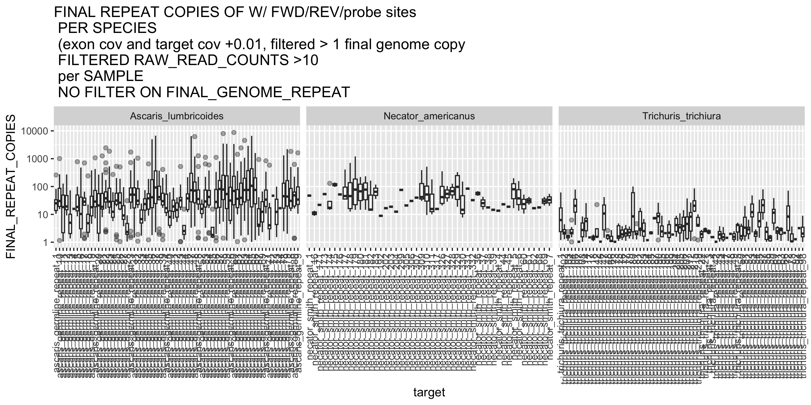
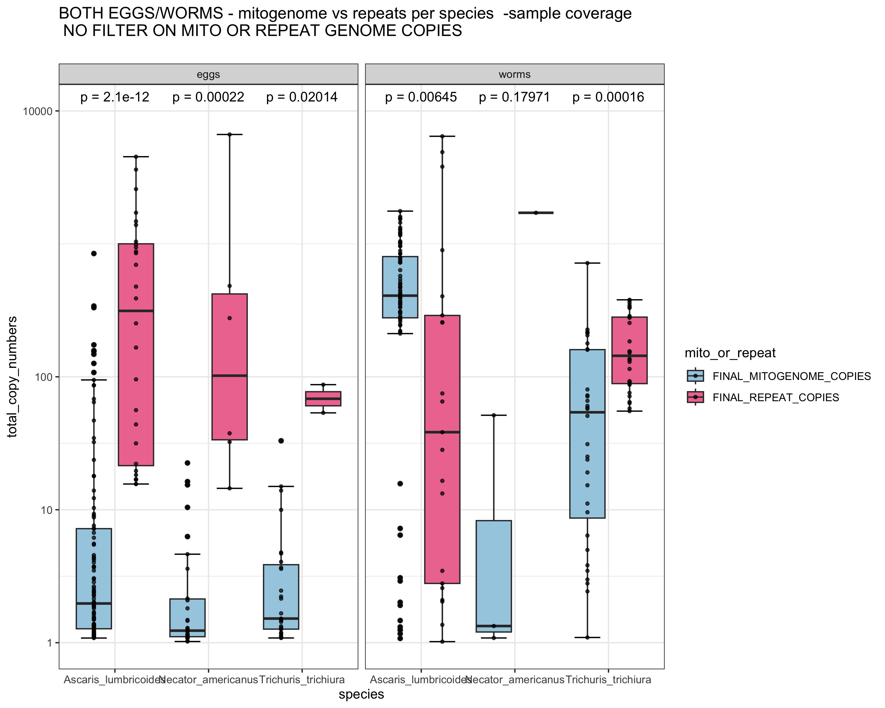

# Comparison of normalised repeat coverage to normalised mitochondrial genome coverage
Author: Marina Papaiakovou, mpapaiakovou[at]gmail.com 

## Contents: 
- code to assess single copy exon coverage in individual sample files
- code to assess repeat coverage in in individual sample files
- R code to normalise repeat coverage by single copy exon coverage
- R code to normalise mitochondrial genome coverage by single copy exon coverage
- Statistical analysis to compare normalised mitogenome copies vs repeat copies per life stage of worms
- Supplementary figure in MS - to be updated with doi 
- Beautifications on illustrator 


- Exon coverage per sample
```{r warning = FALSE}
#path where the sample-level coverage data were
library(tidyverse)
library(forcats)
library(viridis)
library(patchwork)

##################################################
########## EXON COVERAGE PER SAMPLE ##############
##################################################

setwd("/Users/marinapapaiakovou/Documents/00.Cambridge_PhD/02.Science/02.Genome_skimming/07.Global_genome_skim_2023/02_DATA/02_TRIMMED_DATA/03_NUCLEAR_MAPPING/05_BEDTOOLS_GENOME_EXON_COVERAGE/")
#library(forcats)
COVERAGE_PER_SAMPLE_EXON_FUNCTION <- function (data){
  #import data
  data1 <- read.table(data, sep = "\t")
  #import the header
  EXON_HEADER <- readLines("ALL_FILES2")
  colnames(data1) <- EXON_HEADER
  data_l <- pivot_longer(data1, names_to = "sample_id", values_to = "raw_read_counts", cols=5:ncol(data1))
  
  country_map <- c(
    "BEN" = "Benin","CMR" = "Cameroon","TZA" = "Tanzania","ETH" = "Ethiopia","UGA" = "Uganda","IND" = "India","MWI" = "Malawi","MMR" = "Myanmar", "HND" ="Honduras",   "NGA" = "Nigeria","ARG" = "Argentina","BGD" = "Bangladesh","CHN" = "China","ECU" = "Ecuador","GLP" = "Guadeloupe","FJI" = "Fiji","LKA" = "Sri_Lanka",
    "MOZ" = "Mozambique","ITA" = "Italy","PR1" = "Puerto_Rico","COD" = "DRC","SEN" = "Senegal","THA" = "Thailand","USA" = "USA","ZAF" = "South_Africa","MYS" = "Malaysia", 
    "KEN" = "Kenya")
  data_l_country <- data_l %>%
    mutate(country = country_map[substr(sample_id, 1, 3)])
  
 # data_l_country_2 <- data_l_country %>% mutate(data_type = ifelse(grepl("BEN|BGD|ARG|ETH003|ETH_|IND|KEN00|LKA|ITA|MMR|MWI|NGA|ZAF|COD|MYS|UGA0|UGA_BLANK", sample_id), 'faecal_metagenome', 'worm_eggs'))
  
  #add a column which is scaffold_end - scaffold_start 
  data_l_country2 <- data_l_country %>%
    mutate(exon_size = scaffold_end - scaffold_start) %>%
    relocate(exon_size, .before = exon_name)
  
  ##testing if I filter for raw_read_count > 10 (like I did in the heatmap)
  #  data_l_country2 <- data_l_country2 %>%
  #    filter(raw_read_counts >10)
  
  #divide counts by the size of the target
  data_l_country3 <- data_l_country2 %>%
    mutate(normalized_exon_coverage = raw_read_counts/exon_size) #NORMALLY you would add here length of read AND divide by number of million reads BUT, 
  #they will cancel each other out in the ratio (when you normalise) so I am simplifying it here because I am only using RATIOS
  
  data_l_country4 <- data_l_country3 %>%
    group_by(country) %>% #even though the coverage on the exons comes from the samples, then I am still taking the mean per country 
    mutate(mean_exon_normal_cov_per_sample = mean(normalized_exon_coverage))
  
  #if you want to add a small value to avoid dividing by 0 where exon coverage is 0... Remember to do this to the repeat data as well
  data_l_country4 <- data_l_country4 %>%
    mutate(mean_exon_normal_cov_per_sample_plus_0.01 = mean_exon_normal_cov_per_sample+0.01)
}

#If I get values of 1 when I normalise with repeat coverage then we know it's 'meaningless; it meant both of them were 0. 
#call the function for all the species
ALUM_NORMALISED_EXON_COV_BY_SAMPLE <- COVERAGE_PER_SAMPLE_EXON_FUNCTION("ALL_ALUM_EXONS_BEDTOOLS_MULTICOV.txt")
ALUM_NORMALISED_EXON_COV_BY_SAMPLE$species  <- 'Ascaris_lumbricoides'
#write_csv(ALUM_NORMALISED_EXON_COV_BY_SAMPLE, "ALUM_EXONS_COV_PER_SAMPLE_NORM_BY_EXON_LENGTH.csv")

#DO IT FOR ALL SPECIES
TT_NORMALISED_EXON_COV_BY_SAMPLE <- COVERAGE_PER_SAMPLE_EXON_FUNCTION("ALL_TT_EXONS_BEDTOOLS_MULTICOV.txt")
TT_NORMALISED_EXON_COV_BY_SAMPLE$species <- 'Trichuris_trichiura'
#write_csv(TT_NORMALISED_EXON_COV_BY_COUNTRY, "TT_EXONS_COV_PER_SAMPLE_NORM_BY_EXON_LENGTH.csv")

STRONGY_NORMALISED_EXON_COV_BY_SAMPLE <- COVERAGE_PER_SAMPLE_EXON_FUNCTION("ALL_STRONGY_EXONS_BEDTOOLS_MULTICOV.txt")
STRONGY_NORMALISED_EXON_COV_BY_SAMPLE$species <- 'Strongyloides_stercoralis'
#write_csv(STRONGY_NORMALISED_EXON_COV_BY_SAMPLE, "STRONGY_EXONS_COV_PER_SAMPLE_NORM_BY_EXON_LENGTH.csv")

NEC_NORMALISED_EXON_COV_BY_SAMPLE <- COVERAGE_PER_SAMPLE_EXON_FUNCTION("ALL_NEC_EXONS_BEDTOOLS_MULTICOV.txt")
NEC_NORMALISED_EXON_COV_BY_SAMPLE$species <- 'Necator_americanus'
#write_csv(NEC__NORMALISED_EXON_COV_BY_SAMPLE, "NEC_EXONS_COV_PER_SAMPLE_NORM_BY_EXON_LENGTH.csv")

#combine all of them here
ALL_SPECIES_NORMALISED_EXON_COV_BY_SAMPLE <- rbind(ALUM_NORMALISED_EXON_COV_BY_SAMPLE, TT_NORMALISED_EXON_COV_BY_SAMPLE, STRONGY_NORMALISED_EXON_COV_BY_SAMPLE,NEC_NORMALISED_EXON_COV_BY_SAMPLE)


```

- Repeat coverage per sample (bash code)
```bash
############################################################
########### REPEAT COVERAGE PER SAMPLE #####################
############################################################

#WHERE DID YOU RUN THE BEDTOOLS MULTICOV 
/home/marip3/mbl_genome_skimming/03.GLOBAL_SKIM/04.ANALYSIS/02.NUCLEAR_MAPPING/03_BEDTOOLS_MULTICOV

#bed file with the 'important repeats':
/home/marip3/mbl_genome_skimming/03.GLOBAL_SKIM/04.ANALYSIS/02.NUCLEAR_MAPPING/06_BEDTOOLS_COVERAGE_BY_COUNTRY

################################################
#BEDTOOLS MULTICOV BY COUNTRY AND BY SAMPLE
###############################################

#/home/marip3/mbl_genome_skimming/03.GLOBAL_SKIM/04.ANALYSIS/02.NUCLEAR_MAPPING/06_BEDTOOLS_COVERAGE_BY_COUNTRY
#-f 0,51 to avoid read overlap and counting the reads twice 

#copy all the target files from: /home/marip3/mbl_genome_skimming/03.GLOBAL_SKIM/04.ANALYSIS/03.REPEAT_ANALYSIS/01_ALUM
#and the bed file with the repeats with the primer/probe sites
#/home/marip3/mbl_genome_skimming/03.GLOBAL_SKIM/04.ANALYSIS/02.NUCLEAR_MAPPING/06_BEDTOOLS_COVERAGE_BY_COUNTRY
#that is because I know I did not have enough coverage on ITS and other targets. So I am only calculating it now for the repeats

bedtools multicov -bams *merged.bam -f 0.51 -bed ascaris_15_cov90.coords_GERMLINE_FWD_REV_PROBE_POS_FINAL.bed  > ascaris_15_cov90_GERMLINE_W_FWD_REV_PRIMER_PROBE_SITES_BEDTOOLS_MULTICOV_PER_COUNTRY_NO_OVERLAP.txt

bedtools multicov -bams *merged.bam -f 0.51 -bed trichuris_15_cov90.coords_REPEAT_FWD_REV_PROBE_POS_FINAL.bed  > trichuris_15_cov90_REPEAT_W_FWD_REV_PRIMER_PROBE_SITES_BEDTOOLS_MULTICOV_PER_COUNTRY_NO_OVERLAP.txt

bedtools multicov -bams *merged.bam -f 0.51 -bed necator_15_cov90.coords_REPEAT_FWD_REV_PROBE_POS_FINAL.bed  > necator_15_cov90_REPEAT_W_FWD_REV_PRIMER_PROBE_SITES_BEDTOOLS_MULTICOV_PER_COUNTRY_NO_OVERLAP.txt

# bedtools multicov per sample now as well 
#/home/marip3/mbl_genome_skimming/03.GLOBAL_SKIM/04.ANALYSIS/02.NUCLEAR_MAPPING/03_BEDTOOLS_MULTICOV

bedtools multicov -bams *_filtered_CIGAR_final.bam -f 0.51 -bed ascaris_15_cov90.coords_GERMLINE_FWD_REV_PROBE_POS_FINAL.bed  > ascaris_15_cov90_GERMLINE_W_FWD_REV_PRIMER_PROBE_SITES_BEDTOOLS_MULTICOV_PER_SAMPLE_NO_OVERLAP.txt

bedtools multicov -bams *_filtered_CIGAR_final.bam -f 0.51 -bed trichuris_15_cov90.coords_REPEAT_FWD_REV_PROBE_POS_FINAL.bed  > trichuris_15_cov90_REPEAT_W_FWD_REV_PRIMER_PROBE_SITES_BEDTOOLS_MULTICOV_PER_SAMPLE_NO_OVERLAP.txt

#necator 
bedtools multicov -bams *_filtered_CIGAR_final.bam -f 0.51 -bed necator_15_cov90.coords_REPEAT_FWD_REV_PROBE_POS_FINAL.bed  > necator_15_cov90_REPEAT_W_FWD_REV_PRIMER_PROBE_SITES_BEDTOOLS_MULTICOV_PER_SAMPLE_NO_OVERLAP.txt

```
- Repeat coverage per sample (R code)

```{r warning = FALSE}
setwd("/Users/marinapapaiakovou/Documents/00.Cambridge_PhD/02.Science/02.Genome_skimming/07.Global_genome_skim_2023/02_DATA/02_TRIMMED_DATA/03_NUCLEAR_MAPPING/04_BEDTOOLS_SAMPLE_MULTICOVERAGE/")

#create  a function to transform repeat coverage and normalise per repeat size 
COVERAGE_PER_SAMPLE_REPEAT_FUNCTION <- function (data){
  
data1 <- read.table(data, sep = "\t")
DATA_HEADER <- readLines("ALL_FILES2")
colnames(data1) <- DATA_HEADER
data1$target <- paste0(data1$target, "_", 1:nrow(data1))

data_l <- pivot_longer(data1, names_to = "sample_id", values_to = "raw_read_counts", cols=5:ncol(data1))

country_map <- c(
  "BEN" = "Benin","CMR" = "Cameroon","TZA" = "Tanzania","ETH" = "Ethiopia","UGA" = "Uganda","IND" = "India","MWI" = "Malawi","MMR" = "Myanmar", "HND" ="Honduras",   "NGA" = "Nigeria","ARG" = "Argentina","BGD" = "Bangladesh","CHN" = "China","ECU" = "Ecuador","GLP" = "Guadeloupe","FJI" = "Fiji","LKA" = "Sri_Lanka",
  "MOZ" = "Mozambique","ITA" = "Italy","PR1" = "Puerto_Rico","COD" = "DRC","SEN" = "Senegal","THA" = "Thailand","USA" = "USA","ZAF" = "South_Africa","MYS" = "Malaysia", 
  "KEN" = "Kenya")
data_l_country <- data_l %>%
  mutate(country = country_map[substr(sample_id, 1, 3)])


#add a column which is scaffold_end - scaffold_start 
data_l_country2 <- data_l_country %>%
  mutate(target_size = scaffold_end - scaffold_start) %>%
  relocate(target_size, .before = target)

##testing if I filter for raw_read_count > 10 (like I did in the heatmap)
data_l_country2 <- data_l_country2 %>%
  filter(raw_read_counts >10)

#divide counts by the size of the target
data_l_country3 <- data_l_country2 %>%
  mutate(coverage_per_base_target = raw_read_counts/target_size) #NORMALLY you would add here length of read AND divide by number of million reads BUT, 
#they will cancel each other out in the ratio (when you normalise) so I am simplifying it here because I am only using RATIOS

data_l_country4 <- data_l_country3 %>%
  mutate(coverage_per_base_target_plus_0.01 = coverage_per_base_target+0.01)

}

#call the function
ASCARIS_PER_SAMPLE_REPEAT_COVERAGE <- COVERAGE_PER_SAMPLE_REPEAT_FUNCTION("ascaris_15_cov90_GERMLINE_W_FWD_REV_PRIMER_PROBE_SITES_BEDTOOLS_MULTICOV_PER_SAMPLE_NO_OVERLAP.txt")
ASCARIS_PER_SAMPLE_REPEAT_COVERAGE$species <- 'Ascaris_lumbricoides'
ASCARIS_PER_SAMPLE_REPEAT_COVERAGE$target_name <- 'ascaris_germline_repeat'


TRICHURIS_PER_SAMPLE_REPEAT_COVERAGE <- COVERAGE_PER_SAMPLE_REPEAT_FUNCTION("trichuris_15_cov90_REPEAT_W_FWD_REV_PRIMER_PROBE_SITES_BEDTOOLS_MULTICOV_PER_SAMPLE_NO_OVERLAP.txt")
TRICHURIS_PER_SAMPLE_REPEAT_COVERAGE$species <- 'Trichuris_trichiura'
TRICHURIS_PER_SAMPLE_REPEAT_COVERAGE$target_name <- 'trichuris_repeat'


NECATOR_PER_SAMPLE_REPEAT_COVERAGE <- COVERAGE_PER_SAMPLE_REPEAT_FUNCTION("necator_15_cov90_REPEAT_W_FWD_REV_PRIMER_PROBE_SITES_BEDTOOLS_MULTICOV_PER_SAMPLE_NO_OVERLAP.txt")
NECATOR_PER_SAMPLE_REPEAT_COVERAGE$species <- 'Necator_americanus'
NECATOR_PER_SAMPLE_REPEAT_COVERAGE$target_name <- 'necator_repeat'


#BIND ALL OF THEM IN ONE BIG DATASET 
ALL_SPECIES_TARGET_COVERAGE_BY_SAMPLE_NORM_BY_LENGTH <- rbind(ASCARIS_PER_SAMPLE_REPEAT_COVERAGE, TRICHURIS_PER_SAMPLE_REPEAT_COVERAGE,  NECATOR_PER_SAMPLE_REPEAT_COVERAGE)

```

- Normalise repeat coverage per sample by sample single copy exon coverage 

```{r warning = FALSE}

#need to join datasets by the country maybe so I can add the mean exon coverage per country
#subset the EXON dataset (per sample takes forever.... )  maybe 10 min 
subset_ALL_SPECIES_NORMALISED_EXON_COV_BY_SAMPLE <- unique(ALL_SPECIES_NORMALISED_EXON_COV_BY_SAMPLE[, c("sample_id", "country", "mean_exon_normal_cov_per_sample_plus_0.01", "species")])

#merge the datasets by sample id and species to add the exon coverage norm counts to the target counts to divide
ALL_SPECIES_TARGET_COV_COMBINED_W_EXON_COVERAGE_BY_SAMPLE <- merge(ALL_SPECIES_TARGET_COVERAGE_BY_SAMPLE_NORM_BY_LENGTH, subset_ALL_SPECIES_NORMALISED_EXON_COV_BY_SAMPLE, by = c("sample_id", "country", "species"), all.x = T)

#save the csv so I don't have to run it again because the exon dataset takes a long time
#write_csv(ALL_SPECIES_TARGET_COV_COMBINED_W_EXON_COVERAGE_BY_SAMPLE, "ALL_SPECIES_TARGET_COV_COMBINED_W_EXON_COVERAGE_BY_SAMPLE.csv")
#write_csv(ALL_SPECIES_TARGET_COV_COMBINED_W_EXON_COVERAGE_BY_SAMPLE, "ALL_SPECIES_TARGET_COV_COMBINED_W_EXON_COVERAGE_BY_SAMPLE_NO_FILTER_MITO_REPEAT_GENOME_COPIES.csv")

#uncomment this if you don't want to rerun all of the above
#ALL_SPECIES_TARGET_COV_COMBINED_W_EXON_COVERAGE_BY_SAMPLE <- read.csv("ALL_SPECIES_TARGET_COV_COMBINED_W_EXON_COVERAGE_BY_SAMPLE_NO_FILTER_MITO_REPEAT_GENOME_COPIES.csv")


#CALCULTE THE GENOME COPIES HERE:
ALL_SPECIES_TARGET_COV_COMBINED_W_EXON_COVERAGE_FINAL_NORMALISATION_BY_SAMPLE <-  ALL_SPECIES_TARGET_COV_COMBINED_W_EXON_COVERAGE_BY_SAMPLE %>%
  mutate(FINAL_REPEAT_COPIES = coverage_per_base_target_plus_0.01/mean_exon_normal_cov_per_sample_plus_0.01)
 # filter(FINAL_REPEAT_COPIES > 1) #WE decided not to filter here. So rerunning the code to compare repeats and mito when everything goes through. 

#split them by species to plot them 
ALUM_REPEAT_COPIES <- ALL_SPECIES_TARGET_COV_COMBINED_W_EXON_COVERAGE_FINAL_NORMALISATION_BY_SAMPLE %>%
  filter(species == "Ascaris_lumbricoides")

TT_REPEAT_COPIES <- ALL_SPECIES_TARGET_COV_COMBINED_W_EXON_COVERAGE_FINAL_NORMALISATION_BY_SAMPLE %>%
  filter(species == "Trichuris_trichiura")

STRONGY_REPEAT_COPIES <- ALL_SPECIES_TARGET_COV_COMBINED_W_EXON_COVERAGE_FINAL_NORMALISATION_BY_SAMPLE %>%
  filter(species =="Strongyloides_stercoralis")

NEC_GREPEAT_COPIES <- ALL_SPECIES_TARGET_COV_COMBINED_W_EXON_COVERAGE_FINAL_NORMALISATION_BY_SAMPLE %>%
  filter(species == "Necator_americanus")

```

```{r FINAL_NORMALISED_REPEAT_W_BINDING_SITES_PER_SPECIES_FILTER_RAW_READ_COUNTS_OVER_10_PER_SAMPLE_NO_FILTER_ON_FINAL_GENOME_COPIES, fig.path = './00_FIGURES'}


png(filename = "00_FIGURES/FINAL_NORMALISED_REPEAT_W_BINDING_SITES_PER_SPECIES_FILTER_RAW_READ_COUNTS_OVER_10_PER_SAMPLE_NO_FILTER_ON_FINAL_GENOME_COPIES.png", height = 5, width = 10, units = "in", res = 300)


#REPEAT VARIATION PER COUNTRY, when each point is a single sample
FINAL_NORMALISED_REPEAT_W_BINDING_SITES_PER_SPECIES_FILTER_RAW_READ_COUNTS_OVER_10_PER_SAMPLE_NO_FILTER_ON_FINAL_GENOME_COPIES <- ggplot(ALL_SPECIES_TARGET_COV_COMBINED_W_EXON_COVERAGE_FINAL_NORMALISATION_BY_SAMPLE,aes(x=target, y= FINAL_REPEAT_COPIES))+
  #geom_point(width = 0.2, height = 0)+
  geom_boxplot( alpha = 0.4)+ 
  scale_fill_viridis(discrete=TRUE) +
  scale_color_viridis(discrete=TRUE) +
  facet_wrap(~species, scales = "free_x")+
  scale_y_log10(limits = c(1,10000)) + # Add log scale to y-axis
 # ggtitle("FINAL REPEAT COPIES OF W/ FWD/REV/probe sites \n PER SPECIES \n (exon cov and target cov +0.01, filtered > 1 final genome copy \n FILTERED RAW_READ_COUNTS >10 \n per SAMPLE")+
  ggtitle("FINAL REPEAT COPIES OF W/ FWD/REV/probe sites \n PER SPECIES \n (exon cov and target cov +0.01, filtered > 1 final genome copy \n FILTERED RAW_READ_COUNTS >10 \n per SAMPLE \n NO FILTER ON FINAL_GENOME_REPEAT")+
  #scale_x_log10() +    scale_y_log10() + #Add log scale to y-axis
  theme(strip.text.y.left = element_text(angle = 0), axis.text.x = element_text(angle=90, vjust=0.5, hjust=1))
print(FINAL_NORMALISED_REPEAT_W_BINDING_SITES_PER_SPECIES_FILTER_RAW_READ_COUNTS_OVER_10_PER_SAMPLE_NO_FILTER_ON_FINAL_GENOME_COPIES)
dev.off()

```


- Mitochondrial genome coverage per sample 
```{r warning = FALSE}

setwd("/Users/marinapapaiakovou/Documents/00.Cambridge_PhD/02.Science/02.Genome_skimming/07.Global_genome_skim_2023/02_DATA/02_TRIMMED_DATA/02_MITOGENOME_MAPPING/POST_CIGAR_FILTER_DATA/")

MITOBEDTOOLS_COV_PER_SAMPLE_BAM <- read.table("ALL_STATS_FILTERED_n1000.txt")

column_names <- readLines("/Users/marinapapaiakovou/Documents/00.Cambridge_PhD/02.Science/02.Genome_skimming/07.Global_genome_skim_2023/02_DATA/02_TRIMMED_DATA/01_RAW_READ_COUNTS/extracted_names.txt")
colnames(MITOBEDTOOLS_COV_PER_SAMPLE_BAM) <- column_names

#replace the names so I can sort them
MITOBEDTOOLS_COV_PER_SAMPLE_BAM$species[MITOBEDTOOLS_COV_PER_SAMPLE_BAM$species == 'NC_016198_Ascaris_lumbricoides_mitochondrion_complete_genome'] <- 'Ascaris_lumbricoides'
MITOBEDTOOLS_COV_PER_SAMPLE_BAM$species[MITOBEDTOOLS_COV_PER_SAMPLE_BAM$species == 'NC_017750_Trichuris_trichiura_mitochondrion_complete_genome'] <- 'Trichuris_trichiura'
MITOBEDTOOLS_COV_PER_SAMPLE_BAM$species[MITOBEDTOOLS_COV_PER_SAMPLE_BAM$species == 'NC_028624_Strongyloides_stercoralis_isolate_PV001_mitochondrion'] <- 'Strongyloides_stercoralis'
MITOBEDTOOLS_COV_PER_SAMPLE_BAM$species[MITOBEDTOOLS_COV_PER_SAMPLE_BAM$species == 'NC_003416_Necator_americanus_mitochondrion_complete_genome'] <- 'Necator_americanus'

#wide to long
MITOBEDTOOLS_COV_PER_SAMPLE_BAM_L <- pivot_longer(MITOBEDTOOLS_COV_PER_SAMPLE_BAM, names_to = "sample_id", values_to = "raw_read_counts", cols=4:ncol(MITOBEDTOOLS_COV_PER_SAMPLE_BAM))

#select only those species
MITOBEDTOOLS_COV_PER_SAMPLE_BAM_L <- MITOBEDTOOLS_COV_PER_SAMPLE_BAM_L %>%
  filter(species =="Ascaris_lumbricoides" | species =="Trichuris_trichiura" | species=="Necator_americanus")

#with strongyloides
#MITOBEDTOOLS_COV_PER_COUNTRY_MERGED_BAM_L <- MITOBEDTOOLS_COV_PER_COUNTRY_MERGED_BAM_L %>%
#  filter(species =="Ascaris_lumbricoides" | species =="Trichuris_trichiura" | species=="Necator_americanus" | species == "Strongyloides_stercoralis")

country_map <- c(
  "BEN" = "Benin","CMR" = "Cameroon","TZA" = "Tanzania","ETH" = "Ethiopia","UGA" = "Uganda","IND" = "India","MWI" = "Malawi","MMR" = "Myanmar", "HND" ="Honduras",   "NGA" = "Nigeria","ARG" = "Argentina","BGD" = "Bangladesh","CHN" = "China","ECU" = "Ecuador","GLP" = "Guadeloupe","FJI" = "Fiji","LKA" = "Sri_Lanka",
  "MOZ" = "Mozambique","ITA" = "Italy","PR1" = "Puerto_Rico","COD" = "DRC","SEN" = "Senegal","THA" = "Thailand","USA" = "USA","ZAF" = "South_Africa","MYS" = "Malaysia", 
  "KEN" = "Kenya")
MITOBEDTOOLS_COV_PER_SAMPLE_BAM_L_COUNTRY <- MITOBEDTOOLS_COV_PER_SAMPLE_BAM_L %>%
  mutate(country = country_map[substr(sample_id, 1, 3)])

##testing if I filter for raw_read_count > 10 (like I did in the heatmap)
MITOBEDTOOLS_COV_PER_SAMPLE_BAM_L_COUNTRY <- MITOBEDTOOLS_COV_PER_SAMPLE_BAM_L_COUNTRY %>%
  filter(raw_read_counts >10)

#divide counts by the size of the target
MITOBEDTOOLS_COV_PER_SAMPLE_BAM_L_COUNTRY_NORM <- MITOBEDTOOLS_COV_PER_SAMPLE_BAM_L_COUNTRY %>%
  mutate(normalized_mito_coverage_length_per_sample = raw_read_counts/mitogenome_size_bp)

#remove the _trimmed from the sample id so I can match the mito to the exon data
MITOBEDTOOLS_COV_PER_SAMPLE_BAM_L_COUNTRY_NORM$sample_id <- gsub("_trimmed", "", MITOBEDTOOLS_COV_PER_SAMPLE_BAM_L_COUNTRY_NORM$sample_id)


#and then need to merge the above the exon normalised coverage by length and country to get a ratio. 
#Find the exon coverage above (per sample)
#subset_ALL_SPECIES_NORMALISED_EXON_COV_BY_SAMPLE <- unique(ALL_SPECIES_NORMALISED_EXON_COV_BY_SAMPLE[, c("sample_id", "country", "mean_exon_normal_cov_per_sample_plus_0.01", "species")])


#MERGE MITOGENOME DATA WITH EXON DATA
#merge the datasets by sample id and species to add the exon coverage norm counts to the target counts to divide
MITOBEDTOOLS_COV_PER_SAMPLE_BAM_L_COUNTRY_NORM_COMBINED_W_EXON <- merge(MITOBEDTOOLS_COV_PER_SAMPLE_BAM_L_COUNTRY_NORM, subset_ALL_SPECIES_NORMALISED_EXON_COV_BY_SAMPLE, by = c("sample_id", "country", "species"), all.x = T)

```
- Normalise mitochondrial genome coverage by single copy exon coverage per sample 

```{r warning = FALSE}
#CALCULATE RATIO NOW MITOGENOME/EXON 
#CALCULTE THE GENOME COPIES HERE:
MITOBEDTOOLS_COV_PER_SAMPLE_BAM_L_COUNTRY_NORM_COMBINED_W_EXON_FINAL <-  MITOBEDTOOLS_COV_PER_SAMPLE_BAM_L_COUNTRY_NORM_COMBINED_W_EXON %>%
  mutate(normalized_mito_coverage_length_per_sample_plus_0.01 = normalized_mito_coverage_length_per_sample+0.01) %>%
  mutate(FINAL_MITOGENOME_COPIES = normalized_mito_coverage_length_per_sample_plus_0.01/mean_exon_normal_cov_per_sample_plus_0.01)
  #filter(FINAL_MITOGENOME_COPIES >1) #WE decided not to filter here. So rerunning the code to compare repeats and mito when everything goes through. 


#Transform the datasets from the repeats and the mitogenomes to take only the columns you need
#REPEAT DATASET
ALL_SPECIES_TARGET_COV_COMBINED_W_EXON_COVERAGE_FINAL_NORMALISATION_BY_SAMPLE
REPEAT_COPIES_PER_SAMPLE_PER_SPECIES <- ALL_SPECIES_TARGET_COV_COMBINED_W_EXON_COVERAGE_FINAL_NORMALISATION_BY_SAMPLE %>%
  dplyr::select(species, sample_id, FINAL_REPEAT_COPIES)

#transform
REPEAT_COPIES_PER_SAMPLE_PER_SPECIES_L <- REPEAT_COPIES_PER_SAMPLE_PER_SPECIES %>%
  pivot_longer(cols = FINAL_REPEAT_COPIES,
               names_to = "mito_or_repeat", values_to = "copy_numbers")


#MITO DATASET
MITOBEDTOOLS_COV_PER_SAMPLE_BAM_L_COUNTRY_NORM_COMBINED_W_EXON_FINAL
MITO_COPIES_PER_SAMPLE_PER_SPECIES <- MITOBEDTOOLS_COV_PER_SAMPLE_BAM_L_COUNTRY_NORM_COMBINED_W_EXON_FINAL %>%
  dplyr::select(species, sample_id, FINAL_MITOGENOME_COPIES)

MITO_COPIES_PER_SAMPLE_PER_SPECIES_L <- MITO_COPIES_PER_SAMPLE_PER_SPECIES %>%
  pivot_longer(cols = FINAL_MITOGENOME_COPIES,
               names_to = "mito_or_repeat", values_to = "copy_numbers")

COMBINED_REPEAT_MITO_DATASET <- rbind(REPEAT_COPIES_PER_SAMPLE_PER_SPECIES_L, MITO_COPIES_PER_SAMPLE_PER_SPECIES_L)
#need to add a column whether the sample is a worm or a pool of eggs

COMBINED_REPEAT_MITO_DATASET_WORM_EGGS <- COMBINED_REPEAT_MITO_DATASET %>% mutate(worm_eggs = ifelse(grepl("BEN|BGD|ARG|ETH003|ETH_|IND|KEN00|LKA|ITA|MMR|MWI|NGA|ZAF|COD|MYS|UGA0|UGA_BLANK|CMR|ZAF|MOZ", sample_id), 'eggs', 'worms'))

library(ggplot2)
library(ggsignif)
library(rstatix)
library(ggpubr)


#will run Kruskall Wallis test for worms/eggs for repeats/mitogenomes
#Kruskal-Wallis Test: This non-parametric test compares medians among groups. If the data distribution within each group (e.g., worms vs. eggs) is significantly different, the test outcome might vary when combined or separated.


COMBINED_REPEAT_MITO_DATASET_BOTH_EGGS_WORMS_STATS <- COMBINED_REPEAT_MITO_DATASET_WORM_EGGS %>%
  group_by(species, sample_id, mito_or_repeat, worm_eggs) %>%
  summarise(total_copy_numbers = sum(copy_numbers))


```

- Statistical comparison and plotting 

```{r BOTH_WORMS_EGGS_NORMALISED_MITO_COV_Vs_NORM_REPEAT_COV_WITHIN_SPECIES_FILTER_RAW_READ_COUNTS_OVER_10_W_STATS_NO_FILTER_ON_MITO_REPEAT_GENOME_COPIES, fig.path = './00_FIGURES'}
png(filename = "00_FIGURES/BOTH_WORMS_EGGS_NORMALISED_MITO_COV_Vs_NORM_REPEAT_COV_WITHIN_SPECIES_FILTER_RAW_READ_COUNTS_OVER_10_W_STATS_NO_FILTER_ON_MITO_REPEAT_GENOME_COPIES.png", height = 8, width = 10, units = "in", res = 300)

y_limits <- c(1, 10000)

ggplot(COMBINED_REPEAT_MITO_DATASET_BOTH_EGGS_WORMS_STATS, aes(x = species, y = total_copy_numbers, fill = mito_or_repeat, group_by(worm_eggs))) +
  stat_boxplot(geom = "errorbar", width = 0.55, position = position_dodge(width = 0.9)) +
  geom_boxplot(position = position_dodge(width = 0.9)) + 
  geom_point(position = position_dodge(width = 0.9), size = 1, alpha = 0.7) + # Add points
  theme_minimal() +
  # facet_wrap(~species)+
  # ggtitle("EGGS ONLY - mitogenome vs repeats per species  -sample coverage")+
  ggtitle("BOTH EGGS/WORMS - mitogenome vs repeats per species  -sample coverage \n NO FILTER ON MITO OR REPEAT GENOME COPIES
")+
  facet_wrap(~worm_eggs)+
  scale_fill_manual(values = c("FINAL_MITOGENOME_COPIES" = "#A6CEE3", "FINAL_REPEAT_COPIES" = "palevioletred2")) +
  #scale_color_manual(values = c("worms" = "black", "eggs" = "grey")) + 
  stat_compare_means(aes(group = mito_or_repeat), label = "p.format", method = "kruskal.test",
                     vjust = -1, bracket.size = 0.5, label.y = c(4, 4, 4)) + 
  # stat_compare_means(aes(group = life_stage), label = "p.format", method = "wilcox.test",
  #                  vjust = -1, bracket.size = 0.5, label.y = c(4, 4, 4),
  #                  comparisons = list(c("FINAL_MITOGENOME_COPIES", "FINAL_REPEAT_COPIES"))) + # Adjust label.y values to control label positioning
  scale_y_log10(limits = y_limits, breaks = c(1, 10, 100, 10000), labels = c(1, 10, 100, 10000)) + # Add labels = scales::comma to format y-axis ticks properly
  theme_bw()


dev.off()

```

- Beautify on illustrator (worms = adults)
