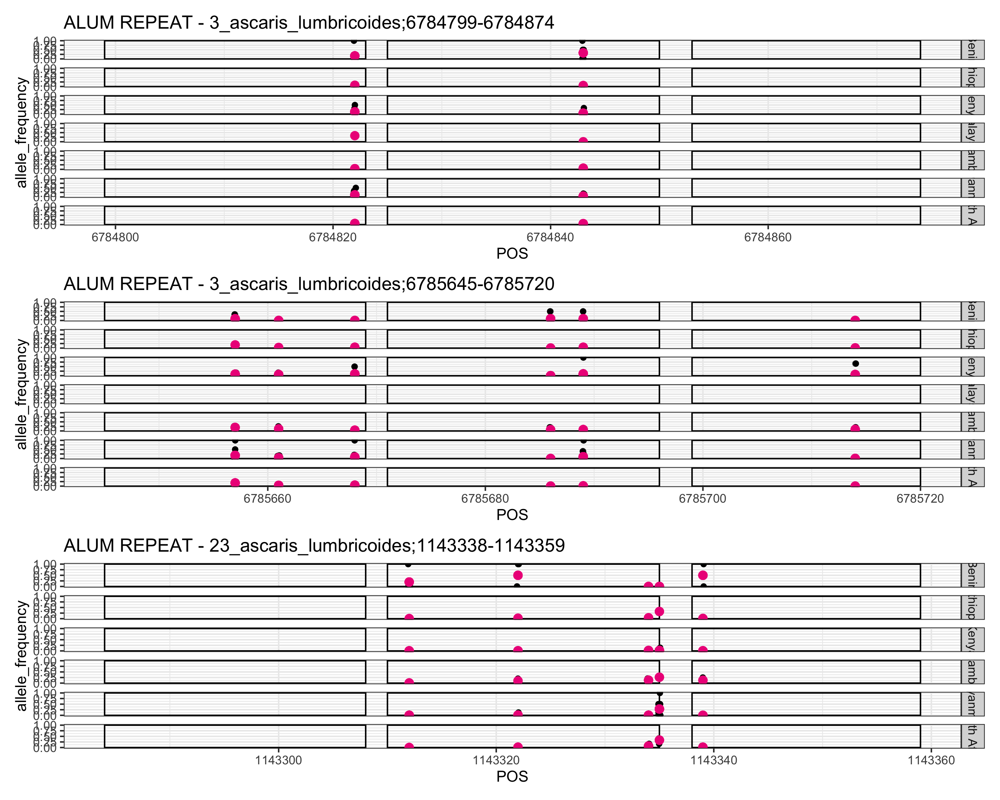
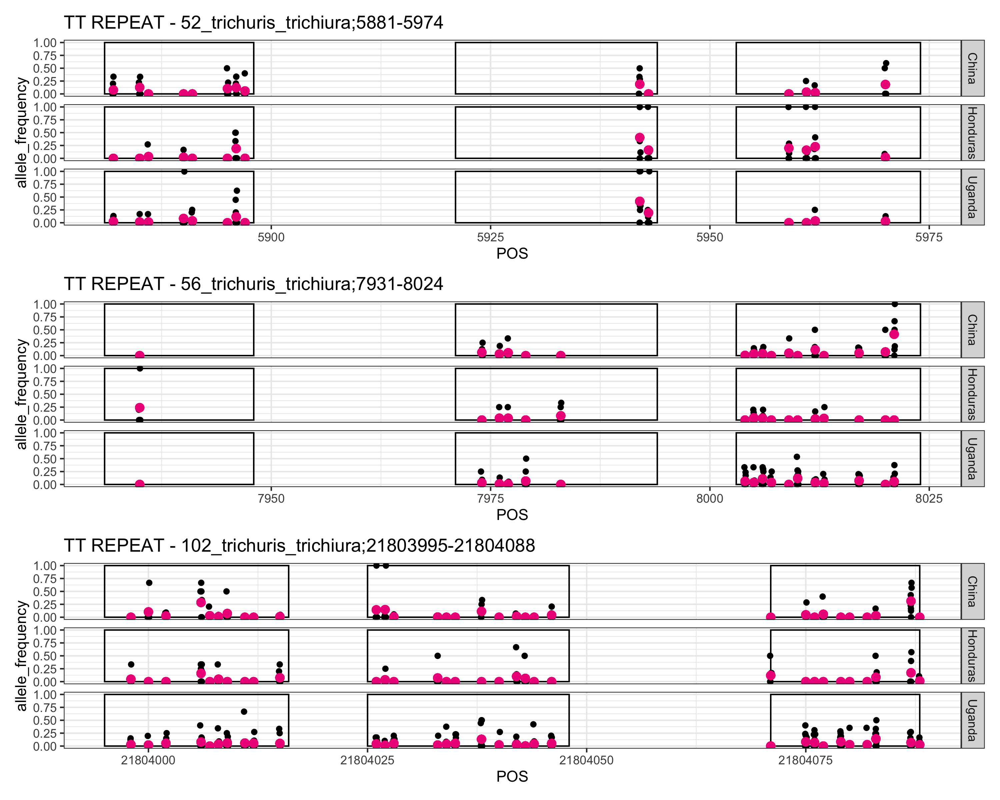

# Selected repeats with variants for testing
Author: Marina Papaiakovou, mpapaiakovou[at]gmail.com 

## Contents: 
- bash/R code to assess allele frequency of variants in repeat sites
- R code to plot repeats with variants
- Rationale for SNP selection 
- Main figure in MS - doi to follow


```bash
#/home/marip3/mbl_genome_skimming/03.GLOBAL_SKIM/04.ANALYSIS/02.NUCLEAR_MAPPING/01_VARIANT_CALLING/05_ASSESSING_ALL_MISSINGNESS_CUTOFFS/01_ALUM
vcftools --vcf ALUM_SAMPLES_SURVIVE_MISSINGNESS_10th_quantile_max_missing_0.7_quantile_file.recode.vcf --extract-FORMAT-info AD --out ALUM_SAMPLES_SURVIVE_MISSINGNESS_10th_quantile_max_missing_0.7_quantile_file.FORMAT_AD

#After filtering, kept 68 out of 68 Individuals
#After filtering, kept 144 out of a possible 144 Sites

vcftools --vcf TT_SAMPLES_SURVIVE_MISSINGNESS_10th_quantile_max_missing_0.7_quantile_file.recode.vcf --extract-FORMAT-info AD --out TT_SAMPLES_SURVIVE_MISSINGNESS_10th_quantile_max_missing_0.7_quantile_file.FORMAT_AD
#After filtering, kept 29 out of 29 Individuals
#After filtering, kept 508 out of a possible 508 Sites

```

```{r warning = FALSE}
setwd("/Users/marinapapaiakovou/Documents/00.Cambridge_PhD/02.Science/02.Genome_skimming/07.Global_genome_skim_2023/02_DATA/02_TRIMMED_DATA/04_VARIANT_CALLING/03_NUCLEAR_VARIANTS/07_FORMAT_AD_FILES_HIGH_QUAL_FILTERED_FOR_DEPTH_MAX_MISSING_0.7/")
library(tidyverse)

CALCULATE_ALLELE_FREQ_ON_REPEAT_VARIANTS <- function(data) {
  # Read the text file
  df <- read.table(data, sep = '\t', header = TRUE)
  # Perform data cleaning and calculations
  df_out <- pivot_longer(df, cols = 3:ncol(df),
                         names_to = "sample.id",
                         values_to = "allele_depth")
  df_out_2 <- separate(data = df_out, col = allele_depth, into = c("REF_depth", "ALT_depth"), sep = ",")
  df_out_2[, 4:5] <- lapply(df_out_2[, 4:5], as.numeric)
  df_out_3 <- mutate(df_out_2, SUM_DEPTH = rowSums(df_out_2[, 4:5], na.rm = TRUE))
  df_out_4 <- df_out_3 %>% group_by(CHROM) %>% mutate(allele_frequency = ALT_depth / SUM_DEPTH)
  
  # Define the country map
  country_map <- c(
    "BEN" = "Benin","CMR" = "Cameroon","TZA" = "Tanzania","ETH" = "Ethiopia","UGA" = "Uganda","IND" = "India","MWI" = "Malawi","MMR" = "Myanmar", "HND" ="Honduras",   "NGA" = "Nigeria","ARG" = "Argentina","BGD" = "Bangladesh","CHN" = "China","ECU" = "Ecuador","GLP" = "Guadeloupe","FJI" = "Fiji","LKA" = "Sri Lanka",
    "MOZ" = "Mozambique","ITA" = "Italy","PR1" = "Puerto Rico","COD" = "DRC","SEN" = "Senegal","THA" = "Thailand","USA" = "U.S.A","ZAF" = "South Africa","MYS" = "Malaysia", 
    "KEN" = "Kenya")
  
  df_out_5 <- df_out_4 %>%
    mutate(country = country_map[substr(sample.id, 1, 3)])
  
  # Return the resulting dataframe
  return(df_out_5)
}

#call function
ALUM_REPEAT_VAR_FREQs <- CALCULATE_ALLELE_FREQ_ON_REPEAT_VARIANTS("ALUM_SAMPLES_SURVIVE_MISSINGNESS_10th_quantile_max_missing_0.7_quantile_file.FORMAT_AD.AD.FORMAT")
TT_REPEAT_VAR_FREQs <- CALCULATE_ALLELE_FREQ_ON_REPEAT_VARIANTS("TT_SAMPLES_SURVIVE_MISSINGNESS_10th_quantile_max_missing_0.7_quantile_file.FORMAT_AD.AD.FORMAT")

```

- *Ascaris* repeats 
```{r warning = FALSE}
#select only 3_ascaris_lumbricoides 6,784,799 - 6,784,874 and 300_ascaris_lumbricoides 17,413-17,488
#FWD = 6,784,853 - 6,784,874
#REV = 6,784,799 - 6,784,823
#PROBE = 6,784,825 - 6,784,850

ALUM_REPEAT_VAR_FREQs_filtered_scaffold_3_a <- ALUM_REPEAT_VAR_FREQs %>%
  filter(CHROM == "3_ascaris_lumbricoides") %>%
  filter(!grepl("^CHN|^UGA|^NGA", sample.id)) %>% #because I am working with ascaris data and these are contamiinations
  filter(POS >= 6784799 & POS <= 6784874)

#select scaffold_23 as well, 1143284 - 1143359
#FWD = 1143338 - 1143359
#REV = 1143284 - 1143308
#PROBE = 1143310 - 1143335
ALUM_REPEAT_VAR_FREQs_filtered_scaffold_23 <- ALUM_REPEAT_VAR_FREQs %>%
  filter(CHROM == "23_ascaris_lumbricoides") %>%
  filter(!grepl("^CHN|^UGA|^NGA|^MYS", sample.id)) %>% #because I am working with ascaris data and these are contamiinations
  filter(POS >= 1143284 & POS <= 1143359)

#select only 3_scaffold lumbricoides, 6785645 - 6785720
#FWD, 6785699 - 6785720
#REV, 6785645 - 6785669
#probe 6785696 - 6785671

ALUM_REPEAT_VAR_FREQs_filtered_scaffold_3_b <- ALUM_REPEAT_VAR_FREQs %>%
  filter(CHROM == "3_ascaris_lumbricoides") %>%
  filter(!grepl("^CHN|^UGA|^NGA", sample.id)) %>% #because I am working with ascaris data and these are contamiinations
  filter(POS >= 6785645 & POS <= 6785720)

#add a column, mean per position, per country 
#for scffold 3
ALUM_REPEAT_VAR_FREQs_filtered_scaffold_3_a_mean_freq_POS_country <- ALUM_REPEAT_VAR_FREQs_filtered_scaffold_3_a %>%
  group_by(POS, country) %>%
  mutate(mean_freq_pos_country = mean(allele_frequency,na.rm = T))

#for scaffold 23
ALUM_REPEAT_VAR_FREQs_filtered_scaffold_23_mean_freq_POS_country <- ALUM_REPEAT_VAR_FREQs_filtered_scaffold_23 %>%
  group_by(POS, country) %>%
  mutate(mean_freq_pos_country = mean(allele_frequency,na.rm = T))

#for scaffold 300 too 
ALUM_REPEAT_VAR_FREQs_filtered_scaffold_3_b_mean_freq_POS_country <- ALUM_REPEAT_VAR_FREQs_filtered_scaffold_3_b %>%
  group_by(POS, country) %>%
  mutate(mean_freq_pos_country = mean(allele_frequency,na.rm = T))

```

- Plotting *Ascaris* repeats 

```{r ALUM_REPEAT_3a_ALUM_REPEAT_3b_ALUM_REPEAT_23_REPEATS, fig.path = './00_FIGURES/'}

png(filename = "00_FIGURES/ALUM_REPEAT_3a_ALUM_REPEAT_3b_ALUM_REPEAT_23_REPEATS.png", height = 8, width = 10, units = "in", res = 300)
ALUM_MAIN_PLOT_3_a <- ggplot(ALUM_REPEAT_VAR_FREQs_filtered_scaffold_3_a_mean_freq_POS_country, 
                         aes(x = POS, y = allele_frequency)) +
  facet_grid(country ~ .) +
  geom_point(color = "black", position =  position_jitter(width = 0.1), size = 1.5)+
  ggtitle("ALUM REPEAT - 3_ascaris_lumbricoides;6784799-6784874") +
  annotate("rect", ymin = 0, ymax = 1, xmin = 6784853, xmax = 6784874,
           color = "black", alpha = 0.5, fill = NA) +
  annotate("rect", ymin = 0, ymax = 1, xmin = 6784825, xmax = 6784850,
           color = "black", alpha = .5, fill = NA) +
  annotate("rect", ymin = 0, ymax = 1, xmin = 6784799, xmax = 6784823,
           color= "black", alpha = .5, fill = NA) +
  theme_bw()+
  geom_point(data=ALUM_REPEAT_VAR_FREQs_filtered_scaffold_3_a_mean_freq_POS_country, aes (x=POS, y= mean_freq_pos_country),  color = "deeppink2", size = 2.5)


ALUM_MAIN_PLOT_23 <- ggplot(ALUM_REPEAT_VAR_FREQs_filtered_scaffold_23_mean_freq_POS_country, 
                           aes(x = POS, y = allele_frequency)) +
  facet_grid(country ~ .) +
  geom_point(color = "black", position =  position_jitter(width = 0.1), size = 1.5)+
  ggtitle("ALUM REPEAT - 23_ascaris_lumbricoides;1143338-1143359") +
  annotate("rect", ymin = 0, ymax = 1, xmin = 1143338, xmax = 1143359,
           color = "black", alpha = 0.3, fill = NA) +
  annotate("rect", ymin = 0, ymax = 1, xmin = 1143310, xmax = 1143335,
           color = "black", alpha = .3, fill = NA) +
  annotate("rect", ymin = 0, ymax = 1, xmin = 1143284, xmax = 1143308,
           color= "black", alpha = .3, fill = NA) +
  theme_bw()+
  geom_point(data=ALUM_REPEAT_VAR_FREQs_filtered_scaffold_23_mean_freq_POS_country, aes (x=POS, y= mean_freq_pos_country),  color = "deeppink2", size = 2.5)

ALUM_MAIN_PLOT_3_b <- ggplot(ALUM_REPEAT_VAR_FREQs_filtered_scaffold_3_b_mean_freq_POS_country, 
                         aes(x = POS, y = allele_frequency)) +
  facet_grid(country ~ .) +
  geom_point(color = "black", position =  position_jitter(width = 0.1), size = 1.5)+
  ggtitle("ALUM REPEAT - 3_ascaris_lumbricoides;6785645-6785720") +
  annotate("rect", ymin = 0, ymax = 1, xmin = 6785645, xmax = 6785669,
           color = "black", alpha = 0.3, fill = NA) +
  annotate("rect", ymin = 0, ymax = 1, xmin = 6785696, xmax = 6785671,
           color = "black", alpha = 0.3, fill = NA) +
  annotate("rect", ymin = 0, ymax = 1, xmin = 6785699, xmax = 6785720,
           color = "black", alpha = 0.3, fill = NA) +
  geom_point(alpha = 0.4)+
  theme_bw()+
  geom_point(data=ALUM_REPEAT_VAR_FREQs_filtered_scaffold_3_b_mean_freq_POS_country, aes (x=POS, y= mean_freq_pos_country),  color = "deeppink2", size = 2.5)


ALL_ASCARIS_REPEATS <- ALUM_MAIN_PLOT_3_a / ALUM_MAIN_PLOT_3_b / ALUM_MAIN_PLOT_23

print(ALL_ASCARIS_REPEATS)

dev.off()
```

- pre-filter Malaysia out (0 allele frequency)
- Rectangles show where FWD/REV/probe bind

- *Trichuris* repeats 
```{r warning = FALSE}
##########################################################
###### SELECT SCAFFOLDS NOW WITH REPEATS TO BE TESTED
#TRICHURIS  ----
##########################################################
#have alrady called the function: 
#TT_REPEAT_VAR_FREQs <- CALCULATE_ALLELE_FREQ_ON_REPEAT_VARIANTS("TT_SAMPLES_SURVIVE_MISSINGNESS_10th_quantile_max_missing_0.7_quantile_file.FORMAT_AD.AD.FORMAT")

#need to select the scaffolds now 
#scaffold 52 5881 - 5974
#FWD = 5881 - 5898 
#REV = 5953 - 5974
#probe = 5921 - 5944

TT_REPEAT_VAR_FREQs_filtered_scaffold_52 <- TT_REPEAT_VAR_FREQs %>%
  filter(!grepl("^MOZ", sample.id)) %>% #because I am working with ascaris data and these are contamiinations
   filter(CHROM == "52_trichuris_trichiura") %>%
  filter(POS >= 5881 & POS <= 5974)

#caln mean fre per SPO, per country 
#add a column, mean per position, per country 
TT_REPEAT_VAR_FREQs_filtered_scaffold_52_mean_freq_POS_country <- TT_REPEAT_VAR_FREQs_filtered_scaffold_52 %>%
  group_by(POS, country) %>%
  mutate(mean_freq_pos_country = mean(allele_frequency,na.rm = T))

#scaffold 56  7931 - 8024
#FWD = 7931 - 7948
#REV = 8003 - 8024
#PROBE = 7971 - 7994

TT_REPEAT_VAR_FREQs_filtered_scaffold_56 <- TT_REPEAT_VAR_FREQs %>%
  filter(!grepl("^MOZ", sample.id)) %>% #because I am working with ascaris data and these are contamiinations
  filter(CHROM == "56_trichuris_trichiura") %>%
  filter(POS >= 7931 & POS <= 8024)

#add a column, mean per position, per country 
TT_REPEAT_VAR_FREQs_filtered_scaffold_56_mean_freq_POS_country <- TT_REPEAT_VAR_FREQs_filtered_scaffold_56 %>%
  group_by(POS, country) %>%
  mutate(mean_freq_pos_country = mean(allele_frequency,na.rm = T))


#scaffold 102 21803995 - 21804088

#REV = 21803995 - 21804016
#FWD = 21804071 - 21804088
#PROBE = 21804025 - 21804048

TT_REPEAT_VAR_FREQs_filtered_scaffold_102 <- TT_REPEAT_VAR_FREQs %>%
  filter(!grepl("^MOZ", sample.id)) %>% #because I am working with ascaris data and these are contamiinations
  filter(CHROM == "102_trichuris_trichiura") %>%
  filter(POS >= 21803995 & POS <= 21804088)

#add a column, mean per position, per country 
TT_REPEAT_VAR_FREQs_filtered_scaffold_102_mean_freq_POS_country <- TT_REPEAT_VAR_FREQs_filtered_scaffold_102 %>%
  group_by(POS, country) %>%
  mutate(mean_freq_pos_country = mean(allele_frequency,na.rm = T))

```
- Plotting *Trichuris* repeats 

```{r TT_REPEAT_52_TT_REPEAT_56_TT_REPEAT_102, fig.path='./00_FIGURES/'}

png(filename = "00_FIGURES/TT_REPEAT_52_TT_REPEAT_56_TT_REPEAT_102.png", height = 8, width = 10, units = "in", res = 300)

TT_MAIN_PLOT_52 <- ggplot(TT_REPEAT_VAR_FREQs_filtered_scaffold_52_mean_freq_POS_country, 
                           aes(x = POS, y = allele_frequency)) +
  facet_grid(country ~ .) +
  geom_point(color = "black", position =  position_jitter(width = 0.1), size = 1.5)+
  ggtitle("TT REPEAT - 52_trichuris_trichiura;5881-5974") +
  annotate("rect", ymin = 0, ymax = 1, xmin = 5881, xmax = 5898,
           color = "black", alpha = 0.3, fill = NA) +
  annotate("rect", ymin = 0, ymax = 1, xmin = 5921, xmax = 5944,
           color = "black", alpha = 0.3, fill = NA) +
  annotate("rect", ymin = 0, ymax = 1, xmin = 5953, xmax = 5974,
           color = "black", alpha = 0.3, fill = NA) +
  theme_bw()+
  geom_point(data=TT_REPEAT_VAR_FREQs_filtered_scaffold_52_mean_freq_POS_country, aes (x=POS, y= mean_freq_pos_country),  color = "deeppink2", size = 2.5)


TT_MAIN_PLOT_56 <- ggplot(TT_REPEAT_VAR_FREQs_filtered_scaffold_56_mean_freq_POS_country, 
                          aes(x = POS, y = allele_frequency)) +
  facet_grid(country ~ .) +
  geom_point(color = "black", position =  position_jitter(width = 0.1), size = 1.5)+
  ggtitle("TT REPEAT - 56_trichuris_trichiura;7931-8024") +
  annotate("rect", ymin = 0, ymax = 1, xmin = 7931, xmax = 7948,
           color = "black", alpha = 0.3, fill = NA) +
  annotate("rect", ymin = 0, ymax = 1, xmin = 7971, xmax = 7994,
           color = "black", alpha = 0.3, fill = NA) +
  annotate("rect", ymin = 0, ymax = 1, xmin = 8003, xmax = 8024,
           color = "black", alpha = 0.3, fill = NA) +
  theme_bw()+
  geom_point(data=TT_REPEAT_VAR_FREQs_filtered_scaffold_56_mean_freq_POS_country, aes (x=POS, y= mean_freq_pos_country),  color = "deeppink2", size = 2.5)


TT_MAIN_PLOT_102 <- ggplot(TT_REPEAT_VAR_FREQs_filtered_scaffold_102_mean_freq_POS_country, 
                             aes(x = POS, y = allele_frequency)) +
  geom_point(color = "black", position =  position_jitter(width = 0.1), size = 1.5)+
  facet_grid(country ~ .) +
  ggtitle("TT REPEAT - 102_trichuris_trichiura;21803995-21804088") +
  annotate("rect", ymin = 0, ymax = 1, xmin = 21804071, xmax = 21804088,
           color = "black", alpha = 0.3, fill = NA) +
  annotate("rect", ymin = 0, ymax = 1, xmin = 21804025, xmax = 21804048,
           color = "black", alpha = 0.3, fill = NA) +
  annotate("rect", ymin = 0, ymax = 1, xmin = 21803995, xmax = 21804016,
           color = "black", alpha = 0.3, fill = NA) +
  theme_bw()+
  geom_point(data=TT_REPEAT_VAR_FREQs_filtered_scaffold_102_mean_freq_POS_country, aes (x=POS, y= mean_freq_pos_country),  color = "deeppink2", size = 2.5)


ALL_TRICHURIS_REPEATS <- TT_MAIN_PLOT_52 / TT_MAIN_PLOT_56 / TT_MAIN_PLOT_102

print(ALL_TRICHURIS_REPEATS)
dev.off()

```

- Rectangles show where FWD/REV/probe bind

### How did I select the SNPs for testing: 
- All SNPs had to be on binding sites of qPCR assays
- SNPs had to be on the 3' end where the primer sits (up to 5 bp)
- Looked at the mismatch (C-C, A-G etc)
- Frequency of variant present - wanted the variant to be present (high depth) in many samples/countries but not all of them as that would indicate a fixed change
