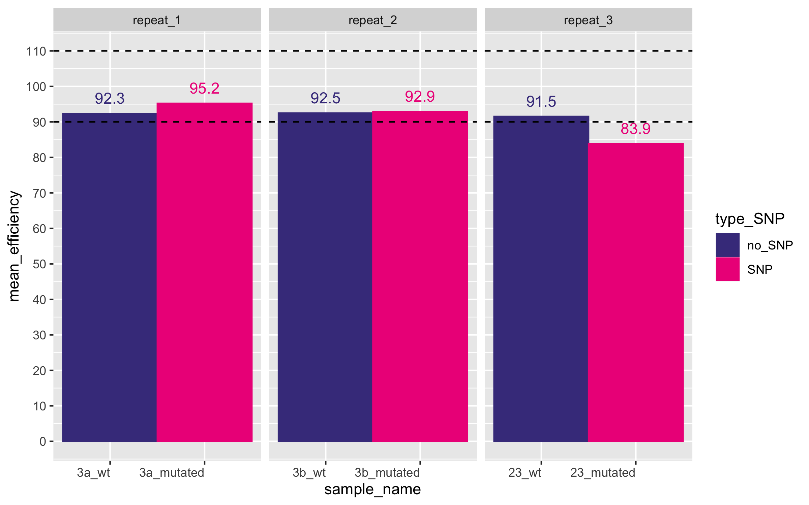
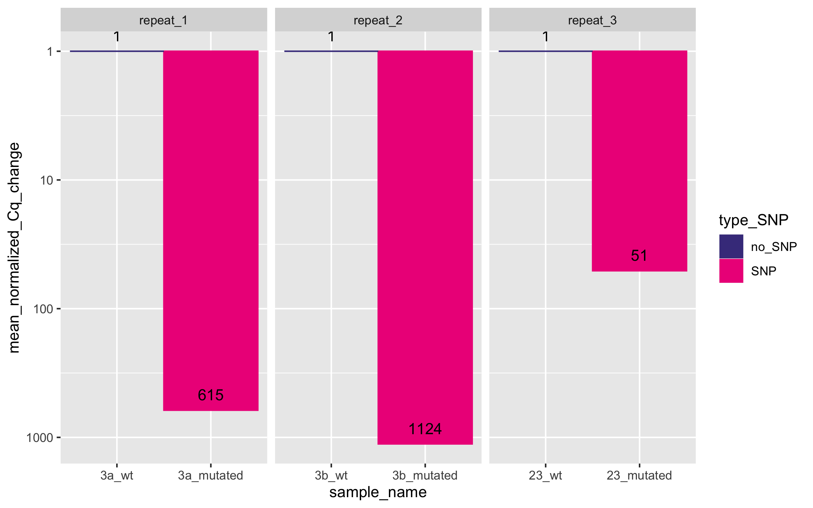
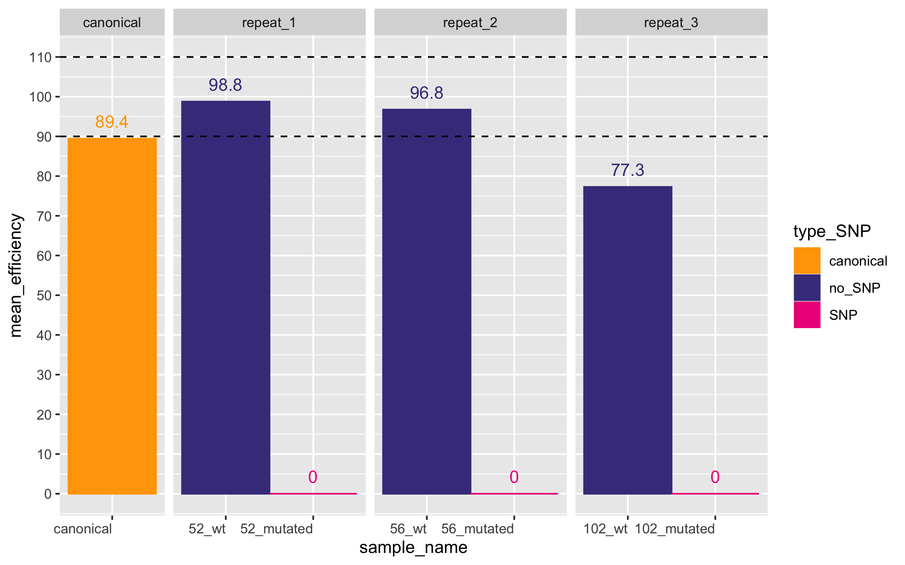
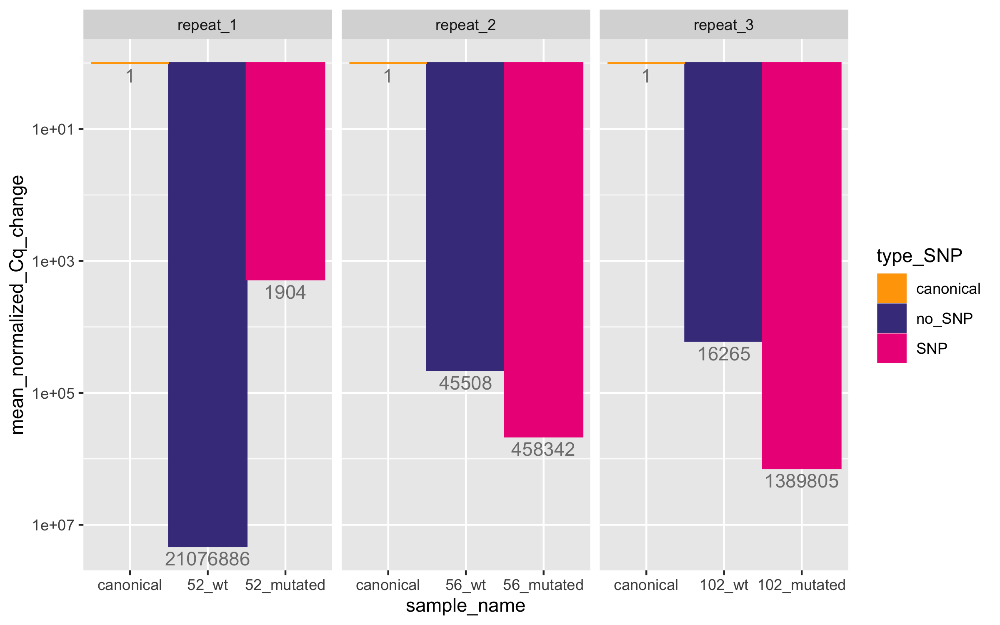

# qPCR testing and effect of SNPs
Author: Marina Papaiakovou, mpapaiakovou[at]gmail.com 

## Contents: 
- R code to visualise effect of 3 SNPs in 3 repeats,via qPCR
- showing PCR efficiencies, and fold-loss of product due to the SNP present
- *Ascaris* and *Trichuris*

- *Ascaris* - SNP testing 
```{r warning = FALSE}

setwd("/Users/marinapapaiakovou/Documents/00.Cambridge_PhD/02.Science/02.Genome_skimming/07.Global_genome_skim_2023/07_LAB_WORK/01_ASCARIS_PCR_RUNS_FINAL/")
#plot the bars 
library(tidyverse)
library(viridisLite)
library(viridis)
library(ggforce)
############################################
# EFFICIENCIES PLOTS ----
############################################
#copied the efficiency values from the Thermo cloud exports - for the canonical repeat I took all 3 efficiencies and put the mean
efficiencies <- read.csv("ascaris_efficiencies.csv")

efficiencies$Target_name <- factor(efficiencies$Target_name, levels = efficiencies$Target_name)

#add type of SNP if any 
efficiencies$type_SNP <- ifelse(grepl("_original", efficiencies$Target_name), "no_SNP",
                                ifelse(grepl("_mutated", efficiencies$Target_name), "SNP", "canonical"))

#add scaffold details
efficiencies$scaffold <- ifelse(grepl("Ascaris_3a_(original|mutated)", efficiencies$Target_name), "3a",
                                ifelse(grepl("Ascaris_3b_(original|mutated)", efficiencies$Target_name),"3b",
                                       ifelse(grepl("Ascaris_23_(original|mutated)", efficiencies$Target_name),"23", "canonical")))


#add another column that mentions repeats
efficiencies <- efficiencies %>%
  mutate(repeat_type = case_when(
    grepl("3a", scaffold) ~ "repeat_1",
    grepl("23", scaffold) ~ "repeat_3",
    grepl("3b", scaffold) ~ "repeat_2", 
    TRUE ~ "canonical"  # Default value for all others
  ))

#assign another column now
efficiencies <- efficiencies %>%
  mutate(sample_name = case_when(
    scaffold == "3a" & type_SNP == "SNP" ~ "3a_mutated",
    scaffold == "3a" & type_SNP == "no_SNP" ~ "3a_wt",
    scaffold == "3b" & type_SNP == "SNP" ~ "3b_mutated",
    scaffold == "3b" & type_SNP == "no_SNP" ~ "3b_wt",
    scaffold == "23" & type_SNP == "SNP" ~ "23_mutated",
    scaffold == "23" & type_SNP == "no_SNP" ~ "23_wt",
    scaffold =="canonical" ~ "canonical",
    TRUE ~ NA  # Assign NA for other combinations
  ))

#order them so you can plot them as you want them 
efficiencies$sample_name <- factor(efficiencies$sample_name, levels = c("canonical", "3a_wt", "3a_mutated", "3b_wt", "3b_mutated", "23_wt", "23_mutated"))


#will drop the canonical repeat
efficiencies <- efficiencies %>%
  filter(sample_name != "canonical")


```

- Effect of 3 SNPs on qPCR efficiency of *Ascaris*
```{r ASCARIS_EFFICIENCIES_PANEL_A_no_canonical, fig.path='./00_FIGURES/'}
png(filename = "00_FIGURES/ASCARIS_EFFICIENCIES_PANEL_A_no_canonical.png", height = 5, width = 8, units = "in", res = 300)


efficiencies_plot <- ggplot(efficiencies, aes(x = sample_name, y = mean_efficiency, fill = type_SNP, color = type_SNP)) +
  geom_bar(stat = "identity", width = 1) + 
  theme(axis.text.x = element_text( hjust = 1)) +
 # labs(title = "Mean Efficiency by Target Name", x = "Target Name", y = "Mean Efficiency") +
  geom_hline(yintercept = 90, linetype = "dashed", color = "black") + 
  geom_hline(yintercept = 110, linetype = "dashed", color = "black") + 
  scale_fill_manual(values = c("no_SNP" = "slateblue4", "SNP" = "deeppink2")) +  
  scale_color_manual(values = c("no_SNP" = "slateblue4", "SNP" = "deeppink2")) +  
  geom_text(aes(label = round(mean_efficiency, 1)), vjust = -0.9) + 
  scale_y_continuous(limits = c(0, 110), breaks = seq(0, 110, by = 10)) + 
  facet_grid(~ repeat_type, scales = "free", space = "free") 

print(efficiencies_plot)
dev.off()
```

- Fold-loss (= cycle differneces) due to the 3 SNPs in *Ascaris*

```{r warning = FALSE}
setwd("/Users/marinapapaiakovou/Documents/00.Cambridge_PhD/02.Science/02.Genome_skimming/07.Global_genome_skim_2023/07_LAB_WORK/01_ASCARIS_PCR_RUNS_FINAL/")

qPCR_ascaris_all_canonicals <- read.csv("qPCR_tesults_ascaris_can_wt_mut_ALLcanonicals.csv")

#remove NTCs
qPCR_ascaris_all_canonicals_filtered <- qPCR_ascaris_all_canonicals %>%
  filter(Cq != "Undetermined") #remove the NTCs

#select only the canonicals and gives me the mean for each concentration so I can use it moving forward
qPCR_ascaris_all_canonicals_filtered$Cq_Mean <- as.numeric(as.character(qPCR_ascaris_all_canonicals_filtered$Cq_Mean))

qPCR_ascaris_mean_canonical_only<- qPCR_ascaris_all_canonicals_filtered %>%
  filter(test == "canonical") %>%
  select(Sample_Name, Cq_Mean) %>%
  group_by(Sample_Name) %>%
  summarise(mean_Cq = mean(Cq_Mean, na.rm = TRUE))

#save this to use if with the updated csv file
#write_csv(qPCR_ascaris_mean_canonical_only, "qPCR_ascaris_mean_canonical_only.csv")
#took the above values and I added them to the original file: qPCR_tesults_ascaris_can_wt_mut_ALLcanonicals.csv and saved as: Ascaris_Cq_efficiencies_MEAN_CANONICAL.csv


qPCR_ascaris_mean_canonical <- read.csv("Ascaris_Cq_efficiencies_MEAN_CANONICAL.csv")

qPCR_ascaris_mean_canonical_filtered <- qPCR_ascaris_mean_canonical %>%
  filter(Cq != "Undetermined") #remove the NTCs

qPCR_ascaris_filtered2 <- qPCR_ascaris_mean_canonical_filtered %>%
  mutate(Cq_Mean = as.numeric(Cq_Mean)) %>%
  select(1,2,4)

colnames(qPCR_ascaris_filtered2) <- c('Sample_Name', 'Target_name', 'Cq_Mean')

#add a scaffold name as another variable so we can calculate fold differences from mutated to the original 
qPCR_ascaris_filtered2$scaffold <- ifelse(grepl("Ascaris_3a_(original|mutated)", qPCR_ascaris_filtered2$Target_name), "3a",
                                          ifelse(grepl("Ascaris_3b_(original|mutated)", qPCR_ascaris_filtered2$Target_name),"3b",
                                                 ifelse(grepl("Ascaris_23_(original|mutated)", qPCR_ascaris_filtered2$Target_name),"23", "canonical")))
#add type of snp, original or mutated
qPCR_ascaris_filtered2$type_SNP <- ifelse(grepl("_original", qPCR_ascaris_filtered2$Target_name), "no_SNP",
                                          ifelse(grepl("_mutated", qPCR_ascaris_filtered2$Target_name), "SNP", "canonical"))

#remove duplicates
qPCR_ascaris_filtered3 <- qPCR_ascaris_filtered2 %>%
  distinct() %>%
  select(-Sample_Name)


#merge the datasets now 
merged_qPCR_ascaris_filtered2_efficiencies <- left_join(qPCR_ascaris_filtered3, efficiencies, by = c("type_SNP", "scaffold", "Target_name"))

#make them wide
melted_data <- merged_qPCR_ascaris_filtered2_efficiencies %>%
  mutate(
    wild_type_Cq = ifelse(type_SNP == "no_SNP", Cq_Mean, NA),
    mutated_Cq = ifelse(type_SNP == "SNP", Cq_Mean, NA), 
    wild_type_efficiency = ifelse(type_SNP == "no_SNP", mean_efficiency, NA),
    mutated_efficiency = ifelse(type_SNP == "SNP", mean_efficiency, NA)
  )

Ascaris_Cq_efficiencies <- read.csv("Ascaris_Cq_efficiencies_tested.csv")

##convert to numeric so you can do calculations
Ascaris_Cq_efficiencies_numeric <- Ascaris_Cq_efficiencies %>%
  mutate(
    wild_type_efficiency = wild_type_efficiency / 100,
    mutated_efficiency = mutated_efficiency /100,
    wild_type_Cq = as.numeric(wild_type_Cq),
    mutated_Cq = as.numeric(mutated_Cq)
  )

# Create the new column with the normalized Cq change
normalised_Cq_changes <- Ascaris_Cq_efficiencies_numeric %>%
  mutate(normalized_Cq_change = 2^abs((wild_type_Cq * wild_type_efficiency) - (mutated_Cq * mutated_efficiency)))

#multiply by 1 to make it negative to show loss
#decided not to multiple by -1, but keeping the code - just removing the minus
#will use ggforce package instead, with scale log 10 
normalised_Cq_changes_inverted <- normalised_Cq_changes %>%
  mutate(
    normalized_Cq_change = 1 * normalized_Cq_change
  )

#import the wild type dataset, so we can add the barplot at -1, how would it be if there were no SNPs
#does not matter what you put in, any Cq value from any concentration, so when you divide it it's 1. 

No_SNPs <- read.csv("Ascaris_original_repeat_to_add_to_plot_tested.csv")
str(No_SNPs)
# Create the new column with the normalized Cq change
normalised_Cq_changes_no_SNPs <- No_SNPs %>%
  mutate(normalized_Cq_change = 2^abs((wild_type_Cq * wild_type_efficiency) - (mutated_Cq * mutated_efficiency)))

#same here, removing the minus
normalised_Cq_changes_inverted_no_SNP <- normalised_Cq_changes_no_SNPs %>%
  mutate(
    normalized_Cq_change = 1 * normalized_Cq_change
  )


bind_data <- rbind (normalised_Cq_changes_inverted, normalised_Cq_changes_inverted_no_SNP)

#calculate the mean normalized_Cq_change per scaffold and per test
bind_data2 <- bind_data %>%
  group_by(scaffold, type_SNP) %>%
  mutate(mean_normalized_Cq_change= mean(normalized_Cq_change)) %>%
  select(scaffold, type_SNP, mean_normalized_Cq_change) %>%
  distinct()

bind_data2$scaffold <- factor(bind_data2$scaffold, levels = c("3a", "3b", "23"))


#add here another column with 'repeat_1', 'repeat_2' etc
#add type of snp, original or mutated
bind_data2 <- bind_data2 %>%
  mutate(repeat_type = case_when(
    grepl("3a", scaffold) ~ "repeat_1",
    grepl("23", scaffold) ~ "repeat_3",
    TRUE ~ "repeat_2"  # Default value for all others
  ))

#assign another column now
bind_data2 <- bind_data2 %>%
  mutate(sample_name = case_when(
    scaffold == "3a" & type_SNP == "SNP" ~ "3a_mutated",
    scaffold == "3a" & type_SNP == "no_SNP" ~ "3a_wt",
    scaffold == "3b" & type_SNP == "SNP" ~ "3b_mutated",
    scaffold == "3b" & type_SNP == "no_SNP" ~ "3b_wt",
    scaffold == "23" & type_SNP == "SNP" ~ "23_mutated",
    scaffold == "23" & type_SNP == "no_SNP" ~ "23_wt",
    TRUE ~ NA  # Assign NA for other combinations
  ))

bind_data2$sample_name <- factor(bind_data2$sample_name, levels = c("3a_wt", "3a_mutated", "3b_wt", "3b_mutated", "23_wt", "23_mutated"))


```
- Fold-loss in *Ascaris* due to SNP presence
```{r ASCARIS_EFFICIENCIES_FOLD_LOSS_nocanonical, fig.path='./00_FIGURES/'}
png(filename = "00_FIGURES/ASCARIS_EFFICIENCIES_FOLD_LOSS_nocanonical.png", height = 5, width = 8, units = "in", res = 300)


fold_loss2 <- ggplot(bind_data2, aes(x = sample_name, y = mean_normalized_Cq_change, fill = type_SNP, color = type_SNP)) +
  geom_bar(stat = "identity", position = "dodge", width =1) +
  #labs(title = "Fold loss of product due to SNP", x = "Target Name", y = "Mean Normalized Cq Change") +
  scale_fill_manual(values = c("no_SNP" = "slateblue4", "SNP" = "deeppink2")) +  # Adjust fill colors
  scale_color_manual(values = c("no_SNP" = "slateblue4", "SNP" = "deeppink2")) +  
  geom_text(aes(label = round(mean_normalized_Cq_change, 0)), vjust = -0.9, color = "black") + # Add text labels on top of bars
  facet_grid(~ repeat_type, scales = "free", space = "free") +
  scale_y_continuous(trans = trans_reverser('log10'))

print(fold_loss2)
dev.off()
```

- *Trichuris* - SNP testing 
```{r warning = FALSE}
setwd("/Users/marinapapaiakovou/Documents/00.Cambridge_PhD/02.Science/02.Genome_skimming/07.Global_genome_skim_2023/07_LAB_WORK/02_TRICHURIS_PCR_RUNS_FINAL/")
#plot the bars 
library(tidyverse)
library(viridisLite)
library(viridis)

############################################
# EFFICIENCIES PLOTS ----
############################################
#copied the efficiency values from the Thermo cloud exports - for the canonical repeat I took all 3 efficiencies and put the mean
trichuris_efficiencies <- read.csv("trichuris_efficiencies.csv")
trichuris_efficiencies$Target_name <- factor(trichuris_efficiencies$Target_name, levels = trichuris_efficiencies$Target_name)

#add type of SNP if any 
trichuris_efficiencies$type_SNP <- ifelse(grepl("_original", trichuris_efficiencies$Target_name), "no_SNP",
                                          ifelse(grepl("_mutated", trichuris_efficiencies$Target_name), "SNP", "canonical"))

#add scaffold details
trichuris_efficiencies$scaffold <- ifelse(grepl("Trichuris_52_(original|mutated)", trichuris_efficiencies$Target_name), "52",
                                          ifelse(grepl("Trichuris_56_(original|mutated)", trichuris_efficiencies$Target_name),"56",
                                                 ifelse(grepl("Trichuris_102_(original|mutated)", trichuris_efficiencies$Target_name),"102", "canonical")))


#add another column that mentions repeats
trichuris_efficiencies <- trichuris_efficiencies %>%
  mutate(repeat_type = case_when(
    grepl("52", scaffold) ~ "repeat_1",
    grepl("56", scaffold) ~ "repeat_2",
    grepl("102", scaffold) ~ "repeat_3", 
    TRUE ~ "canonical"  # Default value for all others
  ))

#assign another column now
trichuris_efficiencies <- trichuris_efficiencies %>%
  mutate(sample_name = case_when(
    scaffold == "52" & type_SNP == "SNP" ~ "52_mutated",
    scaffold == "52" & type_SNP == "no_SNP" ~ "52_wt",
    scaffold == "56" & type_SNP == "SNP" ~ "56_mutated",
    scaffold == "56" & type_SNP == "no_SNP" ~ "56_wt",
    scaffold == "102" & type_SNP == "SNP" ~ "102_mutated",
    scaffold == "102" & type_SNP == "no_SNP" ~ "102_wt",
    scaffold =="canonical" ~ "canonical",
    TRUE ~ NA  # Assign NA for other combinations
  ))

#order them so you can plot them as you want them 
trichuris_efficiencies$sample_name <- factor(trichuris_efficiencies$sample_name, levels = c("canonical", "52_wt", "52_mutated", "56_wt", "56_mutated", "102_wt", "102_mutated"))


#will drop the canonical repeat
#trichuris_efficiencies <- trichuris_efficiencies %>%
 # filter(sample_name != "canonical")


```

- Effect of 3 SNPs on qPCR efficiency of *Trichuris*

```{r TRICHURIS_EFFICIENCIES_PANEL_A, fig.path='./00_FIGURES/'}
png(filename = "00_FIGURES/TRICHURIS_EFFICIENCIES_PANEL_A.png", height = 5, width = 8, units = "in", res = 300)

trichuris_efficiencies_plot <- ggplot(trichuris_efficiencies, aes(x = sample_name, y = mean_efficiency, fill = type_SNP, color = type_SNP)) +
  geom_bar(stat = "identity", width = 1) + 
  theme(axis.text.x = element_text( hjust = 1)) +
  # labs(title = "Mean Efficiency by Target Name", x = "Target Name", y = "Mean Efficiency") +
  geom_hline(yintercept = 90, linetype = "dashed", color = "black") + 
  geom_hline(yintercept = 110, linetype = "dashed", color = "black") + 
  scale_fill_manual(values = c("no_SNP" = "slateblue4", "SNP" = "deeppink2", "canonical" = "orange")) +  
  scale_color_manual(values = c("no_SNP" = "slateblue4", "SNP" = "deeppink2", "canonical" = "orange")) +  
  geom_text(aes(label = round(mean_efficiency, 1)), vjust = -0.9) + 
  scale_y_continuous(limits = c(0, 110), breaks = seq(0, 110, by = 10)) + 
  facet_grid(~ repeat_type, scales = "free", space = "free") 

print(trichuris_efficiencies_plot)
dev.off()
```


- Fold-loss (= cycle differneces) due to the 3 SNPs in *Trichuris*
```{r warning = FALSE}
# For the Cq_mean values - you need to plot mean values first and then you need some fold difference of the mutated relative to the wild type 
setwd("/Users/marinapapaiakovou/Documents/00.Cambridge_PhD/02.Science/02.Genome_skimming/07.Global_genome_skim_2023/07_LAB_WORK/02_TRICHURIS_PCR_RUNS_FINAL/")


qPCR_trichuris_all_canonicals <- read.csv("qPCR_results_trichuris_can_wt_mut_ALLcanonicals.csv")

#remove NTCs
qPCR_trichuris_all_canonicals_filtered <- qPCR_trichuris_all_canonicals %>%
  filter(Cq != "Undetermined") #remove the NTCs


#select only the canonicals and gives me the mean for each concentration so I can use it moving forward
qPCR_trichuris_all_canonicals_filtered$Cq_Mean <- as.numeric(as.character(qPCR_trichuris_all_canonicals_filtered$Cq_Mean))


qPCR_trichuris_mean_canonical_only<- qPCR_trichuris_all_canonicals_filtered %>%
  filter(test == "canonical") %>%
  select(Sample_Name, Cq_Mean) %>%
  group_by(Sample_Name) %>%
  summarise(mean_Cq = mean(Cq_Mean, na.rm = TRUE))

#save this to use if with the updated csv file
#write_csv(qPCR_trichuris_mean_canonical_only, "qPCR_trichuris_mean_canonical_only.csv")
#took the above values and I added them to the original file: qPCR_results_trichuris_can_wt_mut_ALLcanonicals.csv and saved as: Trichuris_Cq_efficiencies_MEAN_CANONICAL.csv
#remove all the other ones, by using Filter in excel 

#read the new file now with the mean canonical Cq 
#qPCR_trichuris_mean_canonical <- read.csv("Trichuris_Cq_efficiencies_MEAN_CANONICAL.csv")

#In this file: Trichuris_Cq_efficiencies_MEAN_CANONICAL.csv I replaced all the 0 values (where the mutated target is) with 40, which is the cycle cut off, 
#so the mean fold loss numbers make more sense 
#Also removed all the concentrations for which I had O as Cq (like low concentrations in the original)

qPCR_trichuris_mean_canonical_Cq_45 <- read.csv("Trichuris_Cq_efficiencies_MEAN_CANONICAL_Cq_45_where_zero.csv")


#In this file, I only took values from one standard, that the mean from all the canonicals - very comparable anyways (on the canonical)

qPCR_trichuris_mean_canonical_filtered <- qPCR_trichuris_mean_canonical_Cq_45 %>%
  filter(Cq != "Undetermined") #remove the NTCs


qPCR_trichuris_filtered2 <- qPCR_trichuris_mean_canonical_filtered %>%
  mutate(Cq_Mean = as.numeric(Cq_Mean)) %>%
  select(1,2,4)


colnames(qPCR_trichuris_filtered2) <- c('Sample_Name', 'Target_name', 'Cq_Mean')


#add a scaffold name as another variable so we can calculate fold differences from mutated to the original 
#add type of SNP if any 
qPCR_trichuris_filtered2$type_SNP <- ifelse(grepl("_original", qPCR_trichuris_filtered2$Target_name), "no_SNP",
                                            ifelse(grepl("_mutated", qPCR_trichuris_filtered2$Target_name), "SNP", "canonical"))

#add scaffold details
qPCR_trichuris_filtered2$scaffold <- ifelse(grepl("Trichuris_52_(original|mutated)", qPCR_trichuris_filtered2$Target_name), "52",
                                            ifelse(grepl("Trichuris_56_(original|mutated)", qPCR_trichuris_filtered2$Target_name),"56",
                                                   ifelse(grepl("Trichuris_102_(original|mutated)", qPCR_trichuris_filtered2$Target_name),"102", "canonical")))


#remove duplicates
qPCR_trichuris_filtered3 <- qPCR_trichuris_filtered2 %>%
  distinct() %>%
  select(-Sample_Name)

####### run now efficiencies again because you have renamed the tests here
#copied the efficiency values from the Thermo cloud exports - for the canonical repeat I took all 3 efficiencies and put the mean
trichuris_efficiencies <- read.csv("trichuris_efficiencies.csv")
trichuris_efficiencies$Target_name <- factor(trichuris_efficiencies$Target_name, levels = trichuris_efficiencies$Target_name)

#add type of SNP if any 
trichuris_efficiencies$type_SNP <- ifelse(grepl("_original", trichuris_efficiencies$Target_name), "no_SNP",
                                          ifelse(grepl("_mutated", trichuris_efficiencies$Target_name), "SNP", "canonical"))

#add scaffold details
trichuris_efficiencies$scaffold <- ifelse(grepl("Trichuris_52_(original|mutated)", trichuris_efficiencies$Target_name), "52",
                                          ifelse(grepl("Trichuris_56_(original|mutated)", trichuris_efficiencies$Target_name),"56",
                                                 ifelse(grepl("Trichuris_102_(original|mutated)", trichuris_efficiencies$Target_name),"102", "canonical")))


#add another column that mentions repeats
trichuris_efficiencies <- trichuris_efficiencies %>%
  mutate(repeat_type = case_when(
    grepl("52", scaffold) ~ "repeat_1",
    grepl("56", scaffold) ~ "repeat_2",
    grepl("102", scaffold) ~ "repeat_3", 
    TRUE ~ "canonical"  # Default value for all others
  ))

#assign another column now
trichuris_efficiencies <- trichuris_efficiencies %>%
  mutate(sample_name = case_when(
    scaffold == "52" & type_SNP == "SNP" ~ "52_mutated",
    scaffold == "52" & type_SNP == "no_SNP" ~ "52_wt",
    scaffold == "56" & type_SNP == "SNP" ~ "56_mutated",
    scaffold == "56" & type_SNP == "no_SNP" ~ "56_wt",
    scaffold == "102" & type_SNP == "SNP" ~ "102_mutated",
    scaffold == "102" & type_SNP == "no_SNP" ~ "102_wt",
    scaffold =="canonical" ~ "canonical",
    TRUE ~ NA  # Assign NA for other combinations
  ))

#order them so you can plot them as you want them 
trichuris_efficiencies$sample_name <- factor(trichuris_efficiencies$sample_name, levels = c("canonical", "52_wt", "52_mutated", "56_wt", "56_mutated", "102_wt", "102_mutated"))

#merge the datasets now 
merged_qPCR_trichuris_filtered2_efficiencies <- left_join(qPCR_trichuris_filtered3, trichuris_efficiencies, by = c("type_SNP", "scaffold", "Target_name"))

#make them wide
melted_data <- merged_qPCR_trichuris_filtered2_efficiencies %>%
  mutate(
    wild_type_Cq = ifelse(type_SNP == "no_SNP", Cq_Mean, NA),
    mutated_Cq = ifelse(type_SNP == "SNP", Cq_Mean, NA), 
    canonical_Cq = ifelse(type_SNP == "canonical", Cq_Mean, NA), 
    wild_type_efficiency = ifelse(type_SNP == "no_SNP", mean_efficiency, NA),
    mutated_efficiency = ifelse(type_SNP =="SNP", mean_efficiency, NA),
    canonical_efficiency = ifelse(type_SNP == "canonical", mean_efficiency, NA)
  )

Trichuris_Cq_efficiencies <- read.csv("Trichuris_Cq_efficiencies_canonical_vs_wildtype_tested_adding_mutatedtoo_Cq45_edited.csv")

##convert to numeric so you can do calculations
Trichuris_Cq_efficiencies_numeric <- Trichuris_Cq_efficiencies %>%
  mutate(canonical_efficiency = canonical_efficiency /100,
         wild_type_efficiency = wild_type_efficiency / 100,
         mutated_efficiency = mutated_efficiency/100,
         canonical_Cq = as.numeric(canonical_Cq),
         wild_type_Cq = as.numeric(wild_type_Cq),
         mutated_Cq = as.numeric(mutated_Cq)
  )


# Create the new column with the normalized Cq change
Trichuris_normalised_Cq_changes <- Trichuris_Cq_efficiencies_numeric %>%
  mutate(normalized_Cq_change_wt_from_canonical = 2^abs((wild_type_Cq * wild_type_efficiency) - (canonical_Cq * canonical_efficiency)), 
         normalised_Cq_change_mutated_from_wt = 2^abs((mutated_Cq * mutated_efficiency) - (wild_type_Cq * wild_type_efficiency)))


#multiply by -1 to make it negative to show loss
Trichuris_normalised_Cq_changes_inverted <- Trichuris_normalised_Cq_changes %>%
  mutate(
    normalized_Cq_change_wt_from_canonical = 1 * normalized_Cq_change_wt_from_canonical,
    
    normalised_Cq_change_mutated_from_wt = 1 * normalised_Cq_change_mutated_from_wt, 
  )

colnames(Trichuris_normalised_Cq_changes_inverted)

#Here I need to add the file with the canonical stuff (because this is what I compare the wildtype against

Trichuris_no_SNPs <- read.csv("Trichuris_canonical_repeat_to_add_to_plot.csv")

Trichuris_no_SNPs <- Trichuris_no_SNPs %>%
  mutate(canonical_efficiency = as.numeric(canonical_efficiency))

str(Trichuris_no_SNPs)
# Create the new column with the normalized Cq change

Trichuris_normalised_Cq_changes_no_SNPs <- Trichuris_no_SNPs %>%
  mutate(normalized_Cq_change_wt_from_canonical = 2^abs((wild_type_Cq * wild_type_efficiency) - (canonical_Cq * canonical_efficiency)), 
         normalised_Cq_change_mutated_from_wt = 2^abs((mutated_Cq * mutated_efficiency) - (wild_type_Cq * wild_type_efficiency)))

#removed the - here - will keep the code as is, will just use reverse y 
Trichuris_normalised_Cq_changes_inverted_no_SNP <- Trichuris_normalised_Cq_changes_no_SNPs %>%
  mutate(
    normalized_Cq_change_wt_from_canonical = 1 * normalized_Cq_change_wt_from_canonical,
    
    normalised_Cq_change_mutated_from_wt = 1 * normalised_Cq_change_mutated_from_wt, 
  )

Trichuris_bind_data <- rbind (Trichuris_normalised_Cq_changes_inverted, Trichuris_normalised_Cq_changes_inverted_no_SNP)
#colnames(Trichuris_normalised_Cq_changes_inverted)
#colnames(Trichuris_normalised_Cq_changes_inverted_no_SNP)
#calculate the mean normalized_Cq_change per scaffold and per test
Trichuris_bind_data2 <- Trichuris_bind_data %>%
  group_by(scaffold, type_SNP) %>%
  mutate(mean_normalized_Cq_change_wt_from_canonical= mean(normalized_Cq_change_wt_from_canonical), 
         mean_normalised_Cq_change_mutated_from_wt = mean(normalised_Cq_change_mutated_from_wt)) %>%
  select(scaffold, type_SNP, mean_normalised_Cq_change_mutated_from_wt, mean_normalized_Cq_change_wt_from_canonical) %>%
  distinct()

Trichuris_bind_data2$scaffold <- factor(Trichuris_bind_data2$scaffold, levels = c("canonical", "52", "56", "102"))


#add here another column with 'repeat_1', 'repeat_2' etc
#add type of snp, original or Trichuris_bind_data2
Trichuris_bind_data2 <- Trichuris_bind_data2 %>%
  mutate(repeat_type = case_when(
    grepl("52", scaffold) ~ "repeat_1",
    grepl("56", scaffold) ~ "repeat_2",
    grepl("102", scaffold) ~ "repeat_3", 
    grepl("canonical", scaffold)~ "canonical",
    TRUE ~ NA  # Default value for all others
  ))


#assign another column now
Trichuris_bind_data2 <- Trichuris_bind_data2 %>%
  mutate(sample_name = case_when(
    scaffold == "52" & type_SNP == "SNP" ~ "52_mutated",
    scaffold == "52" & type_SNP == "no_SNP" ~ "52_wt",
    scaffold == "56" & type_SNP == "SNP" ~ "56_mutated",
    scaffold == "56" & type_SNP == "no_SNP" ~ "56_wt",
    scaffold == "102" & type_SNP == "SNP" ~ "102_mutated",
    scaffold == "102" & type_SNP == "no_SNP" ~ "102_wt",
    scaffold == "52" & type_SNP == "canonical" ~ "canonical",
    scaffold == "56" & type_SNP == "canonical" ~ "canonical",
    scaffold == "102" & type_SNP == "canonical" ~ "canonical",
    TRUE ~ NA  # Assign NA for other combinations
  ))

Trichuris_bind_data2$sample_name <- factor(Trichuris_bind_data2$sample_name, levels = c("canonical", "52_wt", "52_mutated", "56_wt", "56_mutated", "102_wt", "102_mutated"))

tt_all_for_plotting <- read.csv("Trichuris_bind_data2_Cq45_edited.csv")

#add levels
tt_all_for_plotting$sample_name <- factor(tt_all_for_plotting$sample_name, levels = c("canonical", "52_wt", "52_mutated", "56_wt", "56_mutated", "102_wt", "102_mutated"))


```

- Fold-loss in *Trichuris* due to SNP presence
```{r TRICHURIS_FOLD_LOSS_PANELB, fig.path='./00_FIGURES/'}
png(filename = "00_FIGURES/TRICHURIS_FOLD_LOSS_PANELB.png", height = 5, width = 8, units = "in", res = 300)

Trichuris_fold_loss2 <- ggplot(tt_all_for_plotting, aes(x = sample_name, y = mean_normalized_Cq_change, fill = type_SNP, color = type_SNP)) +
  geom_bar(stat = "identity", position = "dodge", width =1) +
  #labs(title = "Fold loss of product due to SNP", x = "Target Name", y = "Mean Normalized Cq Change") +
  scale_fill_manual(values = c("no_SNP" = "slateblue4", "SNP" = "deeppink2", "canonical" ="orange")) +  # Adjust fill colors
  scale_color_manual(values = c("no_SNP" = "slateblue4", "SNP" = "deeppink2", "canonical" ="orange")) +  
  geom_text(aes(label = round(mean_normalized_Cq_change, 0), color = "black"), vjust = 1.4) + # Add text labels on top of bars
 # ggtitle("mean fold loss - mutated Cq replaced by 45 - and 100% efficiency")+
  facet_grid(~ repeat_type, scales = "free", space = "free")+
scale_y_continuous(trans = trans_reverser('log10'))

print(Trichuris_fold_loss2)
dev.off()
```


- The end! 